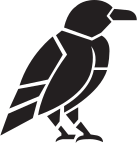

<p align="center">
  
</p>

<h3 align="center">modern scientific computing for OCaml</h3>

<p align="center">
  <a href="https://raven-ml.dev/docs/">docs</a> &middot;
  <a href="https://raven-ml.dev/docs/installation/">install</a> &middot;
  <a href="https://github.com/raven-ml/raven/issues">issues</a>
</p>

---

Raven is an ecosystem of OCaml libraries for numerical computing, machine learning, and data science. Everything you know from Python — NumPy, JAX, PyTorch, Matplotlib, Jupyter — rebuilt with type safety.

> Raven is **alpha**. APIs will change. [Feedback welcome.](https://github.com/raven-ml/raven/issues)

```ocaml
(* nx — n-dimensional arrays *)
let x = Nx.linspace float32 0. 10. 100
let y = Nx.sin x

(* rune — automatic differentiation *)
let grad_f = Rune.grad (fun x -> Rune.sum (Rune.mul x x)) x

(* brot — tokenization *)
let tokenizer = Brot.from_file "tokenizer.json" |> Result.get_ok
let ids = Brot.encode_ids tokenizer "The meaning of life is"

(* kaun — neural networks *)
let model = Kaun.Layer.sequential [
  Kaun.Layer.linear ~in_features:768 ~out_features:128 ();
  Kaun.Layer.relu ();
  Kaun.Layer.linear ~in_features:128 ~out_features:10 ();
]

(* talon — dataframes *)
let df = Talon.create [
  "name", Talon.Col.string_list [ "Alice"; "Bob"; "Charlie" ];
  "score", Talon.Col.float64_list [ 85.5; 92.0; 78.5 ];
]

(* hugin — plotting *)
let () = Hugin.(figure () |> subplot |> Plotting.plot ~x ~y |> ignore; show ())
```

## Packages

| | Package | Like | What it does |
|-|---------|------|-------------|
| | [**nx**](packages/nx/) | NumPy | N-dimensional arrays with linear algebra operations |
| ᚱ | [**rune**](packages/rune/) | JAX | Automatic differentiation and functional transformations |
| ᚲ | [**kaun**](packages/kaun/) | Flax | Neural networks and training |
| ᚨ | [**brot**](packages/brot/) | HF Tokenizers | Fast, HuggingFace-compatible tokenization |
| ᛃ | [**talon**](packages/talon/) | Polars | Fast and elegant dataframes with type-safe operations |
| ᛞ | [**hugin**](packages/hugin/) | Matplotlib | Publication-quality plotting |
| ᛈ | [**quill**](packages/quill/) | Jupyter + IPython | Interactive REPL and markdown notebooks |
| ᚠ | [**fehu**](packages/fehu/) | Gymnasium | Reinforcement learning environments |
| ᛋ | [**sowilo**](packages/sowilo/) | OpenCV | Differentiable computer vision |

## Getting started

```bash
opam install raven
```

This installs the full ecosystem. You can also install only what you need — e.g. `opam install kaun` for neural networks, or `opam install nx` for just arrays.

Add to your `dune` file:

```dune
(executable
 (name main)
 (libraries raven))
```

See the [installation guide](https://raven-ml.dev/docs/installation/) for system dependencies and editor setup.

## Support

Building a scientific computing ecosystem takes sustained effort. Sponsorships help us ship JIT compilation, distributed training, better developer tooling, and production deployment through MirageOS.

**[Support Raven →](https://raven-ml.dev/docs/support-raven/)**

Thanks to our sponsors [Ahrefs](https://ahrefs.com) and [Tarides](https://tarides.com).

## License

[ISC](LICENSE)
