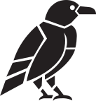

<p align="center">
  
</p>

<h3 align="center">modern scientific computing for OCaml</h3>

<p align="center">
  <a href="https://raven-ml.dev/docs/">docs</a> &middot;
  <a href="https://raven-ml.dev/docs/installation/">install</a> &middot;
  <a href="https://github.com/raven-ml/raven/issues">issues</a>
</p>

---

Raven is an ecosystem of OCaml libraries for numerical computing, machine learning, and data science. Everything you know from Python — NumPy, JAX, PyTorch, Matplotlib, Jupyter — rebuilt with type safety.

> Raven is **alpha**. APIs will change. [Feedback welcome.](https://github.com/raven-ml/raven/issues)

```ocaml
(* nx — n-dimensional arrays *)
let x = Nx.linspace float32 0. 10. 100
let y = Nx.sin x

(* rune — automatic differentiation *)
let grad_f = Rune.grad' (fun x -> Nx.sum (Nx.mul x x)) x

(* brot — tokenization *)
let tokenizer = Brot.from_file "tokenizer.json" |> Result.get_ok
let ids = Brot.encode_ids tokenizer "The meaning of life is"

(* kaun — neural networks *)
let layer = Kaun.Linear.init ~inputs:768 ~outputs:10
let logits = Kaun.Linear.apply layer x

(* talon — dataframes *)
let df = Talon.v [
  "name", Talon.Column.v Talon.Type.string [| "Alice"; "Bob"; "Charlie" |];
  "score", Talon.Column.v Talon.Type.float64 [| 85.5; 92.0; 78.5 |];
]
let top = Talon.(Query.of_table df |> Kit.top_k 2 [ Order.desc "score" ] |> Query.run)

(* hugin — plotting *)
let () = Hugin.(line ~x:(num x) ~y:(num y) () |> save "sine.png")
```

## Packages

|     | Package                        | Like              | What it does                                             |
| --- | ------------------------------ | ----------------- | -------------------------------------------------------- |
|     | [**nx**](packages/nx/)         | NumPy             | N-dimensional arrays with linear algebra operations      |
| ᛏ   | [**tolk**](packages/tolk/)     | tinygrad          | Minimal ML compiler for GPU tensor computation           |
| ᚱ   | [**rune**](packages/rune/)     | JAX               | Automatic differentiation and functional transformations |
| ᚲ   | [**kaun**](packages/kaun/)     | Flax              | Neural networks and training                             |
| ᚹ   | [**vega**](packages/vega/)     | Optax             | Composable gradient-based optimizers                     |
| ᚾ   | [**norn**](packages/norn/)     | NumPyro / Stan    | Probabilistic inference: models, samplers, diagnostics   |
| ᚨ   | [**brot**](packages/brot/)     | HF Tokenizers     | Fast, HuggingFace-compatible tokenization                |
| ᛃ   | [**talon**](packages/talon/)   | pandas / Polars   | Dataframes with typed queries, CSV and Parquet           |
| ᛞ   | [**hugin**](packages/hugin/)   | Matplotlib        | Publication-quality plotting                             |
| ᛈ   | [**quill**](packages/quill/)   | Jupyter + IPython | Interactive REPL and markdown notebooks                  |
| ᛗ   | [**munin**](packages/munin/)  | W&B / MLFlow      | Local experiment tracking with live TUI dashboard        |

### Contrib

Packages in [`contrib/`](contrib/) build against every change to the core and release on their own schedule.

|     | Package                               | Like      | What it does                                   |
| --- | ------------------------------------- | --------- | ---------------------------------------------- |
| ᚠ   | [**fehu**](contrib/fehu/)             | Gymnasium | Reinforcement learning environments            |
| ᛋ   | [**sowilo**](contrib/sowilo/)         | OpenCV    | Differentiable computer vision                 |

## Getting started

```bash
opam install raven
```

This installs the core ecosystem. You can also install only what you need — e.g. `opam install kaun` for neural networks, or `opam install nx` for just arrays.

Add to your `dune` file:

```dune
(executable
 (name main)
 (libraries raven))
```

See the [installation guide](https://raven-ml.dev/docs/installation/) for system dependencies and editor setup.

## Support

Building a scientific computing ecosystem takes sustained effort. Sponsorships help us ship JIT compilation, distributed training, better developer tooling, and production deployment through MirageOS.

**[Support Raven →](https://raven-ml.dev/docs/support-raven/)**

Thanks to our sponsors [Ahrefs](https://ahrefs.com) and [Tarides](https://tarides.com).

## License

[ISC](LICENSE)
