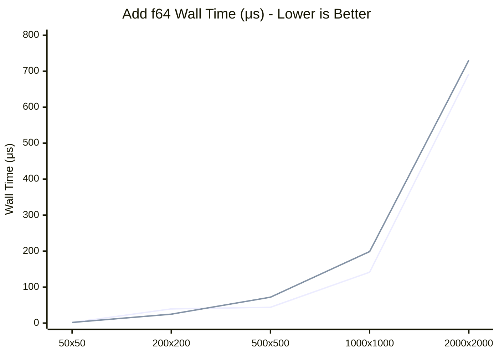

# Nx OxCaml Benchmarks

This directory contains benchmarks comparing the Nx OxCaml backend against the Nx C backend.

### Float64 Performance

Here is a comparison of the wall time for adding two Float64 matrices of varying sizes using both backends:



Overall, we achieve comparable performance between the two backends, with some variations depending on matrix size:
- **Small matrices (50x50, 200x200)**: OxCaml backend is faster, possibly due to lower FFI overhead
- **Medium matrices (500x500)**: Performance is comparable between backends
- **Large matrices (1000x1000+)**: C backend has slight edge, both scale similarly

## Results

```
┌─────────────────────────────────────────┬──────────┬──────────┬─────────┬─────────┬────────────┐
│ Name                                    │ Wall/Run │  CPU/Run │ mWd/Run │ Speedup │ vs Fastest │
├─────────────────────────────────────────┼──────────┼──────────┼─────────┼─────────┼────────────┤
│ Add 500x500 f32 (Nx (C))                │  60.91μs │ 162.38μs │ 462.00w │   0.68x │       148% │
│ Add 500x500 f32 (Nx (OxCaml))           │  62.10μs │ 297.94μs │ 166.00w │   0.66x │       151% │
│ Sub 500x500 f32 (Nx (C))                │  58.42μs │ 131.37μs │ 462.00w │   0.70x │       142% │
│ Sub 500x500 f32 (Nx (OxCaml))           │  66.81μs │ 246.33μs │ 166.00w │   0.62x │       162% │
│ Mul 500x500 f32 (Nx (C))                │  62.82μs │ 141.32μs │ 462.00w │   0.65x │       153% │
│ Mul 500x500 f32 (Nx (OxCaml))           │  63.18μs │ 252.18μs │ 166.00w │   0.65x │       154% │
│ Div 500x500 f32 (Nx (C))                │  44.05μs │ 153.54μs │ 470.00w │   0.93x │       107% │
│ Div 500x500 f32 (Nx (OxCaml))           │  58.65μs │ 299.78μs │ 174.00w │   0.70x │       143% │
│ Mod 500x500 f32 (Nx (C))                │ 500.49μs │   2.71ms │ 462.00w │   0.08x │      1216% │
│ Mod 500x500 f32 (Nx (OxCaml))           │ 143.68μs │ 810.20μs │ 166.00w │   0.29x │       349% │
│ Pow 500x500 f32 (Nx (C))                │ 222.39μs │   1.08ms │ 462.00w │   0.19x │       540% │
│ Pow 500x500 f32 (Nx (OxCaml))           │ 149.94μs │ 787.56μs │ 166.00w │   0.27x │       364% │
│ Max 500x500 f32 (Nx (C))                │  43.57μs │ 154.34μs │ 462.00w │   0.94x │       106% │
│ Max 500x500 f32 (Nx (OxCaml))           │  59.52μs │ 288.74μs │ 166.00w │   0.69x │       145% │
│ Min 500x500 f32 (Nx (C))                │  46.08μs │ 146.43μs │ 462.00w │   0.89x │       112% │
│ Min 500x500 f32 (Nx (OxCaml))           │  60.88μs │ 291.16μs │ 166.00w │   0.68x │       148% │
│ Neg 500x500 f32 (Nx (C))                │  52.01μs │ 163.63μs │ 251.00w │   0.79x │       126% │
│ Neg 500x500 f32 (Nx (OxCaml))           │  65.15μs │ 332.19μs │ 138.00w │   0.63x │       158% │
│ Abs 500x500 f32 (Nx (C))                │  41.15μs │ 149.04μs │ 251.00w │   1.00x │       100% │
│ Abs 500x500 f32 (Nx (OxCaml))           │  65.35μs │ 320.19μs │ 138.00w │   0.63x │       159% │
│ Sqrt 500x500 f32 (Nx (C))               │  44.99μs │ 153.07μs │ 251.00w │   0.91x │       109% │
│ Sqrt 500x500 f32 (Nx (OxCaml))          │  52.03μs │ 258.95μs │ 138.00w │   0.79x │       126% │
│ Exp 500x500 f32 (Nx (C))                │ 263.84μs │ 593.21μs │ 251.00w │   0.16x │       641% │
│ Exp 500x500 f32 (Nx (OxCaml))           │ 148.51μs │ 771.92μs │ 138.00w │   0.28x │       361% │
│ Log 500x500 f32 (Nx (C))                │ 161.44μs │ 696.72μs │ 251.00w │   0.25x │       392% │
│ Log 500x500 f32 (Nx (OxCaml))           │ 135.93μs │ 651.16μs │ 138.00w │   0.30x │       330% │
│ Sin 500x500 f32 (Nx (C))                │ 222.13μs │   1.04ms │ 251.00w │   0.19x │       540% │
│ Sin 500x500 f32 (Nx (OxCaml))           │ 142.70μs │ 679.38μs │ 138.00w │   0.29x │       347% │
│ Cos 500x500 f32 (Nx (C))                │ 227.59μs │   1.08ms │ 251.00w │   0.18x │       553% │
│ Cos 500x500 f32 (Nx (OxCaml))           │ 143.39μs │ 664.62μs │ 138.00w │   0.29x │       348% │
│ Reduce_sum 500x500 f32 (Nx (C))         │ 140.62μs │ 447.38μs │ 252.00w │   0.29x │       342% │
│ Reduce_sum 500x500 f32 (Nx (OxCaml))    │ 901.13μs │ 890.69μs │  48.00w │   0.05x │      2190% │
│ Reduce_prod 500x500 f32 (Nx (C))        │ 712.28μs │ 710.78μs │ 252.00w │   0.06x │      1731% │
│ Reduce_prod 500x500 f32 (Nx (OxCaml))   │ 883.51μs │ 883.27μs │  48.00w │   0.05x │      2147% │
│ Reduce_max 500x500 f32 (Nx (C))         │ 782.80μs │ 782.08μs │ 252.00w │   0.05x │      1902% │
│ Reduce_max 500x500 f32 (Nx (OxCaml))    │ 861.74μs │ 860.26μs │  48.00w │   0.05x │      2094% │
│ Reduce_min 500x500 f32 (Nx (C))         │ 776.45μs │ 775.49μs │ 252.00w │   0.05x │      1887% │
│ Reduce_min 500x500 f32 (Nx (OxCaml))    │ 562.39μs │ 565.48μs │  48.00w │   0.07x │      1367% │
│ Add 500x500 f64 (Nx (C))                │  67.98μs │ 174.79μs │ 462.00w │   0.61x │       165% │
│ Add 500x500 f64 (Nx (OxCaml))           │  81.24μs │ 340.61μs │ 166.00w │   0.51x │       197% │
│ Sub 500x500 f64 (Nx (C))                │  68.15μs │ 173.80μs │ 462.00w │   0.60x │       166% │
│ Sub 500x500 f64 (Nx (OxCaml))           │  80.88μs │ 324.26μs │ 166.00w │   0.51x │       197% │
│ Mul 500x500 f64 (Nx (C))                │  66.08μs │ 172.44μs │ 462.00w │   0.62x │       161% │
│ Mul 500x500 f64 (Nx (OxCaml))           │  81.51μs │ 327.91μs │ 166.00w │   0.50x │       198% │
│ Div 500x500 f64 (Nx (C))                │  66.17μs │ 172.20μs │ 470.00w │   0.62x │       161% │
│ Div 500x500 f64 (Nx (OxCaml))           │  82.53μs │ 306.76μs │ 174.00w │   0.50x │       201% │
│ Mod 500x500 f64 (Nx (C))                │ 546.03μs │   2.75ms │ 462.00w │   0.08x │      1327% │
│ Mod 500x500 f64 (Nx (OxCaml))           │ 148.64μs │ 740.93μs │ 166.00w │   0.28x │       361% │
│ Pow 500x500 f64 (Nx (C))                │ 443.48μs │   2.37ms │ 462.00w │   0.09x │      1078% │
│ Pow 500x500 f64 (Nx (OxCaml))           │ 151.13μs │ 776.94μs │ 166.00w │   0.27x │       367% │
│ Max 500x500 f64 (Nx (C))                │  69.32μs │ 178.04μs │ 462.00w │   0.59x │       168% │
│ Max 500x500 f64 (Nx (OxCaml))           │  79.95μs │ 324.86μs │ 166.00w │   0.51x │       194% │
│ Min 500x500 f64 (Nx (C))                │  66.84μs │ 173.82μs │ 462.00w │   0.62x │       162% │
│ Min 500x500 f64 (Nx (OxCaml))           │  79.46μs │ 310.28μs │ 166.00w │   0.52x │       193% │
│ Neg 500x500 f64 (Nx (C))                │  64.11μs │ 157.16μs │ 251.00w │   0.64x │       156% │
│ Neg 500x500 f64 (Nx (OxCaml))           │ 101.26μs │ 433.89μs │ 138.00w │   0.41x │       246% │
│ Abs 500x500 f64 (Nx (C))                │  64.27μs │ 158.90μs │ 251.00w │   0.64x │       156% │
│ Abs 500x500 f64 (Nx (OxCaml))           │  95.23μs │ 407.17μs │ 138.00w │   0.43x │       231% │
│ Sqrt 500x500 f64 (Nx (C))               │  72.94μs │ 198.08μs │ 251.00w │   0.56x │       177% │
│ Sqrt 500x500 f64 (Nx (OxCaml))          │  74.56μs │ 293.32μs │ 138.00w │   0.55x │       181% │
│ Exp 500x500 f64 (Nx (C))                │ 174.68μs │ 721.18μs │ 251.00w │   0.24x │       425% │
│ Exp 500x500 f64 (Nx (OxCaml))           │ 187.47μs │ 955.12μs │ 138.00w │   0.22x │       456% │
│ Log 500x500 f64 (Nx (C))                │ 295.87μs │   1.31ms │ 251.00w │   0.14x │       719% │
│ Log 500x500 f64 (Nx (OxCaml))           │ 135.58μs │ 655.49μs │ 138.00w │   0.30x │       329% │
│ Sin 500x500 f64 (Nx (C))                │ 248.81μs │   1.19ms │ 251.00w │   0.17x │       605% │
│ Sin 500x500 f64 (Nx (OxCaml))           │ 116.74μs │ 557.79μs │ 138.00w │   0.35x │       284% │
│ Cos 500x500 f64 (Nx (C))                │ 262.36μs │   1.21ms │ 251.00w │   0.16x │       638% │
│ Cos 500x500 f64 (Nx (OxCaml))           │ 171.47μs │ 847.64μs │ 138.00w │   0.24x │       417% │
│ Reduce_sum 500x500 f64 (Nx (C))         │ 139.26μs │ 449.17μs │ 252.00w │   0.30x │       338% │
│ Reduce_sum 500x500 f64 (Nx (OxCaml))    │ 884.43μs │ 884.09μs │  48.00w │   0.05x │      2149% │
│ Reduce_prod 500x500 f64 (Nx (C))        │ 715.44μs │ 715.20μs │ 252.00w │   0.06x │      1739% │
│ Reduce_prod 500x500 f64 (Nx (OxCaml))   │ 885.26μs │ 885.46μs │  48.00w │   0.05x │      2151% │
│ Reduce_max 500x500 f64 (Nx (C))         │ 785.63μs │ 785.07μs │ 252.00w │   0.05x │      1909% │
│ Reduce_max 500x500 f64 (Nx (OxCaml))    │ 858.39μs │ 858.09μs │  48.00w │   0.05x │      2086% │
│ Reduce_min 500x500 f64 (Nx (C))         │ 778.87μs │ 777.88μs │ 252.00w │   0.05x │      1893% │
│ Reduce_min 500x500 f64 (Nx (OxCaml))    │ 561.58μs │ 561.23μs │  48.00w │   0.07x │      1365% │
│ Add 1000x1000 f32 (Nx (C))              │  84.14μs │ 275.03μs │ 462.00w │   0.49x │       204% │
│ Add 1000x1000 f32 (Nx (OxCaml))         │ 112.10μs │ 511.69μs │ 166.00w │   0.37x │       272% │
│ Sub 1000x1000 f32 (Nx (C))              │  83.64μs │ 270.48μs │ 462.00w │   0.49x │       203% │
│ Sub 1000x1000 f32 (Nx (OxCaml))         │ 113.30μs │ 516.48μs │ 166.00w │   0.36x │       275% │
│ Mul 1000x1000 f32 (Nx (C))              │  86.74μs │ 272.37μs │ 462.00w │   0.47x │       211% │
│ Mul 1000x1000 f32 (Nx (OxCaml))         │ 112.71μs │ 521.52μs │ 166.00w │   0.37x │       274% │
│ Div 1000x1000 f32 (Nx (C))              │  89.03μs │ 272.11μs │ 470.00w │   0.46x │       216% │
│ Div 1000x1000 f32 (Nx (OxCaml))         │ 112.90μs │ 510.18μs │ 174.00w │   0.36x │       274% │
│ Mod 1000x1000 f32 (Nx (C))              │   1.97ms │  10.78ms │ 462.00w │   0.02x │      4778% │
│ Mod 1000x1000 f32 (Nx (OxCaml))         │ 467.07μs │   2.80ms │ 166.00w │   0.09x │      1135% │
│ Pow 1000x1000 f32 (Nx (C))              │ 795.32μs │   4.46ms │ 462.00w │   0.05x │      1933% │
│ Pow 1000x1000 f32 (Nx (OxCaml))         │ 472.25μs │   2.85ms │ 166.00w │   0.09x │      1148% │
│ Max 1000x1000 f32 (Nx (C))              │  82.44μs │ 278.57μs │ 462.00w │   0.50x │       200% │
│ Max 1000x1000 f32 (Nx (OxCaml))         │ 111.00μs │ 512.82μs │ 166.00w │   0.37x │       270% │
│ Min 1000x1000 f32 (Nx (C))              │  87.55μs │ 269.30μs │ 462.00w │   0.47x │       213% │
│ Min 1000x1000 f32 (Nx (OxCaml))         │ 109.66μs │ 520.73μs │ 166.00w │   0.38x │       267% │
│ Neg 1000x1000 f32 (Nx (C))              │  80.38μs │ 235.38μs │ 251.00w │   0.51x │       195% │
│ Neg 1000x1000 f32 (Nx (OxCaml))         │ 148.42μs │ 747.57μs │ 138.00w │   0.28x │       361% │
│ Abs 1000x1000 f32 (Nx (C))              │  76.75μs │ 240.87μs │ 251.00w │   0.54x │       187% │
│ Abs 1000x1000 f32 (Nx (OxCaml))         │ 147.09μs │ 734.21μs │ 138.00w │   0.28x │       357% │
│ Sqrt 1000x1000 f32 (Nx (C))             │  85.76μs │ 285.13μs │ 251.00w │   0.48x │       208% │
│ Sqrt 1000x1000 f32 (Nx (OxCaml))        │  99.09μs │ 438.27μs │ 138.00w │   0.42x │       241% │
│ Exp 1000x1000 f32 (Nx (C))              │ 378.21μs │   1.97ms │ 251.00w │   0.11x │       919% │
│ Exp 1000x1000 f32 (Nx (OxCaml))         │ 389.32μs │   2.33ms │ 138.00w │   0.11x │       946% │
│ Log 1000x1000 f32 (Nx (C))              │ 495.26μs │   2.71ms │ 251.00w │   0.08x │      1204% │
│ Log 1000x1000 f32 (Nx (OxCaml))         │ 554.40μs │   3.41ms │ 138.00w │   0.07x │      1347% │
│ Sin 1000x1000 f32 (Nx (C))              │ 734.87μs │   4.03ms │ 251.00w │   0.06x │      1786% │
│ Sin 1000x1000 f32 (Nx (OxCaml))         │ 618.31μs │   3.82ms │ 138.00w │   0.07x │      1503% │
│ Cos 1000x1000 f32 (Nx (C))              │ 767.40μs │   4.24ms │ 251.00w │   0.05x │      1865% │
│ Cos 1000x1000 f32 (Nx (OxCaml))         │ 620.78μs │   3.81ms │ 138.00w │   0.07x │      1509% │
│ Reduce_sum 1000x1000 f32 (Nx (C))       │ 285.59μs │   1.23ms │ 252.00w │   0.14x │       694% │
│ Reduce_sum 1000x1000 f32 (Nx (OxCaml))  │   3.53ms │   3.53ms │  48.00w │   0.01x │      8579% │
│ Reduce_prod 1000x1000 f32 (Nx (C))      │   2.82ms │   2.82ms │ 252.00w │   0.01x │      6865% │
│ Reduce_prod 1000x1000 f32 (Nx (OxCaml)) │   3.53ms │   3.52ms │  48.00w │   0.01x │      8571% │
│ Reduce_max 1000x1000 f32 (Nx (C))       │   3.16ms │   3.13ms │ 252.00w │   0.01x │      7688% │
│ Reduce_max 1000x1000 f32 (Nx (OxCaml))  │   3.42ms │   3.42ms │  48.00w │   0.01x │      8321% │
│ Reduce_min 1000x1000 f32 (Nx (C))       │   3.10ms │   3.10ms │ 252.00w │   0.01x │      7544% │
│ Reduce_min 1000x1000 f32 (Nx (OxCaml))  │   3.30ms │   3.29ms │  48.00w │   0.01x │      8012% │
│ Add 1000x1000 f64 (Nx (C))              │ 165.94μs │ 752.21μs │ 462.00w │   0.25x │       403% │
│ Add 1000x1000 f64 (Nx (OxCaml))         │ 199.08μs │   1.09ms │ 166.00w │   0.21x │       484% │
│ Sub 1000x1000 f64 (Nx (C))              │ 161.20μs │ 686.83μs │ 462.00w │   0.26x │       392% │
│ Sub 1000x1000 f64 (Nx (OxCaml))         │ 205.38μs │   1.12ms │ 166.00w │   0.20x │       499% │
│ Mul 1000x1000 f64 (Nx (C))              │ 183.60μs │ 754.33μs │ 462.00w │   0.22x │       446% │
│ Mul 1000x1000 f64 (Nx (OxCaml))         │ 221.02μs │   1.12ms │ 166.00w │   0.19x │       537% │
│ Div 1000x1000 f64 (Nx (C))              │ 161.27μs │ 688.35μs │ 470.00w │   0.26x │       392% │
│ Div 1000x1000 f64 (Nx (OxCaml))         │ 284.32μs │   1.19ms │ 174.00w │   0.14x │       691% │
│ Mod 1000x1000 f64 (Nx (C))              │   1.99ms │  10.89ms │ 462.00w │   0.02x │      4837% │
│ Mod 1000x1000 f64 (Nx (OxCaml))         │ 184.21ms │    1.13s │ 166.00w │   0.00x │    447698% │
│ Pow 1000x1000 f64 (Nx (C))              │   1.65ms │   9.29ms │ 462.00w │   0.02x │      4006% │
│ Pow 1000x1000 f64 (Nx (OxCaml))         │   1.26ms │   6.37ms │ 166.00w │   0.03x │      3051% │
│ Max 1000x1000 f64 (Nx (C))              │ 165.38μs │ 746.81μs │ 462.00w │   0.25x │       402% │
│ Max 1000x1000 f64 (Nx (OxCaml))         │ 203.17μs │   1.08ms │ 166.00w │   0.20x │       494% │
│ Min 1000x1000 f64 (Nx (C))              │ 161.64μs │ 684.60μs │ 462.00w │   0.25x │       393% │
│ Min 1000x1000 f64 (Nx (OxCaml))         │ 198.86μs │   1.08ms │ 166.00w │   0.21x │       483% │
│ Neg 1000x1000 f64 (Nx (C))              │ 111.46μs │ 428.13μs │ 251.00w │   0.37x │       271% │
│ Neg 1000x1000 f64 (Nx (OxCaml))         │ 248.38μs │   1.37ms │ 138.00w │   0.17x │       604% │
│ Abs 1000x1000 f64 (Nx (C))              │ 110.31μs │ 440.17μs │ 251.00w │   0.37x │       268% │
│ Abs 1000x1000 f64 (Nx (OxCaml))         │ 246.74μs │   1.34ms │ 138.00w │   0.17x │       600% │
│ Sqrt 1000x1000 f64 (Nx (C))             │ 131.78μs │ 512.30μs │ 251.00w │   0.31x │       320% │
│ Sqrt 1000x1000 f64 (Nx (OxCaml))        │ 150.23μs │ 724.62μs │ 138.00w │   0.27x │       365% │
│ Exp 1000x1000 f64 (Nx (C))              │ 511.01μs │   2.81ms │ 251.00w │   0.08x │      1242% │
│ Exp 1000x1000 f64 (Nx (OxCaml))         │ 471.85μs │   2.84ms │ 138.00w │   0.09x │      1147% │
│ Log 1000x1000 f64 (Nx (C))              │ 929.60μs │   5.18ms │ 251.00w │   0.04x │      2259% │
│ Log 1000x1000 f64 (Nx (OxCaml))         │ 668.88μs │   4.12ms │ 138.00w │   0.06x │      1626% │
│ Sin 1000x1000 f64 (Nx (C))              │   1.39ms │   5.19ms │ 251.00w │   0.03x │      3378% │
│ Sin 1000x1000 f64 (Nx (OxCaml))         │ 962.09μs │   5.72ms │ 138.00w │   0.04x │      2338% │
│ Cos 1000x1000 f64 (Nx (C))              │ 864.40μs │   4.80ms │ 251.00w │   0.05x │      2101% │
│ Cos 1000x1000 f64 (Nx (OxCaml))         │ 909.83μs │   5.45ms │ 138.00w │   0.05x │      2211% │
│ Reduce_sum 1000x1000 f64 (Nx (C))       │ 285.75μs │   1.24ms │ 252.00w │   0.14x │       694% │
│ Reduce_sum 1000x1000 f64 (Nx (OxCaml))  │   3.53ms │   3.53ms │  48.00w │   0.01x │      8588% │
│ Reduce_prod 1000x1000 f64 (Nx (C))      │   2.86ms │   2.85ms │ 252.00w │   0.01x │      6942% │
│ Reduce_prod 1000x1000 f64 (Nx (OxCaml)) │   3.56ms │   3.53ms │  48.00w │   0.01x │      8646% │
│ Reduce_max 1000x1000 f64 (Nx (C))       │   3.12ms │   3.11ms │ 252.00w │   0.01x │      7577% │
│ Reduce_max 1000x1000 f64 (Nx (OxCaml))  │   3.44ms │   3.42ms │  48.00w │   0.01x │      8365% │
│ Reduce_min 1000x1000 f64 (Nx (C))       │   3.16ms │   3.13ms │ 252.00w │   0.01x │      7677% │
│ Reduce_min 1000x1000 f64 (Nx (OxCaml))  │   2.78ms │   2.78ms │  48.00w │   0.01x │      6761% │
└─────────────────────────────────────────┴──────────┴──────────┴─────────┴─────────┴────────────┘
```
