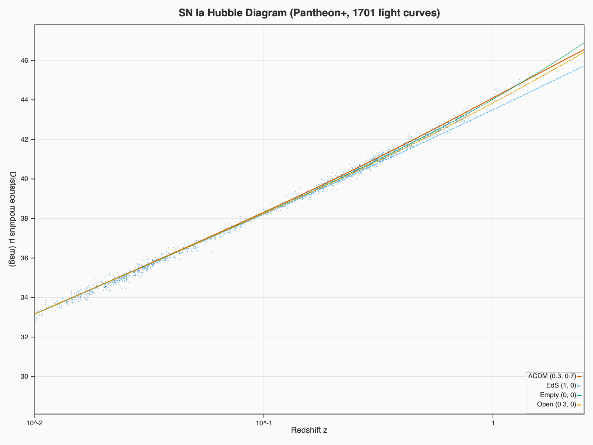
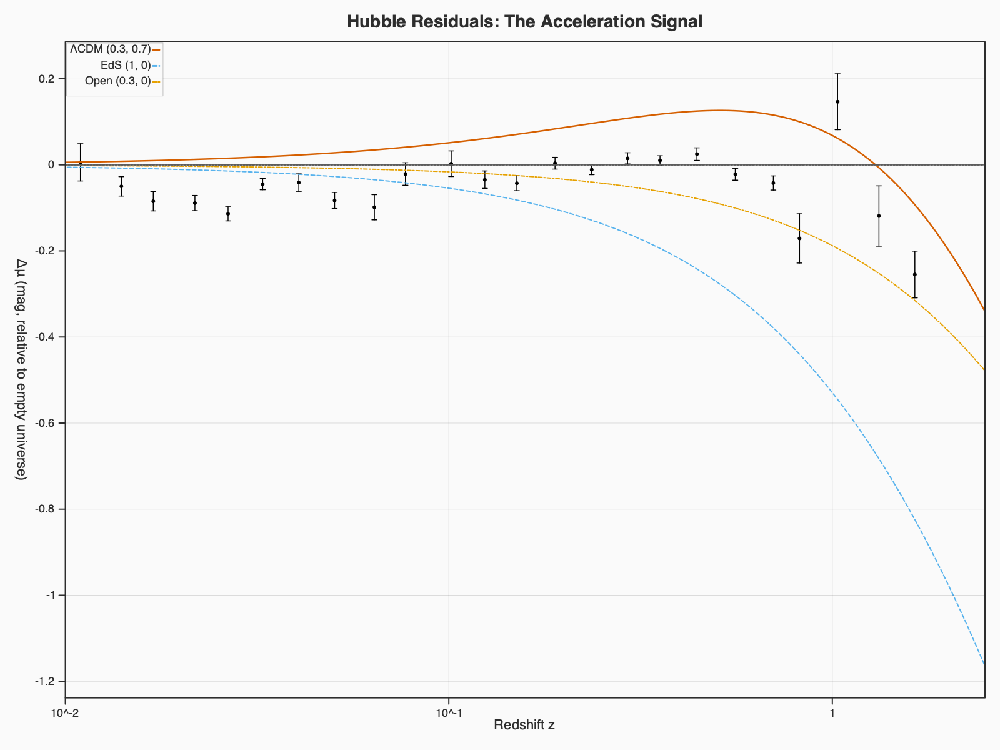
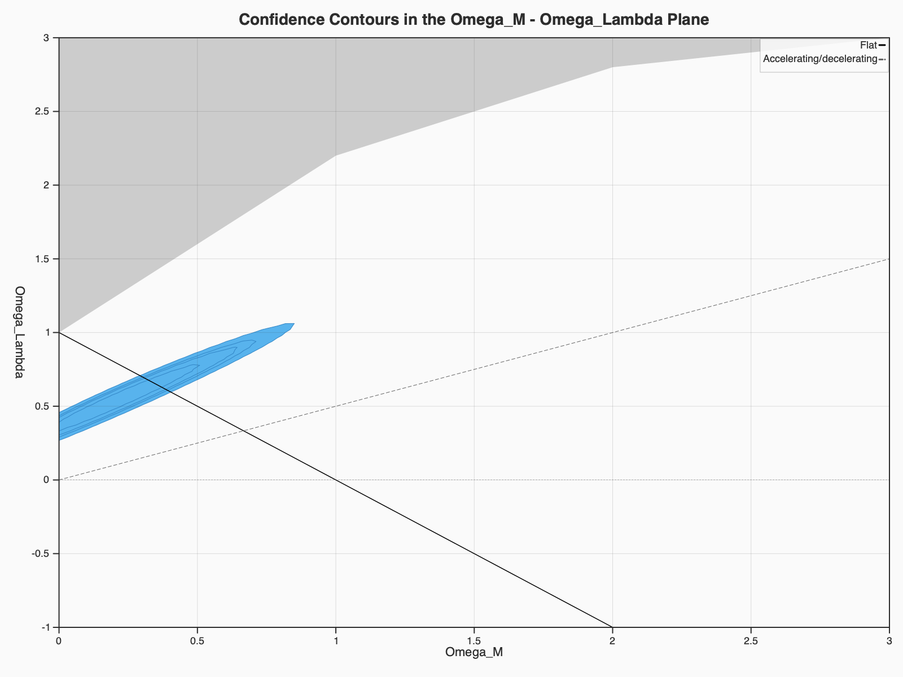
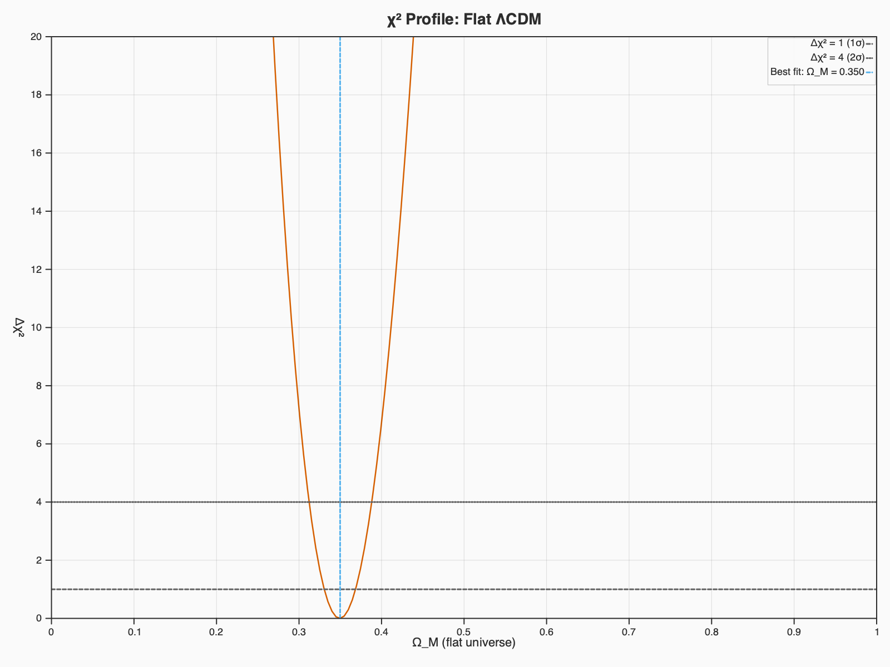

# The Accelerating Universe

Reproducing the key result of Perlmutter et al. (1999), "Measurements of
$\Omega$ and $\Lambda$ from 42 High-Redshift Supernovae" (ApJ 517, 565) --
the Nobel Prize-winning discovery that the expansion of the universe is
accelerating.

We use the modern Pantheon+ dataset (Scolnic et al. 2022, 1701 SNe Ia spanning
$0.001 < z < 2.26$) which extends the original 42 supernovae and confirms the
result with far greater precision.

<!-- quill:cell id="c_intro" -->
## Background

Type Ia supernovae (SNe Ia) are "standardizable candles": after correcting for
the correlation between peak luminosity and light-curve width, they have
remarkably uniform absolute magnitudes. This lets us measure their distances
through the **distance modulus**:

$$\mu = m - M = 5 \log_{10}\!\left(\frac{d_L}{\text{Mpc}}\right) + 25$$

where $d_L$ is the luminosity distance, which depends on the cosmological
parameters $\Omega_M$ (matter density) and $\Omega_\Lambda$ (dark energy
density). In 1998--1999, two independent teams (the Supernova Cosmology Project
and the High-z Supernova Search Team) found that distant SNe Ia are **fainter
than expected** in a decelerating universe -- implying that the expansion is
accelerating, driven by a cosmological constant or dark energy.

We reproduce three key results:
1. The **Hubble diagram** ($\mu$ vs $z$) with cosmological model curves
2. **Residuals** relative to an empty universe, showing the acceleration signal
3. **Confidence contours** in the $\Omega_M$--$\Omega_\Lambda$ plane

<!-- quill:cell id="c_setup" -->
## Setup


<!-- quill:cell id="c_arrnj4crg3br" -->
```ocaml
#require "umbra";;

open Nx
open Umbra

let f64 = Nx.float64
let f32 = Nx.float32
```
<!-- quill:output -->
<!-- out:stdout -->
val f64 : (float, Nx.float64_elt) Nx.dtype = Nx.Float64
val f32 : (float, Nx.float32_elt) Nx.dtype = Nx.Float32
<!-- /quill:output -->

## Loading the Pantheon+ data

The Pantheon+ compilation (Scolnic et al. 2022) provides standardized distance
moduli for 1701 SN Ia light curves from 18 surveys. We load the data file
(downloaded by `download_data.sh`) and extract redshift, distance modulus, and
the diagonal error (for plotting; full cosmological fits require the covariance
matrix).


<!-- quill:cell id="c_data" -->
```ocaml
let df = Talon_csv.read ~sep:' ' "data/Pantheon+SH0ES.dat"

let () =
  Printf.printf "Loaded %d light curves, %d columns\n"
    (Talon.num_rows df) (List.length (Talon.column_names df))
```
<!-- quill:output -->
<!-- out:stdout -->
Loaded 1701 light curves, 47 columns
val df : Talon.t =
  
<!-- out:display text/html -->
<table>
<thead><tr><th>CID</th><th>IDSURVEY</th><th>zHD</th><th>zHDERR</th><th>zCMB</th><th>zCMBERR</th><th>zHEL</th><th>zHELERR</th><th>m_b_corr</th><th>m_b_corr_err_DIAG</th><th>…</th></tr></thead>
<tbody>
<tr><td>2011fe</td><td>51</td><td>0.00122</td><td>0.00084</td><td>0.00122</td><td>2e-05</td><td>0.00082</td><td>2e-05</td><td>9.74571</td><td>1.51621</td><td>…</td></tr>
<tr><td>2011fe</td><td>56</td><td>0.00122</td><td>0.00084</td><td>0.00122</td><td>2e-05</td><td>0.00082</td><td>2e-05</td><td>9.80286</td><td>1.51723</td><td>…</td></tr>
<tr><td>2012cg</td><td>51</td><td>0.00256</td><td>0.00084</td><td>0.00256</td><td>2e-05</td><td>0.00144</td><td>2e-05</td><td>11.4703</td><td>0.781906</td><td>…</td></tr>
<tr><td>2012cg</td><td>56</td><td>0.00256</td><td>0.00084</td><td>0.00256</td><td>2e-05</td><td>0.00144</td><td>2e-05</td><td>11.4919</td><td>0.798612</td><td>…</td></tr>
<tr><td>1994DRichmond</td><td>50</td><td>0.00299</td><td>0.00084</td><td>0.00299</td><td>4e-05</td><td>0.00187</td><td>4e-05</td><td>11.5227</td><td>0.880798</td><td>…</td></tr>
<tr><td>1981B</td><td>50</td><td>0.00317</td><td>0.00084</td><td>0.0035</td><td>1e-05</td><td>0.00236</td><td>1e-05</td><td>11.5416</td><td>0.613941</td><td>…</td></tr>
<tr><td>2013aa</td><td>56</td><td>0.00331</td><td>0.00085</td><td>0.00478</td><td>0.00015</td><td>0.00411</td><td>0.00015</td><td>11.2074</td><td>0.59407</td><td>…</td></tr>
<tr><td>2013aa</td><td>5</td><td>0.00331</td><td>0.00085</td><td>0.00478</td><td>0.00015</td><td>0.00411</td><td>0.00015</td><td>11.2998</td><td>0.579622</td><td>…</td></tr>
<tr><td>2017cbv</td><td>5</td><td>0.00331</td><td>0.00085</td><td>0.00478</td><td>0.00015</td><td>0.00411</td><td>0.00015</td><td>11.1483</td><td>0.577815</td><td>…</td></tr>
<tr><td>2017cbv</td><td>18</td><td>0.00331</td><td>0.00085</td><td>0.00478</td><td>0.00015</td><td>0.00411</td><td>0.00015</td><td>11.2577</td><td>0.577916</td><td>…</td></tr>
<tr><td>2001el</td><td>50</td><td>0.00333</td><td>0.00084</td><td>0.00357</td><td>1e-05</td><td>0.00379</td><td>1e-05</td><td>12.2481</td><td>0.590389</td><td>…</td></tr>
<tr><td>2011by</td><td>51</td><td>0.00349</td><td>0.00084</td><td>0.00369</td><td>2e-05</td><td>0.00313</td><td>2e-05</td><td>12.5403</td><td>0.55206</td><td>…</td></tr>
<tr><td>1998aq</td><td>50</td><td>0.00349</td><td>0.00084</td><td>0.00369</td><td>1e-05</td><td>0.00313</td><td>1e-05</td><td>12.2437</td><td>0.544824</td><td>…</td></tr>
<tr><td>1990N</td><td>50</td><td>0.00359</td><td>0.00084</td><td>0.00462</td><td>2e-05</td><td>0.00355</td><td>2e-05</td><td>12.4439</td><td>0.550332</td><td>…</td></tr>
<tr><td>2021pit</td><td>56</td><td>0.00384</td><td>0.00084</td><td>0.00366</td><td>1e-05</td><td>0.00388</td><td>1e-05</td><td>11.7469</td><td>0.565861</td><td>…</td></tr>
<tr><td>2005df</td><td>50</td><td>0.00407</td><td>0.00084</td><td>0.00435</td><td>1e-05</td><td>0.00435</td><td>1e-05</td><td>12.1403</td><td>0.475638</td><td>…</td></tr>
<tr><td>2005df_ANU</td><td>50</td><td>0.00407</td><td>0.00084</td><td>0.00435</td><td>1e-05</td><td>0.00435</td><td>1e-05</td><td>12.1249</td><td>0.478515</td><td>…</td></tr>
<tr><td>2013dy</td><td>51</td><td>0.00432</td><td>0.00084</td><td>0.00293</td><td>0.00012</td><td>0.00394</td><td>0.00012</td><td>12.246</td><td>0.513549</td><td>…</td></tr>
<tr><td>2013dy</td><td>56</td><td>0.00432</td><td>0.00084</td><td>0.00293</td><td>0.00012</td><td>0.00394</td><td>0.00012</td><td>12.3081</td><td>0.530151</td><td>…</td></tr>
<tr><td>2012ht</td><td>56</td><td>0.00465</td><td>0.00084</td><td>0.00465</td><td>2e-05</td><td>0.00352</td><td>2e-05</td><td>12.6779</td><td>0.441191</td><td>…</td></tr>
<tr><td>…</td><td>…</td><td>…</td><td>…</td><td>…</td><td>…</td><td>…</td><td>…</td><td>…</td><td>…</td><td>…</td></tr>
</tbody>
</table>
<p><small>1701 rows × 47 columns</small></p>
<!-- /quill:output -->

<!-- quill:cell id="c_extract" -->
```ocaml
let col name =
  Talon.get_column_exn df name |> Talon.Col.to_tensor f64 |> Option.get

let sn_z = col "zHD"
let sn_mu = col "MU_SH0ES"
let sn_mu_err = col "MU_SH0ES_ERR_DIAG"

let () =
  let n = (Nx.shape sn_z).(0) in
  Printf.printf "%d SNe Ia, z in [%.4f, %.3f]\n" n
    (Nx.item [] (Nx.min sn_z)) (Nx.item [] (Nx.max sn_z))
```
<!-- quill:output -->
<!-- out:stdout -->
1701 SNe Ia, z in [0.0012, 2.261]
val col : string -> (float, Nx.float64_elt) Nx.t = <fun>
val sn_z : (float, Nx.float64_elt) Nx.t = float64 [1701] 
  [0.00122, 0.00122, ..., 1.91165, 2.26137]
val sn_mu : (float, Nx.float64_elt) Nx.t = float64 [1701] 
  [28.9987, 29.0559, ..., 45.4233, 46.1828]
val sn_mu_err : (float, Nx.float64_elt) Nx.t = float64 [1701] 
  [1.51645, 1.51747, ..., 0.358642, 0.281309]
<!-- /quill:output -->

## Cosmological models

We compute the theoretical distance modulus $\mu(z)$ for several cosmologies
to compare with the data. The key insight from Perlmutter et al. is that the
data prefer $\Omega_\Lambda > 0$ (accelerating expansion) over
$\Omega_\Lambda = 0$ (decelerating expansion).

The models we compare:
- **Best-fit $\Lambda$CDM**: $(\Omega_M, \Omega_\Lambda) = (0.3, 0.7)$, $H_0 = 70$
- **Einstein--de Sitter**: $(\Omega_M, \Omega_\Lambda) = (1, 0)$ -- matter-only, decelerating
- **Empty (Milne)**: $(\Omega_M, \Omega_\Lambda) = (0, 0)$ -- coasting, no gravity
- **Open CDM**: $(\Omega_M, \Omega_\Lambda) = (0.3, 0)$ -- matter only, curved


<!-- quill:cell id="c_models" -->
```ocaml
let h0 = 70.0

let p_lcdm = Cosmo.lcdm ~h0 ~omega_m:0.3 ~omega_l:0.7
let p_edsit = Cosmo.lcdm ~h0 ~omega_m:1.0 ~omega_l:0.0
let p_empty = Cosmo.lcdm ~h0 ~omega_m:0.01 ~omega_l:0.0
let p_open = Cosmo.lcdm ~h0 ~omega_m:0.3 ~omega_l:0.0

let n_grid = 200
let z_grid = Nx.logspace f64 (-2.5) 0.4 n_grid  (* z ~ 0.003 to 2.5 *)

let mu_of_model p =
  Nx.init f64 [| n_grid |] (fun idx ->
    let z = Nx.scalar f64 (Nx.item [idx.(0)] z_grid) in
    Nx.item [] (Cosmo.distance_modulus ~p z))

let mu_lcdm = mu_of_model p_lcdm
let mu_edsit = mu_of_model p_edsit
let mu_empty = mu_of_model p_empty
let mu_open = mu_of_model p_open

let () = Printf.printf "Theory curves computed for %d redshift points\n" n_grid
```
<!-- quill:output -->
<!-- out:stdout -->
Theory curves computed for 200 redshift points
val h0 : float = 70.
val p_lcdm : Umbra.Cosmo.params = <abstr>
val p_edsit : Umbra.Cosmo.params = <abstr>
val p_empty : Umbra.Cosmo.params = <abstr>
val p_open : Umbra.Cosmo.params = <abstr>
val n_grid : int = 200
val z_grid : (float, Nx.float64_elt) Nx.t = float64 [200] 
  [0.00316228, 0.00327019, ..., 2.429, 2.51189]
val mu_of_model : Umbra.Cosmo.params -> (float, Nx.float64_elt) Nx.t = <fun>
val mu_lcdm : (float, Nx.float64_elt) Nx.t = float64 [200] 
  [30.6639, 30.737, ..., 46.4718, 46.5603]
val mu_edsit : (float, Nx.float64_elt) Nx.t = float64 [200] 
  [30.6603, 30.7332, ..., 45.6533, 45.7352]
val mu_empty : (float, Nx.float64_elt) Nx.t = float64 [200] 
  [30.662, 30.735, ..., 46.7919, 46.9042]
val mu_open : (float, Nx.float64_elt) Nx.t = float64 [200] 
  [30.6615, 30.7345, ..., 46.3264, 46.4235]
<!-- /quill:output -->

## The Hubble diagram

The Hubble diagram plots distance modulus $\mu$ against redshift $z$. Distant
supernovae ($z > 0.3$) are systematically fainter than predicted by
decelerating models (Einstein--de Sitter, Open CDM), showing that the expansion
has been **accelerating**.


<!-- quill:cell id="c_hubble" -->
```ocaml
let to32 t = Nx.astype f32 t

let _fig =
  Hugin.layers [
    Hugin.point ~x:(to32 sn_z) ~y:(to32 sn_mu)
      ~color:(Hugin.Color.with_alpha 0.3 Hugin.Color.blue)
      ~size:2.0 ~marker:Hugin.Circle () ;
    Hugin.line ~x:(to32 z_grid) ~y:(to32 mu_lcdm)
      ~color:Hugin.Color.vermillion ~line_width:2.5
      ~label:"ΛCDM (0.3, 0.7)" () ;
    Hugin.line ~x:(to32 z_grid) ~y:(to32 mu_edsit)
      ~color:Hugin.Color.sky_blue ~line_width:2.0
      ~line_style:`Dashed ~label:"EdS (1, 0)" () ;
    Hugin.line ~x:(to32 z_grid) ~y:(to32 mu_empty)
      ~color:Hugin.Color.green ~line_width:2.0
      ~line_style:`Dotted ~label:"Empty (0, 0)" () ;
    Hugin.line ~x:(to32 z_grid) ~y:(to32 mu_open)
      ~color:Hugin.Color.orange ~line_width:2.0
      ~line_style:`Dash_dot ~label:"Open (0.3, 0)" () ;
  ]
  |> Hugin.xscale `Log
  |> Hugin.xlim 0.01 2.5
  |> Hugin.xlabel "Redshift z"
  |> Hugin.ylabel "Distance modulus μ (mag)"
  |> Hugin.title "SN Ia Hubble Diagram (Pantheon+, 1701 light curves)"
  |> Hugin.legend ~loc:Hugin.Lower_right
  |> Hugin.grid_lines true
```
<!-- quill:output -->
<!-- out:stdout -->
val to32 : ('a, 'b) Nx.t -> (float, Nx.float32_elt) Nx.t = <fun>
val _fig : Hugin.t =
  
<!-- out:display image/png -->

<!-- /quill:output -->

## Residuals: the acceleration signal

Residuals $\Delta\mu = \mu_\text{obs} - \mu_\text{empty}(z)$ relative to an
empty (coasting) universe isolate the acceleration signal. Positive residuals
at high redshift mean supernovae are **fainter than expected** -- i.e. farther
away than in a coasting universe. This is the direct evidence for cosmic
acceleration.

We bin the data in redshift to show the trend clearly.


<!-- quill:cell id="c_residual" -->
```ocaml
let sn_mu_empty =
  let n = (Nx.shape sn_z).(0) in
  Nx.init f64 [| n |] (fun idx ->
    let z = Nx.scalar f64 (Nx.item [idx.(0)] sn_z) in
    Nx.item [] (Cosmo.distance_modulus ~p:p_empty z))

let sn_residual = Nx.sub sn_mu sn_mu_empty

(* Model residuals on the grid *)
let res_lcdm = Nx.sub mu_lcdm mu_empty
let res_edsit = Nx.sub mu_edsit mu_empty
let res_open = Nx.sub mu_open mu_empty

(* Bin the residuals using Talon grouping *)
let n_bins = 25
let log_z_min = Float.log10 0.01
let log_z_max = Float.log10 2.3
let bin_width = (log_z_max -. log_z_min) /. Float.of_int n_bins

let bin_df =
  let df = Talon.create [
    "z", Talon.Col.of_tensor sn_z;
    "res", Talon.Col.of_tensor sn_residual;
  ] in
  let df = Talon.filter_by df Talon.Row.(map (number "z") ~f:(fun z -> z > 0.01)) in
  Talon.with_column df "bin" f64 Talon.Row.(
       map (number "z") ~f:(fun z ->
         let b = int_of_float ((Float.log10 z -. log_z_min) /. bin_width) in
         Float.of_int (Int.max 0 (Int.min (n_bins - 1) b))))

let groups =
  Talon.group_by bin_df Talon.Row.(map (number "bin") ~f:int_of_float)
  |> List.filter (fun (_, g) -> Talon.num_rows g > 2)
  |> List.sort (fun (a, _) (b, _) -> Int.compare a b)

let n_groups = List.length groups
let bz = Nx.create f32 [| n_groups |]
  (Array.of_list (List.map (fun (_, g) -> Talon.Agg.mean g "z") groups))
let bmu = Nx.create f32 [| n_groups |]
  (Array.of_list (List.map (fun (_, g) -> Talon.Agg.mean g "res") groups))
let berr = Nx.create f32 [| n_groups |]
  (Array.of_list (List.map (fun (_, g) ->
    Talon.Agg.std g "res"
    /. Float.sqrt (Float.of_int (Talon.num_rows g - 1))) groups))
```
<!-- quill:output -->
<!-- out:stdout -->
val sn_mu_empty : (float, Nx.float64_elt) Nx.t = float64 [1701] 
  [28.5917, 28.5917, ..., 46.007, 46.5544]
val sn_residual : (float, Nx.float64_elt) Nx.t = float64 [1701] 
  [0.40697, 0.46417, ..., -0.583671, -0.371643]
val res_lcdm : (float, Nx.float64_elt) Nx.t = float64 [200] 
  [0.00189584, 0.00196019, ..., -0.320084, -0.343972]
val res_edsit : (float, Nx.float64_elt) Nx.t = float64 [200] 
  [-0.00170018, -0.00175822, ..., -1.13865, -1.16906]
val res_open : (float, Nx.float64_elt) Nx.t = float64 [200] 
  [-0.000498446, -0.000515476, ..., -0.465507, -0.480768]
val n_bins : int = 25
val log_z_min : float = -2.
val log_z_max : float = 0.361727836017592841
val bin_width : float = 0.094469113440703717
val bin_df : Talon.t =
  
<!-- out:display text/html -->
<table>
<thead><tr><th>z</th><th>res</th><th>bin</th></tr></thead>
<tbody>
<tr><td>0.01016</td><td>-0.424629577679</td><td>0.</td></tr>
<tr><td>0.01017</td><td>-0.287976550182</td><td>0.</td></tr>
<tr><td>0.01017</td><td>-0.238776550182</td><td>0.</td></tr>
<tr><td>0.01026</td><td>0.112394684341</td><td>0.</td></tr>
<tr><td>0.01026</td><td>-0.000105315659297</td><td>0.</td></tr>
<tr><td>0.01028</td><td>0.0491444208064</td><td>0.</td></tr>
<tr><td>0.01042</td><td>-0.135579053456</td><td>0.</td></tr>
<tr><td>0.01044</td><td>-0.17646444435</td><td>0.</td></tr>
<tr><td>0.01061</td><td>0.0819784530003</td><td>0.</td></tr>
<tr><td>0.01061</td><td>-0.0055215469997</td><td>0.</td></tr>
<tr><td>0.01073</td><td>-0.215072175983</td><td>0.</td></tr>
<tr><td>0.01079</td><td>-0.267045255969</td><td>0.</td></tr>
<tr><td>0.01079</td><td>-0.154445255969</td><td>0.</td></tr>
<tr><td>0.01096</td><td>0.201426552503</td><td>0.</td></tr>
<tr><td>0.01114</td><td>0.328659998161</td><td>0.</td></tr>
<tr><td>0.01114</td><td>0.231859998161</td><td>0.</td></tr>
<tr><td>0.01122</td><td>0.414035730767</td><td>0.</td></tr>
<tr><td>0.01122</td><td>0.0129357307671</td><td>0.</td></tr>
<tr><td>0.01122</td><td>0.0740357307671</td><td>0.</td></tr>
<tr><td>0.01155</td><td>0.0993356408497</td><td>0.</td></tr>
<tr><td>…</td><td>…</td><td>…</td></tr>
</tbody>
</table>
<p><small>1590 rows × 3 columns</small></p>
<!-- out:stdout -->

val groups : (int * Talon.t) list =
  [(0,
    
<!-- out:display text/html -->
<table>
<thead><tr><th>z</th><th>res</th><th>bin</th></tr></thead>
<tbody>
<tr><td>0.01016</td><td>-0.424629577679</td><td>0.</td></tr>
<tr><td>0.01017</td><td>-0.287976550182</td><td>0.</td></tr>
<tr><td>0.01017</td><td>-0.238776550182</td><td>0.</td></tr>
<tr><td>0.01026</td><td>0.112394684341</td><td>0.</td></tr>
<tr><td>0.01026</td><td>-0.000105315659297</td><td>0.</td></tr>
<tr><td>0.01028</td><td>0.0491444208064</td><td>0.</td></tr>
<tr><td>0.01042</td><td>-0.135579053456</td><td>0.</td></tr>
<tr><td>0.01044</td><td>-0.17646444435</td><td>0.</td></tr>
<tr><td>0.01061</td><td>0.0819784530003</td><td>0.</td></tr>
<tr><td>0.01061</td><td>-0.0055215469997</td><td>0.</td></tr>
<tr><td>0.01073</td><td>-0.215072175983</td><td>0.</td></tr>
<tr><td>0.01079</td><td>-0.267045255969</td><td>0.</td></tr>
<tr><td>0.01079</td><td>-0.154445255969</td><td>0.</td></tr>
<tr><td>0.01096</td><td>0.201426552503</td><td>0.</td></tr>
<tr><td>0.01114</td><td>0.328659998161</td><td>0.</td></tr>
<tr><td>0.01114</td><td>0.231859998161</td><td>0.</td></tr>
<tr><td>0.01122</td><td>0.414035730767</td><td>0.</td></tr>
<tr><td>0.01122</td><td>0.0129357307671</td><td>0.</td></tr>
<tr><td>0.01122</td><td>0.0740357307671</td><td>0.</td></tr>
<tr><td>0.01155</td><td>0.0993356408497</td><td>0.</td></tr>
<tr><td>…</td><td>…</td><td>…</td></tr>
</tbody>
</table>
<p><small>24 rows × 3 columns</small></p>
<!-- out:stdout -->
);
   (1,
    
<!-- out:display text/html -->
<table>
<thead><tr><th>z</th><th>res</th><th>bin</th></tr></thead>
<tbody>
<tr><td>0.01246</td><td>0.178978224041</td><td>1.</td></tr>
<tr><td>0.01258</td><td>0.0374364117569</td><td>1.</td></tr>
<tr><td>0.01258</td><td>0.0540364117569</td><td>1.</td></tr>
<tr><td>0.01259</td><td>-0.084899767747</td><td>1.</td></tr>
<tr><td>0.01259</td><td>-0.154499767747</td><td>1.</td></tr>
<tr><td>0.01279</td><td>0.0424614815497</td><td>1.</td></tr>
<tr><td>0.01283</td><td>-0.0770620111033</td><td>1.</td></tr>
<tr><td>0.01283</td><td>-0.210762011103</td><td>1.</td></tr>
<tr><td>0.01303</td><td>-0.0118654606603</td><td>1.</td></tr>
<tr><td>0.01303</td><td>0.0133345393397</td><td>1.</td></tr>
<tr><td>0.01304</td><td>-0.173842071152</td><td>1.</td></tr>
<tr><td>0.01304</td><td>-0.181742071152</td><td>1.</td></tr>
<tr><td>0.01312</td><td>-0.242409144024</td><td>1.</td></tr>
<tr><td>0.01312</td><td>-0.290709144024</td><td>1.</td></tr>
<tr><td>0.01325</td><td>0.184241133384</td><td>1.</td></tr>
<tr><td>0.01325</td><td>0.200641133384</td><td>1.</td></tr>
<tr><td>0.01325</td><td>0.140741133384</td><td>1.</td></tr>
<tr><td>0.01375</td><td>-0.0679294440597</td><td>1.</td></tr>
<tr><td>0.01375</td><td>-0.0966294440597</td><td>1.</td></tr>
<tr><td>0.01375</td><td>-0.0929294440597</td><td>1.</td></tr>
<tr><td>…</td><td>…</td><td>…</td></tr>
</tbody>
</table>
<p><small>52 rows × 3 columns</small></p>
<!-- out:stdout -->
);
   (2,
    
<!-- out:display text/html -->
<table>
<thead><tr><th>z</th><th>res</th><th>bin</th></tr></thead>
<tbody>
<tr><td>0.01546</td><td>-0.0881971344432</td><td>2.</td></tr>
<tr><td>0.01549</td><td>0.14766106801</td><td>2.</td></tr>
<tr><td>0.0155</td><td>0.131148947175</td><td>2.</td></tr>
<tr><td>0.0155</td><td>0.0842489471753</td><td>2.</td></tr>
<tr><td>0.0155</td><td>-0.127551052825</td><td>2.</td></tr>
<tr><td>0.0155</td><td>-0.241751052825</td><td>2.</td></tr>
<tr><td>0.01557</td><td>-0.346610654758</td><td>2.</td></tr>
<tr><td>0.01557</td><td>-0.329610654758</td><td>2.</td></tr>
<tr><td>0.01562</td><td>0.0293736691777</td><td>2.</td></tr>
<tr><td>0.01562</td><td>-0.0136263308223</td><td>2.</td></tr>
<tr><td>0.01565</td><td>0.183674953401</td><td>2.</td></tr>
<tr><td>0.01576</td><td>0.00234770294004</td><td>2.</td></tr>
<tr><td>0.01578</td><td>-0.16752766025</td><td>2.</td></tr>
<tr><td>0.01578</td><td>-0.0964276602495</td><td>2.</td></tr>
<tr><td>0.01581</td><td>-0.177684167024</td><td>2.</td></tr>
<tr><td>0.01581</td><td>-0.269884167024</td><td>2.</td></tr>
<tr><td>0.01587</td><td>0.213026247358</td><td>2.</td></tr>
<tr><td>0.01588</td><td>-0.151252326051</td><td>2.</td></tr>
<tr><td>0.0159</td><td>-0.0164068904934</td><td>2.</td></tr>
<tr><td>0.0159</td><td>-0.0504068904934</td><td>2.</td></tr>
<tr><td>…</td><td>…</td><td>…</td></tr>
</tbody>
</table>
<p><small>72 rows × 3 columns</small></p>
<!-- out:stdout -->
);
   (3,
    
<!-- out:display text/html -->
<table>
<thead><tr><th>z</th><th>res</th><th>bin</th></tr></thead>
<tbody>
<tr><td>0.01947</td><td>0.148326584074</td><td>3.</td></tr>
<tr><td>0.01947</td><td>0.182126584074</td><td>3.</td></tr>
<tr><td>0.01975</td><td>0.0993213367396</td><td>3.</td></tr>
<tr><td>0.01975</td><td>0.0817213367396</td><td>3.</td></tr>
<tr><td>0.01976</td><td>0.0277114394619</td><td>3.</td></tr>
<tr><td>0.01995</td><td>-0.31497156999</td><td>3.</td></tr>
<tr><td>0.02001</td><td>-0.000956680793522</td><td>3.</td></tr>
<tr><td>0.02006</td><td>-0.17972935267</td><td>3.</td></tr>
<tr><td>0.02019</td><td>-0.198795323932</td><td>3.</td></tr>
<tr><td>0.02019</td><td>-0.00399532393241</td><td>3.</td></tr>
<tr><td>0.02023</td><td>-0.110835916616</td><td>3.</td></tr>
<tr><td>0.02023</td><td>-0.209135916616</td><td>3.</td></tr>
<tr><td>0.02023</td><td>-0.134335916616</td><td>3.</td></tr>
<tr><td>0.02023</td><td>-0.0621359166155</td><td>3.</td></tr>
<tr><td>0.02024</td><td>0.287380263147</td><td>3.</td></tr>
<tr><td>0.02034</td><td>0.0942711314822</td><td>3.</td></tr>
<tr><td>0.02034</td><td>-0.147328868518</td><td>3.</td></tr>
<tr><td>0.02035</td><td>-0.152406886052</td><td>3.</td></tr>
<tr><td>0.02035</td><td>-0.157706886052</td><td>3.</td></tr>
<tr><td>0.02035</td><td>-0.230206886052</td><td>3.</td></tr>
<tr><td>…</td><td>…</td><td>…</td></tr>
</tbody>
</table>
<p><small>92 rows × 3 columns</small></p>
<!-- out:stdout -->
);
   (4,
    
<!-- out:display text/html -->
<table>
<thead><tr><th>z</th><th>res</th><th>bin</th></tr></thead>
<tbody>
<tr><td>0.02388</td><td>-0.0795275874192</td><td>4.</td></tr>
<tr><td>0.0239</td><td>-0.187266827175</td><td>4.</td></tr>
<tr><td>0.0239</td><td>-0.0822668271749</td><td>4.</td></tr>
<tr><td>0.02391</td><td>-0.177885876584</td><td>4.</td></tr>
<tr><td>0.02401</td><td>0.0154444709488</td><td>4.</td></tr>
<tr><td>0.02411</td><td>0.00941249193803</td><td>4.</td></tr>
<tr><td>0.02411</td><td>-0.624387508062</td><td>4.</td></tr>
<tr><td>0.02412</td><td>-0.218198645962</td><td>4.</td></tr>
<tr><td>0.02417</td><td>-0.158848742089</td><td>4.</td></tr>
<tr><td>0.02417</td><td>-0.0169487420891</td><td>4.</td></tr>
<tr><td>0.02428</td><td>0.0693737074972</td><td>4.</td></tr>
<tr><td>0.02429</td><td>-0.0347311260491</td><td>4.</td></tr>
<tr><td>0.02432</td><td>-0.127443419316</td><td>4.</td></tr>
<tr><td>0.02432</td><td>-0.161543419316</td><td>4.</td></tr>
<tr><td>0.02432</td><td>0.117156580684</td><td>4.</td></tr>
<tr><td>0.02434</td><td>-0.106149778375</td><td>4.</td></tr>
<tr><td>0.02453</td><td>-0.125437393885</td><td>4.</td></tr>
<tr><td>0.02453</td><td>-0.0588373938845</td><td>4.</td></tr>
<tr><td>0.02453</td><td>-0.184137393885</td><td>4.</td></tr>
<tr><td>0.02457</td><td>0.0413818842716</td><td>4.</td></tr>
<tr><td>…</td><td>…</td><td>…</td></tr>
</tbody>
</table>
<p><small>112 rows × 3 columns</small></p>
<!-- out:stdout -->
);
   (5,
    
<!-- out:display text/html -->
<table>
<thead><tr><th>z</th><th>res</th><th>bin</th></tr></thead>
<tbody>
<tr><td>0.02969</td><td>-0.275399367382</td><td>5.</td></tr>
<tr><td>0.02978</td><td>-0.058667628548</td><td>5.</td></tr>
<tr><td>0.02978</td><td>-0.048567628548</td><td>5.</td></tr>
<tr><td>0.0299</td><td>-0.133627805804</td><td>5.</td></tr>
<tr><td>0.02996</td><td>0.287555242197</td><td>5.</td></tr>
<tr><td>0.03012</td><td>-0.0656808035682</td><td>5.</td></tr>
<tr><td>0.03012</td><td>-0.101380803568</td><td>5.</td></tr>
<tr><td>0.03012</td><td>-0.109080803568</td><td>5.</td></tr>
<tr><td>0.03023</td><td>-0.0747137430286</td><td>5.</td></tr>
<tr><td>0.03031</td><td>-0.0448378058181</td><td>5.</td></tr>
<tr><td>0.03036</td><td>-0.122370156394</td><td>5.</td></tr>
<tr><td>0.03047</td><td>-0.0761406185614</td><td>5.</td></tr>
<tr><td>0.03059</td><td>-0.260703391037</td><td>5.</td></tr>
<tr><td>0.03075</td><td>-0.278601806314</td><td>5.</td></tr>
<tr><td>0.03076</td><td>-0.0231184984297</td><td>5.</td></tr>
<tr><td>0.03083</td><td>-0.171728924107</td><td>5.</td></tr>
<tr><td>0.03086</td><td>-0.222272818751</td><td>5.</td></tr>
<tr><td>0.03091</td><td>-0.149641417105</td><td>5.</td></tr>
<tr><td>0.03096</td><td>0.00229566781329</td><td>5.</td></tr>
<tr><td>0.03108</td><td>0.26806774982</td><td>5.</td></tr>
<tr><td>…</td><td>…</td><td>…</td></tr>
</tbody>
</table>
<p><small>99 rows × 3 columns</small></p>
<!-- out:stdout -->
);
   (6,
    
<!-- out:display text/html -->
<table>
<thead><tr><th>z</th><th>res</th><th>bin</th></tr></thead>
<tbody>
<tr><td>0.03697</td><td>0.037370558993</td><td>6.</td></tr>
<tr><td>0.03702</td><td>-0.234817279977</td><td>6.</td></tr>
<tr><td>0.03702</td><td>-0.111717279977</td><td>6.</td></tr>
<tr><td>0.03702</td><td>0.0290827200227</td><td>6.</td></tr>
<tr><td>0.03702</td><td>0.0395827200227</td><td>6.</td></tr>
<tr><td>0.03705</td><td>-0.0785080806863</td><td>6.</td></tr>
<tr><td>0.03707</td><td>0.00409884352897</td><td>6.</td></tr>
<tr><td>0.03725</td><td>-0.047410467157</td><td>6.</td></tr>
<tr><td>0.03725</td><td>-0.061410467157</td><td>6.</td></tr>
<tr><td>0.0373</td><td>-0.187276253133</td><td>6.</td></tr>
<tr><td>0.0374</td><td>-0.0840961258395</td><td>6.</td></tr>
<tr><td>0.03753</td><td>-0.121668755977</td><td>6.</td></tr>
<tr><td>0.03756</td><td>0.260864344984</td><td>6.</td></tr>
<tr><td>0.03756</td><td>0.146064344984</td><td>6.</td></tr>
<tr><td>0.03787</td><td>-0.0843128672071</td><td>6.</td></tr>
<tr><td>0.0379</td><td>-0.0299641891915</td><td>6.</td></tr>
<tr><td>0.03796</td><td>-0.00696275219823</td><td>6.</td></tr>
<tr><td>0.03818</td><td>-0.214844515711</td><td>6.</td></tr>
<tr><td>0.03818</td><td>-0.246944515711</td><td>6.</td></tr>
<tr><td>0.03828</td><td>-0.00033051522886</td><td>6.</td></tr>
<tr><td>…</td><td>…</td><td>…</td></tr>
</tbody>
</table>
<p><small>61 rows × 3 columns</small></p>
<!-- out:stdout -->
);
   (7,
    
<!-- out:display text/html -->
<table>
<thead><tr><th>z</th><th>res</th><th>bin</th></tr></thead>
<tbody>
<tr><td>0.0459</td><td>-0.135594053043</td><td>7.</td></tr>
<tr><td>0.04625</td><td>-0.269958777154</td><td>7.</td></tr>
<tr><td>0.04631</td><td>0.00296267259202</td><td>7.</td></tr>
<tr><td>0.04643</td><td>-0.217483496434</td><td>7.</td></tr>
<tr><td>0.04656</td><td>-0.0402921381081</td><td>7.</td></tr>
<tr><td>0.04664</td><td>-0.0809044161309</td><td>7.</td></tr>
<tr><td>0.04682</td><td>-0.0821587037548</td><td>7.</td></tr>
<tr><td>0.04682</td><td>-0.0750587037548</td><td>7.</td></tr>
<tr><td>0.04691</td><td>0.193176209883</td><td>7.</td></tr>
<tr><td>0.04738</td><td>-0.0229677846992</td><td>7.</td></tr>
<tr><td>0.0476</td><td>0.00344066051645</td><td>7.</td></tr>
<tr><td>0.04777</td><td>-0.010780094188</td><td>7.</td></tr>
<tr><td>0.04777</td><td>-0.042680094188</td><td>7.</td></tr>
<tr><td>0.04819</td><td>-0.127231460348</td><td>7.</td></tr>
<tr><td>0.04837</td><td>-0.259617069447</td><td>7.</td></tr>
<tr><td>0.0486</td><td>-0.313360481081</td><td>7.</td></tr>
<tr><td>0.04865</td><td>-0.00494607201814</td><td>7.</td></tr>
<tr><td>0.04934</td><td>-0.0775548977512</td><td>7.</td></tr>
<tr><td>0.0494</td><td>-0.21085715033</td><td>7.</td></tr>
<tr><td>0.04944</td><td>-0.0989568708902</td><td>7.</td></tr>
<tr><td>…</td><td>…</td><td>…</td></tr>
</tbody>
</table>
<p><small>47 rows × 3 columns</small></p>
<!-- out:stdout -->
);
   (8,
    
<!-- out:display text/html -->
<table>
<thead><tr><th>z</th><th>res</th><th>bin</th></tr></thead>
<tbody>
<tr><td>0.05708</td><td>-0.0115206686667</td><td>8.</td></tr>
<tr><td>0.05728</td><td>0.0590741402491</td><td>8.</td></tr>
<tr><td>0.05824</td><td>-0.064625197056</td><td>8.</td></tr>
<tr><td>0.05824</td><td>-0.114325197056</td><td>8.</td></tr>
<tr><td>0.0583</td><td>-0.0945240955029</td><td>8.</td></tr>
<tr><td>0.05886</td><td>-0.0901701116884</td><td>8.</td></tr>
<tr><td>0.05886</td><td>0.0756298883116</td><td>8.</td></tr>
<tr><td>0.05974</td><td>-0.803417802658</td><td>8.</td></tr>
<tr><td>0.06092</td><td>-0.115228066137</td><td>8.</td></tr>
<tr><td>0.06099</td><td>0.0133048886582</td><td>8.</td></tr>
<tr><td>0.06099</td><td>0.0427048886582</td><td>8.</td></tr>
<tr><td>0.06121</td><td>-0.0195443596127</td><td>8.</td></tr>
<tr><td>0.06137</td><td>-0.202880711986</td><td>8.</td></tr>
<tr><td>0.06137</td><td>-0.194580711986</td><td>8.</td></tr>
<tr><td>0.06153</td><td>-0.0948022912486</td><td>8.</td></tr>
<tr><td>0.06372</td><td>0.103960473042</td><td>8.</td></tr>
<tr><td>0.06384</td><td>-0.232250654126</td><td>8.</td></tr>
<tr><td>0.06446</td><td>-0.194986434258</td><td>8.</td></tr>
<tr><td>0.06533</td><td>-0.218508110773</td><td>8.</td></tr>
<tr><td>0.06627</td><td>0.0260876633256</td><td>8.</td></tr>
<tr><td>…</td><td>…</td><td>…</td></tr>
</tbody>
</table>
<p><small>32 rows × 3 columns</small></p>
<!-- out:stdout -->
);
   (9,
    
<!-- out:display text/html -->
<table>
<thead><tr><th>z</th><th>res</th><th>bin</th></tr></thead>
<tbody>
<tr><td>0.07089</td><td>-0.0324754668871</td><td>9.</td></tr>
<tr><td>0.0709</td><td>0.242007811196</td><td>9.</td></tr>
<tr><td>0.07091</td><td>-0.116208867472</td><td>9.</td></tr>
<tr><td>0.07116</td><td>-0.140111813817</td><td>9.</td></tr>
<tr><td>0.07158</td><td>-0.259128451072</td><td>9.</td></tr>
<tr><td>0.07167</td><td>-0.0958508194342</td><td>9.</td></tr>
<tr><td>0.07193</td><td>0.0423148998275</td><td>9.</td></tr>
<tr><td>0.07222</td><td>0.103375550607</td><td>9.</td></tr>
<tr><td>0.07252</td><td>0.0846613871215</td><td>9.</td></tr>
<tr><td>0.07393</td><td>-0.0276218037538</td><td>9.</td></tr>
<tr><td>0.0744</td><td>-0.16077227092</td><td>9.</td></tr>
<tr><td>0.07446</td><td>-0.147085210939</td><td>9.</td></tr>
<tr><td>0.0752</td><td>-0.143129423208</td><td>9.</td></tr>
<tr><td>0.0752</td><td>-0.0538294232081</td><td>9.</td></tr>
<tr><td>0.0756</td><td>0.182834610902</td><td>9.</td></tr>
<tr><td>0.07575</td><td>-0.0897256482245</td><td>9.</td></tr>
<tr><td>0.07588</td><td>-0.00548430816918</td><td>9.</td></tr>
<tr><td>0.07845</td><td>-0.143184159753</td><td>9.</td></tr>
<tr><td>0.07859</td><td>0.112798691001</td><td>9.</td></tr>
<tr><td>0.07875</td><td>0.292116111885</td><td>9.</td></tr>
<tr><td>…</td><td>…</td><td>…</td></tr>
</tbody>
</table>
<p><small>33 rows × 3 columns</small></p>
<!-- out:stdout -->
);
   (10,
    
<!-- out:display text/html -->
<table>
<thead><tr><th>z</th><th>res</th><th>bin</th></tr></thead>
<tbody>
<tr><td>0.0887</td><td>-0.214759965462</td><td>10.</td></tr>
<tr><td>0.09039</td><td>-0.114490123038</td><td>10.</td></tr>
<tr><td>0.09089</td><td>-0.0202850975671</td><td>10.</td></tr>
<tr><td>0.09205</td><td>0.0842789146355</td><td>10.</td></tr>
<tr><td>0.09293</td><td>0.125110163521</td><td>10.</td></tr>
<tr><td>0.0995</td><td>0.185107403999</td><td>10.</td></tr>
<tr><td>0.10165</td><td>-0.00302391994575</td><td>10.</td></tr>
<tr><td>0.10221</td><td>0.0947708510874</td><td>10.</td></tr>
<tr><td>0.10246</td><td>-0.0681907017381</td><td>10.</td></tr>
<tr><td>0.10294</td><td>-0.148432610935</td><td>10.</td></tr>
<tr><td>0.10361</td><td>-0.0109079016729</td><td>10.</td></tr>
<tr><td>0.10374</td><td>-0.139664168122</td><td>10.</td></tr>
<tr><td>0.10507</td><td>0.0529089143211</td><td>10.</td></tr>
<tr><td>0.10661</td><td>-0.148665966028</td><td>10.</td></tr>
<tr><td>0.10707</td><td>0.0428133675802</td><td>10.</td></tr>
<tr><td>0.10711</td><td>0.00906130066566</td><td>10.</td></tr>
<tr><td>0.10713</td><td>0.359235381084</td><td>10.</td></tr>
<tr><td>0.10774</td><td>0.064581151469</td><td>10.</td></tr>
<tr><td>0.10794</td><td>-0.0363509057905</td><td>10.</td></tr>
<tr><td>0.10908</td><td>-0.0604317214155</td><td>10.</td></tr>
</tbody>
</table>
<p><small>20 rows × 3 columns</small></p>
<!-- out:stdout -->
);
   (11,
    
<!-- out:display text/html -->
<table>
<thead><tr><th>z</th><th>res</th><th>bin</th></tr></thead>
<tbody>
<tr><td>0.11001</td><td>0.0886813554461</td><td>11.</td></tr>
<tr><td>0.11259</td><td>0.0870049833038</td><td>11.</td></tr>
<tr><td>0.11388</td><td>-0.172851036977</td><td>11.</td></tr>
<tr><td>0.1165</td><td>-0.0717173699591</td><td>11.</td></tr>
<tr><td>0.11653</td><td>0.0170929257421</td><td>11.</td></tr>
<tr><td>0.1176</td><td>-0.0613460214423</td><td>11.</td></tr>
<tr><td>0.11792</td><td>-0.031472958122</td><td>11.</td></tr>
<tr><td>0.11818</td><td>-0.229620528577</td><td>11.</td></tr>
<tr><td>0.11901</td><td>-0.0984636003687</td><td>11.</td></tr>
<tr><td>0.12014</td><td>-0.0872353293955</td><td>11.</td></tr>
<tr><td>0.12058</td><td>0.101178454287</td><td>11.</td></tr>
<tr><td>0.12086</td><td>-0.0619431118695</td><td>11.</td></tr>
<tr><td>0.12207</td><td>-0.125106114742</td><td>11.</td></tr>
<tr><td>0.12231</td><td>-0.112215348847</td><td>11.</td></tr>
<tr><td>0.12278</td><td>-0.0476216623284</td><td>11.</td></tr>
<tr><td>0.12316</td><td>-0.143318307083</td><td>11.</td></tr>
<tr><td>0.12357</td><td>-0.13125195377</td><td>11.</td></tr>
<tr><td>0.12377</td><td>0.0495330304242</td><td>11.</td></tr>
<tr><td>0.12383</td><td>0.0717196359588</td><td>11.</td></tr>
<tr><td>0.12393</td><td>-0.103934884938</td><td>11.</td></tr>
<tr><td>…</td><td>…</td><td>…</td></tr>
</tbody>
</table>
<p><small>38 rows × 3 columns</small></p>
<!-- out:stdout -->
);
   (12,
    
<!-- out:display text/html -->
<table>
<thead><tr><th>z</th><th>res</th><th>bin</th></tr></thead>
<tbody>
<tr><td>0.13614</td><td>0.00634512405369</td><td>12.</td></tr>
<tr><td>0.13658</td><td>-0.130706237119</td><td>12.</td></tr>
<tr><td>0.137</td><td>0.0242022119563</td><td>12.</td></tr>
<tr><td>0.13713</td><td>-0.0258886328085</td><td>12.</td></tr>
<tr><td>0.13745</td><td>0.35822685965</td><td>12.</td></tr>
<tr><td>0.13822</td><td>-0.12008128119</td><td>12.</td></tr>
<tr><td>0.13826</td><td>-0.0561499783706</td><td>12.</td></tr>
<tr><td>0.1384</td><td>0.0141110181508</td><td>12.</td></tr>
<tr><td>0.13851</td><td>0.0294747952992</td><td>12.</td></tr>
<tr><td>0.13875</td><td>-0.0147267381425</td><td>12.</td></tr>
<tr><td>0.1388</td><td>0.0312404310394</td><td>12.</td></tr>
<tr><td>0.13955</td><td>-0.0066181867595</td><td>12.</td></tr>
<tr><td>0.14082</td><td>0.128628511143</td><td>12.</td></tr>
<tr><td>0.14104</td><td>0.231016921037</td><td>12.</td></tr>
<tr><td>0.14123</td><td>-0.0148979084376</td><td>12.</td></tr>
<tr><td>0.14134</td><td>0.0663005741243</td><td>12.</td></tr>
<tr><td>0.14325</td><td>-0.0414714699277</td><td>12.</td></tr>
<tr><td>0.14345</td><td>0.423697521</td><td>12.</td></tr>
<tr><td>0.14359</td><td>0.0195383381869</td><td>12.</td></tr>
<tr><td>0.14404</td><td>-0.0256092965459</td><td>12.</td></tr>
<tr><td>…</td><td>…</td><td>…</td></tr>
</tbody>
</table>
<p><small>64 rows × 3 columns</small></p>
<!-- out:stdout -->
);
   (13,
    
<!-- out:display text/html -->
<table>
<thead><tr><th>z</th><th>res</th><th>bin</th></tr></thead>
<tbody>
<tr><td>0.16924</td><td>0.0389733472685</td><td>13.</td></tr>
<tr><td>0.16971</td><td>0.189083761363</td><td>13.</td></tr>
<tr><td>0.17042</td><td>-0.0185879074946</td><td>13.</td></tr>
<tr><td>0.17124</td><td>0.0383736768909</td><td>13.</td></tr>
<tr><td>0.17169</td><td>-0.0498724221099</td><td>13.</td></tr>
<tr><td>0.17256</td><td>-0.0199123832614</td><td>13.</td></tr>
<tr><td>0.1727</td><td>-0.25631246117</td><td>13.</td></tr>
<tr><td>0.17297</td><td>0.19872715637</td><td>13.</td></tr>
<tr><td>0.17331</td><td>-0.145074641558</td><td>13.</td></tr>
<tr><td>0.17374</td><td>0.00231747862402</td><td>13.</td></tr>
<tr><td>0.17378</td><td>-0.189222107681</td><td>13.</td></tr>
<tr><td>0.17392</td><td>0.0581902517402</td><td>13.</td></tr>
<tr><td>0.17417</td><td>0.0296229858146</td><td>13.</td></tr>
<tr><td>0.1742</td><td>-0.212480783249</td><td>13.</td></tr>
<tr><td>0.17438</td><td>-0.0413020372001</td><td>13.</td></tr>
<tr><td>0.17443</td><td>0.00732580573651</td><td>13.</td></tr>
<tr><td>0.17444</td><td>-0.062508604123</td><td>13.</td></tr>
<tr><td>0.17498</td><td>0.188743907993</td><td>13.</td></tr>
<tr><td>0.17666</td><td>-0.0606712840265</td><td>13.</td></tr>
<tr><td>0.17713</td><td>-0.0738066505178</td><td>13.</td></tr>
<tr><td>…</td><td>…</td><td>…</td></tr>
</tbody>
</table>
<p><small>117 rows × 3 columns</small></p>
<!-- out:stdout -->
);
   (14,
    
<!-- out:display text/html -->
<table>
<thead><tr><th>z</th><th>res</th><th>bin</th></tr></thead>
<tbody>
<tr><td>0.21037</td><td>-0.53515754654</td><td>14.</td></tr>
<tr><td>0.21084</td><td>-0.031562219736</td><td>14.</td></tr>
<tr><td>0.21095</td><td>-0.190002164661</td><td>14.</td></tr>
<tr><td>0.21114</td><td>-0.0429424845705</td><td>14.</td></tr>
<tr><td>0.21134</td><td>0.14110646419</td><td>14.</td></tr>
<tr><td>0.21174</td><td>-0.0372897541268</td><td>14.</td></tr>
<tr><td>0.212</td><td>-0.0942081001471</td><td>14.</td></tr>
<tr><td>0.21225</td><td>-0.0732110933607</td><td>14.</td></tr>
<tr><td>0.2135</td><td>-0.00278059242427</td><td>14.</td></tr>
<tr><td>0.21365</td><td>-0.0178518660398</td><td>14.</td></tr>
<tr><td>0.21398</td><td>-0.142524867022</td><td>14.</td></tr>
<tr><td>0.2144</td><td>-0.0166920577869</td><td>14.</td></tr>
<tr><td>0.21507</td><td>-0.159519939026</td><td>14.</td></tr>
<tr><td>0.21521</td><td>0.420530657906</td><td>14.</td></tr>
<tr><td>0.21578</td><td>0.175431938785</td><td>14.</td></tr>
<tr><td>0.2165</td><td>-0.232502482431</td><td>14.</td></tr>
<tr><td>0.21689</td><td>0.00510984041876</td><td>14.</td></tr>
<tr><td>0.21692</td><td>0.0307803130448</td><td>14.</td></tr>
<tr><td>0.21742</td><td>0.0715943550243</td><td>14.</td></tr>
<tr><td>0.21794</td><td>-0.0793987415813</td><td>14.</td></tr>
<tr><td>…</td><td>…</td><td>…</td></tr>
</tbody>
</table>
<p><small>142 rows × 3 columns</small></p>
<!-- out:stdout -->
);
   (15,
    
<!-- out:display text/html -->
<table>
<thead><tr><th>z</th><th>res</th><th>bin</th></tr></thead>
<tbody>
<tr><td>0.26141</td><td>-0.063389305081</td><td>15.</td></tr>
<tr><td>0.26162</td><td>-0.0941332792955</td><td>15.</td></tr>
<tr><td>0.26172</td><td>0.174141517223</td><td>15.</td></tr>
<tr><td>0.26173</td><td>0.16764901455</td><td>15.</td></tr>
<tr><td>0.26175</td><td>-0.121535981157</td><td>15.</td></tr>
<tr><td>0.26184</td><td>0.179131697137</td><td>15.</td></tr>
<tr><td>0.262</td><td>0.205752656004</td><td>15.</td></tr>
<tr><td>0.26303</td><td>0.738750935002</td><td>15.</td></tr>
<tr><td>0.26323</td><td>0.111609861946</td><td>15.</td></tr>
<tr><td>0.2636</td><td>-0.130892774852</td><td>15.</td></tr>
<tr><td>0.26393</td><td>0.0251761002073</td><td>15.</td></tr>
<tr><td>0.26397</td><td>-0.230491074865</td><td>15.</td></tr>
<tr><td>0.26408</td><td>0.0991994542632</td><td>15.</td></tr>
<tr><td>0.26419</td><td>-0.0286096346745</td><td>15.</td></tr>
<tr><td>0.2646</td><td>-0.0244674248267</td><td>15.</td></tr>
<tr><td>0.26463</td><td>0.131857822634</td><td>15.</td></tr>
<tr><td>0.26582</td><td>0.0577820584371</td><td>15.</td></tr>
<tr><td>0.26583</td><td>-0.226609147044</td><td>15.</td></tr>
<tr><td>0.2664</td><td>-0.266102716605</td><td>15.</td></tr>
<tr><td>0.267</td><td>-0.0153587433182</td><td>15.</td></tr>
<tr><td>…</td><td>…</td><td>…</td></tr>
</tbody>
</table>
<p><small>150 rows × 3 columns</small></p>
<!-- out:stdout -->
);
   (16,
    
<!-- out:display text/html -->
<table>
<thead><tr><th>z</th><th>res</th><th>bin</th></tr></thead>
<tbody>
<tr><td>0.32548</td><td>0.180663773592</td><td>16.</td></tr>
<tr><td>0.3256</td><td>0.214952098223</td><td>16.</td></tr>
<tr><td>0.3258</td><td>0.114833307567</td><td>16.</td></tr>
<tr><td>0.32581</td><td>-0.00134261005185</td><td>16.</td></tr>
<tr><td>0.32632</td><td>-0.00261164522524</td><td>16.</td></tr>
<tr><td>0.32804</td><td>-0.0658203680861</td><td>16.</td></tr>
<tr><td>0.32842</td><td>0.23901384648</td><td>16.</td></tr>
<tr><td>0.32848</td><td>0.281661625296</td><td>16.</td></tr>
<tr><td>0.32851</td><td>-0.135564457581</td><td>16.</td></tr>
<tr><td>0.32868</td><td>0.000754754949696</td><td>16.</td></tr>
<tr><td>0.32868</td><td>0.0291547549497</td><td>16.</td></tr>
<tr><td>0.32871</td><td>-0.143471204838</td><td>16.</td></tr>
<tr><td>0.32907</td><td>-0.017181284091</td><td>16.</td></tr>
<tr><td>0.32941</td><td>0.334561631049</td><td>16.</td></tr>
<tr><td>0.32952</td><td>0.161934844394</td><td>16.</td></tr>
<tr><td>0.32968</td><td>0.0247326862566</td><td>16.</td></tr>
<tr><td>0.32995</td><td>-0.235994772669</td><td>16.</td></tr>
<tr><td>0.33047</td><td>0.146304669334</td><td>16.</td></tr>
<tr><td>0.33056</td><td>0.082430130099</td><td>16.</td></tr>
<tr><td>0.33063</td><td>0.0834056020207</td><td>16.</td></tr>
<tr><td>…</td><td>…</td><td>…</td></tr>
</tbody>
</table>
<p><small>130 rows × 3 columns</small></p>
<!-- out:stdout -->
);
   (17,
    
<!-- out:display text/html -->
<table>
<thead><tr><th>z</th><th>res</th><th>bin</th></tr></thead>
<tbody>
<tr><td>0.40368</td><td>0.0305227159842</td><td>17.</td></tr>
<tr><td>0.40463</td><td>0.0832671563379</td><td>17.</td></tr>
<tr><td>0.40483</td><td>-0.255385075024</td><td>17.</td></tr>
<tr><td>0.4055</td><td>0.183823918891</td><td>17.</td></tr>
<tr><td>0.40646</td><td>0.0885295187297</td><td>17.</td></tr>
<tr><td>0.40895</td><td>0.0818394810777</td><td>17.</td></tr>
<tr><td>0.4092</td><td>0.120588849089</td><td>17.</td></tr>
<tr><td>0.40935</td><td>0.0852588703231</td><td>17.</td></tr>
<tr><td>0.40949</td><td>0.0566911608651</td><td>17.</td></tr>
<tr><td>0.41004</td><td>0.0584848294338</td><td>17.</td></tr>
<tr><td>0.41123</td><td>0.0295285142735</td><td>17.</td></tr>
<tr><td>0.4114</td><td>0.199979142478</td><td>17.</td></tr>
<tr><td>0.41161</td><td>0.178283386575</td><td>17.</td></tr>
<tr><td>0.41266</td><td>0.148013322853</td><td>17.</td></tr>
<tr><td>0.41657</td><td>0.0642467660022</td><td>17.</td></tr>
<tr><td>0.41857</td><td>-0.0600359425703</td><td>17.</td></tr>
<tr><td>0.41936</td><td>0.00406598556371</td><td>17.</td></tr>
<tr><td>0.41939</td><td>-0.222016063038</td><td>17.</td></tr>
<tr><td>0.4196</td><td>0.182509917202</td><td>17.</td></tr>
<tr><td>0.41965</td><td>0.114106661782</td><td>17.</td></tr>
<tr><td>…</td><td>…</td><td>…</td></tr>
</tbody>
</table>
<p><small>97 rows × 3 columns</small></p>
<!-- out:stdout -->
);
   (18,
    
<!-- out:display text/html -->
<table>
<thead><tr><th>z</th><th>res</th><th>bin</th></tr></thead>
<tbody>
<tr><td>0.50282</td><td>0.0115974630251</td><td>18.</td></tr>
<tr><td>0.50285</td><td>-0.0792578980026</td><td>18.</td></tr>
<tr><td>0.50306</td><td>-0.00224520003424</td><td>18.</td></tr>
<tr><td>0.50316</td><td>-0.00676282447449</td><td>18.</td></tr>
<tr><td>0.50593</td><td>-0.0864656605981</td><td>18.</td></tr>
<tr><td>0.50615</td><td>-0.0622987115987</td><td>18.</td></tr>
<tr><td>0.50725</td><td>0.0635424328218</td><td>18.</td></tr>
<tr><td>0.50739</td><td>0.0689229785269</td><td>18.</td></tr>
<tr><td>0.50825</td><td>-0.15809275328</td><td>18.</td></tr>
<tr><td>0.51016</td><td>-0.0926766588196</td><td>18.</td></tr>
<tr><td>0.51095</td><td>-0.132914123298</td><td>18.</td></tr>
<tr><td>0.51169</td><td>0.193508853341</td><td>18.</td></tr>
<tr><td>0.51387</td><td>0.0506093976964</td><td>18.</td></tr>
<tr><td>0.51437</td><td>0.0172694047828</td><td>18.</td></tr>
<tr><td>0.51469</td><td>0.11564493179</td><td>18.</td></tr>
<tr><td>0.51726</td><td>-0.130069979609</td><td>18.</td></tr>
<tr><td>0.51883</td><td>-0.0362931904153</td><td>18.</td></tr>
<tr><td>0.51885</td><td>-0.0488939890317</td><td>18.</td></tr>
<tr><td>0.51941</td><td>0.00968501476334</td><td>18.</td></tr>
<tr><td>0.51968</td><td>0.0550258324352</td><td>18.</td></tr>
<tr><td>…</td><td>…</td><td>…</td></tr>
</tbody>
</table>
<p><small>96 rows × 3 columns</small></p>
<!-- out:stdout -->
);
   (19,
    
<!-- out:display text/html -->
<table>
<thead><tr><th>z</th><th>res</th><th>bin</th></tr></thead>
<tbody>
<tr><td>0.62525</td><td>-0.0676927812368</td><td>19.</td></tr>
<tr><td>0.62725</td><td>-0.148965950221</td><td>19.</td></tr>
<tr><td>0.63077</td><td>-0.0857981161031</td><td>19.</td></tr>
<tr><td>0.63183</td><td>-0.442410797453</td><td>19.</td></tr>
<tr><td>0.63225</td><td>0.094002948885</td><td>19.</td></tr>
<tr><td>0.63399</td><td>-0.165486457732</td><td>19.</td></tr>
<tr><td>0.63777</td><td>-0.248879776508</td><td>19.</td></tr>
<tr><td>0.63794</td><td>0.0843028521275</td><td>19.</td></tr>
<tr><td>0.63824</td><td>-0.121262699059</td><td>19.</td></tr>
<tr><td>0.63873</td><td>-0.00232867361532</td><td>19.</td></tr>
<tr><td>0.63934</td><td>0.00470128976596</td><td>19.</td></tr>
<tr><td>0.64185</td><td>0.0517482101598</td><td>19.</td></tr>
<tr><td>0.64311</td><td>-0.440236071775</td><td>19.</td></tr>
<tr><td>0.64371</td><td>-0.00444929008427</td><td>19.</td></tr>
<tr><td>0.64371</td><td>-0.000249290084263</td><td>19.</td></tr>
<tr><td>0.6477</td><td>-0.00131150843364</td><td>19.</td></tr>
<tr><td>0.64852</td><td>0.215975033203</td><td>19.</td></tr>
<tr><td>0.6487</td><td>-0.0909737694835</td><td>19.</td></tr>
<tr><td>0.64962</td><td>-0.0477982164029</td><td>19.</td></tr>
<tr><td>0.66213</td><td>0.0994509027894</td><td>19.</td></tr>
<tr><td>…</td><td>…</td><td>…</td></tr>
</tbody>
</table>
<p><small>76 rows × 3 columns</small></p>
<!-- out:stdout -->
);
   (20,
    
<!-- out:display text/html -->
<table>
<thead><tr><th>z</th><th>res</th><th>bin</th></tr></thead>
<tbody>
<tr><td>0.77929</td><td>-0.286728045808</td><td>20.</td></tr>
<tr><td>0.78807</td><td>-0.0531352325948</td><td>20.</td></tr>
<tr><td>0.78907</td><td>0.0228403967112</td><td>20.</td></tr>
<tr><td>0.78928</td><td>-0.162099242024</td><td>20.</td></tr>
<tr><td>0.79662</td><td>-0.484747596675</td><td>20.</td></tr>
<tr><td>0.79863</td><td>0.039436351798</td><td>20.</td></tr>
<tr><td>0.83981</td><td>-0.174927172808</td><td>20.</td></tr>
<tr><td>0.83981</td><td>-0.333727172808</td><td>20.</td></tr>
<tr><td>0.85482</td><td>0.0320794309533</td><td>20.</td></tr>
<tr><td>0.93585</td><td>-0.308388644025</td><td>20.</td></tr>
</tbody>
</table>
<p><small>10 rows × 3 columns</small></p>
<!-- out:stdout -->
);
   (21,
    
<!-- out:display text/html -->
<table>
<thead><tr><th>z</th><th>res</th><th>bin</th></tr></thead>
<tbody>
<tr><td>0.97423</td><td>0.154450661289</td><td>21.</td></tr>
<tr><td>1.01242</td><td>0.0501694564944</td><td>21.</td></tr>
<tr><td>1.01988</td><td>0.186919560833</td><td>21.</td></tr>
<tr><td>1.02088</td><td>-0.121019067405</td><td>21.</td></tr>
<tr><td>1.02789</td><td>0.42494712992</td><td>21.</td></tr>
<tr><td>1.04817</td><td>0.254697417559</td><td>21.</td></tr>
<tr><td>1.12092</td><td>0.0759845634931</td><td>21.</td></tr>
</tbody>
</table>
<p><small>7 rows × 3 columns</small></p>
<!-- out:stdout -->
);
   (22,
    
<!-- out:display text/html -->
<table>
<thead><tr><th>z</th><th>res</th><th>bin</th></tr></thead>
<tbody>
<tr><td>1.23225</td><td>-0.324587237938</td><td>22.</td></tr>
<tr><td>1.23597</td><td>0.250701908425</td><td>22.</td></tr>
<tr><td>1.29911</td><td>0.0602023436219</td><td>22.</td></tr>
<tr><td>1.3041</td><td>-0.0948606170644</td><td>22.</td></tr>
<tr><td>1.30611</td><td>0.199592161811</td><td>22.</td></tr>
<tr><td>1.31317</td><td>-0.0496838731239</td><td>22.</td></tr>
<tr><td>1.3291</td><td>0.00165723209277</td><td>22.</td></tr>
<tr><td>1.34101</td><td>-0.145764204634</td><td>22.</td></tr>
<tr><td>1.35136</td><td>-0.373984554953</td><td>22.</td></tr>
<tr><td>1.35608</td><td>-0.124370205399</td><td>22.</td></tr>
<tr><td>1.39103</td><td>-0.216813113651</td><td>22.</td></tr>
<tr><td>1.41633</td><td>-0.608368865186</td><td>22.</td></tr>
</tbody>
</table>
<p><small>12 rows × 3 columns</small></p>
<!-- out:stdout -->
);
   (23,
    
<!-- out:display text/html -->
<table>
<thead><tr><th>z</th><th>res</th><th>bin</th></tr></thead>
<tbody>
<tr><td>1.5429</td><td>-0.239796061037</td><td>23.</td></tr>
<tr><td>1.54901</td><td>-0.0492647551793</td><td>23.</td></tr>
<tr><td>1.61505</td><td>-0.312860625322</td><td>23.</td></tr>
<tr><td>1.69706</td><td>-0.341579608953</td><td>23.</td></tr>
<tr><td>1.80119</td><td>-0.33004923418</td><td>23.</td></tr>
</tbody>
</table>
<p><small>5 rows × 3 columns</small></p>
<!-- out:stdout -->
)]
val n_groups : int = 24
val bz : (float, Nx.float32_elt) Nx.t = float32 [24] 
  [0.0109479, 0.0140023, ..., 1.32297, 1.64104]
val bmu : (float, Nx.float32_elt) Nx.t = float32 [24] 
  [0.00578864, -0.0499531, ..., -0.118857, -0.25471]
val berr : (float, Nx.float32_elt) Nx.t = float32 [24] 
  [0.043205, 0.0225362, ..., 0.070028, 0.0543295]
<!-- /quill:output -->

<!-- quill:cell id="c_residual_plot" -->
```ocaml
let _fig =
  Hugin.layers [
    Hugin.errorbar ~x:bz ~y:bmu ~yerr:(`Symmetric berr)
      ~color:Hugin.Color.black ~cap_size:4.0 ~line_width:1.5 () ;
    Hugin.point ~x:bz ~y:bmu
      ~color:Hugin.Color.black ~size:5.0 ~marker:Hugin.Circle () ;
    Hugin.line ~x:(to32 z_grid) ~y:(to32 res_lcdm)
      ~color:Hugin.Color.vermillion ~line_width:2.5
      ~label:"ΛCDM (0.3, 0.7)" () ;
    Hugin.line ~x:(to32 z_grid) ~y:(to32 res_edsit)
      ~color:Hugin.Color.sky_blue ~line_width:2.0
      ~line_style:`Dashed ~label:"EdS (1, 0)" () ;
    Hugin.line ~x:(to32 z_grid) ~y:(to32 res_open)
      ~color:Hugin.Color.orange ~line_width:2.0
      ~line_style:`Dash_dot ~label:"Open (0.3, 0)" () ;
    Hugin.hline ~y:0.0 ~line_style:`Dotted ~color:Hugin.Color.gray () ;
  ]
  |> Hugin.xscale `Log
  |> Hugin.xlim 0.01 2.5
  |> Hugin.xlabel "Redshift z"
  |> Hugin.ylabel "Δμ (mag, relative to empty universe)"
  |> Hugin.title "Hubble Residuals: The Acceleration Signal"
  |> Hugin.legend ~loc:Hugin.Upper_left
  |> Hugin.grid_lines true
```
<!-- quill:output -->
<!-- out:stdout -->
val _fig : Hugin.t =
  
<!-- out:display image/png -->

<!-- /quill:output -->

## Confidence contours in the $\Omega_M$--$\Omega_\Lambda$ plane

Following Perlmutter et al. (1999, Fig. 7), we scan a grid of
$(\Omega_M, \Omega_\Lambda)$ values and compute $\chi^2$ at each point. The
confidence contours are drawn at $\Delta\chi^2 = 2.30, 6.17, 11.8$ (68.3%,
95.4%, 99.7% for 2 parameters). We use only the Hubble-flow SNe ($z > 0.01$)
and the diagonal errors (sufficient for this visualization).


<!-- quill:cell id="c_chisq" -->
```ocaml
(* Filter Hubble-flow SNe using Talon *)
let hf =
  Talon.filter_by df Talon.Row.(
    map2 (number "zHD") (number "MU_SH0ES_ERR_DIAG")
      ~f:(fun z err -> z > 0.01 && err > 0.0 && err < 10.0))

let hf_col name =
  Talon.get_column_exn hf name |> Talon.Col.to_tensor f64 |> Option.get

let hf_z = hf_col "zHD"
let hf_mu = hf_col "MU_SH0ES"
let hf_w = Nx.recip (Nx.square (hf_col "MU_SH0ES_ERR_DIAG"))
let n_hf = (Nx.shape hf_z).(0)

let () = Printf.printf "Using %d Hubble-flow SNe for chi-squared grid\n" n_hf

(* Chi-squared for a given (omega_m, omega_l) with M marginalized analytically.
   chi2 = sum w_i (mu_i - mu_th(z_i) - M)^2
   Minimizing over M:  M* = sum(w_i * (mu_i - mu_th_i)) / sum(w_i)
   chi2_min = sum(w_i * d_i^2) - (sum(w_i * d_i))^2 / sum(w_i) *)
let hf_z_arr = Array.init n_hf (fun i -> Nx.item [i] hf_z)
let hf_mu_arr = Array.init n_hf (fun i -> Nx.item [i] hf_mu)
let hf_w_arr = Array.init n_hf (fun i -> Nx.item [i] hf_w)
let sum_w = Array.fold_left ( +. ) 0.0 hf_w_arr

(* Pure-float distance modulus via 16-point Gauss-Legendre quadrature.
   Avoids all tensor allocation in the chi2 hot loop. *)
let gl_n = [| -0.9894009349916499; -0.9445750230732326; -0.8656312023878318;
  -0.7554044083550030; -0.6178762444026438; -0.4580167776572274;
  -0.2816035507792589; -0.0950125098376374;  0.0950125098376374;
   0.2816035507792589;  0.4580167776572274;  0.6178762444026438;
   0.7554044083550030;  0.8656312023878318;  0.9445750230732326;
   0.9894009349916499 |]
let gl_wt = [| 0.0271524594117541; 0.0622535239386479; 0.0951585116824928;
  0.1246289712555339; 0.1495959888165767; 0.1691565193950025;
  0.1826034150449236; 0.1894506104550685; 0.1894506104550685;
  0.1826034150449236; 0.1691565193950025; 0.1495959888165767;
  0.1246289712555339; 0.0951585116824928; 0.0622535239386479;
  0.0271524594117541 |]

let dist_mod_f omega_m omega_l z =
  let c_over_h0 = 299792.458 /. 70.0 in
  let omega_k = 1.0 -. omega_m -. omega_l in
  let half_z = z *. 0.5 in
  let integral = ref 0.0 in
  for k = 0 to 15 do
    let zp = half_z *. gl_n.(k) +. half_z in
    let opz = 1.0 +. zp in
    let ez = Float.sqrt (omega_m *. opz *. opz *. opz
                         +. omega_k *. opz *. opz +. omega_l) in
    integral := !integral +. gl_wt.(k) /. ez
  done;
  let chi = c_over_h0 *. half_z *. !integral in
  let dl = (1.0 +. z) *. chi in
  5.0 /. Float.log 10.0 *. Float.log dl +. 25.0

let chi2_at omega_m omega_l =
  let sum_wd = ref 0.0 in
  let sum_wdd = ref 0.0 in
  let ok = ref true in
  for i = 0 to n_hf - 1 do
    let mu_th_i = dist_mod_f omega_m omega_l hf_z_arr.(i) in
    if Float.is_nan mu_th_i then ok := false
    else begin
      let d = hf_mu_arr.(i) -. mu_th_i in
      let w = hf_w_arr.(i) in
      sum_wd := !sum_wd +. w *. d;
      sum_wdd := !sum_wdd +. w *. d *. d
    end
  done;
  if not !ok then infinity
  else !sum_wdd -. (!sum_wd *. !sum_wd /. sum_w)

(* Scan the grid -- axis range matches Perlmutter 1999 Figure 7 *)
let n_om = 100
let n_ol = 100
let om_min = 0.0 and om_max = 3.0
let ol_min = -1.0 and ol_max = 3.0

let () = Printf.printf "Computing chi-squared on %dx%d grid...\n%!" n_om n_ol

let chi2_grid =
  Nx.init f64 [| n_ol; n_om |] (fun idx ->
    let j = idx.(0) and i = idx.(1) in
    let omega_m = om_min +. (Float.of_int i +. 0.5) *. (om_max -. om_min) /. Float.of_int n_om in
    let omega_l = ol_min +. (Float.of_int j +. 0.5) *. (ol_max -. ol_min) /. Float.of_int n_ol in
    if omega_m < 0.001 then 1e10
    else chi2_at omega_m omega_l)

let chi2_min = Nx.item [] (Nx.min chi2_grid)
let delta_chi2 = Nx.sub_s chi2_grid chi2_min

let () =
  let flat_idx = Int32.to_int (Nx.item [] (Nx.argmin chi2_grid)) in
  let best_i = flat_idx mod n_om in
  let best_j = flat_idx / n_om in
  let best_om = om_min +. (Float.of_int best_i +. 0.5) *. (om_max -. om_min) /. Float.of_int n_om in
  let best_ol = ol_min +. (Float.of_int best_j +. 0.5) *. (ol_max -. ol_min) /. Float.of_int n_ol in
  Printf.printf "Best fit: Omega_M = %.2f, Omega_Lambda = %.2f (chi2 = %.1f, dof ~ %d)\n"
    best_om best_ol chi2_min (n_hf - 1)
```
<!-- quill:output -->
<!-- out:stdout -->
Using 1590 Hubble-flow SNe for chi-squared grid
Computing chi-squared on 100x100 grid...
Best fit: Omega_M = 0.23, Omega_Lambda = 0.54 (chi2 = 684.2, dof ~ 1589)
val hf : Talon.t =
  
<!-- out:display text/html -->
<table>
<thead><tr><th>CID</th><th>IDSURVEY</th><th>zHD</th><th>zHDERR</th><th>zCMB</th><th>zCMBERR</th><th>zHEL</th><th>zHELERR</th><th>m_b_corr</th><th>m_b_corr_err_DIAG</th><th>…</th></tr></thead>
<tbody>
<tr><td>2013E</td><td>56</td><td>0.01016</td><td>0.00085</td><td>0.01042</td><td>8e-05</td><td>0.00936</td><td>8e-05</td><td>13.5264</td><td>0.3475</td><td>…</td></tr>
<tr><td>1999ac</td><td>57</td><td>0.01017</td><td>0.00084</td><td>0.00979</td><td>2e-05</td><td>0.00947</td><td>2e-05</td><td>13.6652</td><td>0.364224</td><td>…</td></tr>
<tr><td>1999ac</td><td>62</td><td>0.01017</td><td>0.00084</td><td>0.00979</td><td>2e-05</td><td>0.00947</td><td>2e-05</td><td>13.7144</td><td>0.34081</td><td>…</td></tr>
<tr><td>2009an</td><td>51</td><td>0.01026</td><td>0.00084</td><td>0.00921</td><td>1e-05</td><td>0.00887</td><td>1e-05</td><td>14.0848</td><td>0.305101</td><td>…</td></tr>
<tr><td>2009an</td><td>65</td><td>0.01026</td><td>0.00084</td><td>0.00921</td><td>1e-05</td><td>0.00887</td><td>1e-05</td><td>13.9723</td><td>0.297865</td><td>…</td></tr>
<tr><td>2006bh</td><td>5</td><td>0.01028</td><td>0.00086</td><td>0.01042</td><td>0.00015</td><td>0.01077</td><td>0.00015</td><td>14.0258</td><td>0.246478</td><td>…</td></tr>
<tr><td>2004S</td><td>57</td><td>0.01042</td><td>0.00084</td><td>0.0098</td><td>2e-05</td><td>0.0093</td><td>2e-05</td><td>13.8706</td><td>0.316076</td><td>…</td></tr>
<tr><td>2021hpr</td><td>57</td><td>0.01044</td><td>0.00084</td><td>0.00958</td><td>2e-05</td><td>0.00938</td><td>2e-05</td><td>13.8339</td><td>0.342855</td><td>…</td></tr>
<tr><td>2002dp</td><td>63</td><td>0.01061</td><td>0.00084</td><td>0.01049</td><td>1e-05</td><td>0.01169</td><td>1e-05</td><td>14.1276</td><td>0.307827</td><td>…</td></tr>
<tr><td>2002dp</td><td>57</td><td>0.01061</td><td>0.00084</td><td>0.01049</td><td>1e-05</td><td>0.01169</td><td>1e-05</td><td>14.0401</td><td>0.273239</td><td>…</td></tr>
<tr><td>1997do</td><td>62</td><td>0.01073</td><td>0.00084</td><td>0.01048</td><td>2e-05</td><td>0.01012</td><td>2e-05</td><td>13.8551</td><td>0.363667</td><td>…</td></tr>
<tr><td>1997bq</td><td>62</td><td>0.01079</td><td>0.00084</td><td>0.00993</td><td>2e-05</td><td>0.00973</td><td>2e-05</td><td>13.8153</td><td>0.322889</td><td>…</td></tr>
<tr><td>2008fv_comb</td><td>50</td><td>0.01079</td><td>0.00084</td><td>0.00993</td><td>2e-05</td><td>0.00973</td><td>2e-05</td><td>13.9279</td><td>0.377003</td><td>…</td></tr>
<tr><td>ASASSN-16jf</td><td>150</td><td>0.01096</td><td>0.00084</td><td>0.0104</td><td>1e-05</td><td>0.01144</td><td>1e-05</td><td>14.3179</td><td>0.313698</td><td>…</td></tr>
<tr><td>iPTF13ebh</td><td>56</td><td>0.01114</td><td>0.00085</td><td>0.01238</td><td>5e-05</td><td>0.01317</td><td>5e-05</td><td>14.4807</td><td>0.341421</td><td>…</td></tr>
<tr><td>iPTF13ebh</td><td>5</td><td>0.01114</td><td>0.00085</td><td>0.01238</td><td>5e-05</td><td>0.01317</td><td>5e-05</td><td>14.3839</td><td>0.293983</td><td>…</td></tr>
<tr><td>2010ko</td><td>56</td><td>0.01122</td><td>0.00084</td><td>0.01096</td><td>2e-05</td><td>0.01082</td><td>2e-05</td><td>14.5817</td><td>0.352878</td><td>…</td></tr>
<tr><td>2013ex</td><td>51</td><td>0.01122</td><td>0.00084</td><td>0.01096</td><td>2e-05</td><td>0.01082</td><td>2e-05</td><td>14.1806</td><td>0.282135</td><td>…</td></tr>
<tr><td>2013ex</td><td>56</td><td>0.01122</td><td>0.00084</td><td>0.01096</td><td>2e-05</td><td>0.01082</td><td>2e-05</td><td>14.2417</td><td>0.32405</td><td>…</td></tr>
<tr><td>2009ab</td><td>5</td><td>0.01155</td><td>0.00085</td><td>0.01189</td><td>8e-05</td><td>0.01219</td><td>8e-05</td><td>14.3303</td><td>0.27987</td><td>…</td></tr>
<tr><td>…</td><td>…</td><td>…</td><td>…</td><td>…</td><td>…</td><td>…</td><td>…</td><td>…</td><td>…</td><td>…</td></tr>
</tbody>
</table>
<p><small>1590 rows × 47 columns</small></p>
<!-- out:stdout -->

val hf_col : string -> (float, Nx.float64_elt) Nx.t = <fun>
val hf_z : (float, Nx.float64_elt) Nx.t = float64 [1590] 
  [0.01016, 0.01017, ..., 1.91165, 2.26137]
val hf_mu : (float, Nx.float64_elt) Nx.t = float64 [1590] 
  [32.7794, 32.9182, ..., 45.4233, 46.1828]
val hf_w : (float, Nx.float64_elt) Nx.t = float64 [1590] 
  [8.23147, 7.49694, ..., 7.77459, 12.6367]
val n_hf : int = 1590
val hf_z_arr : float array =
  [|0.01016; 0.01017; 0.01017; 0.01026; 0.01026; 0.01028; 0.01042; 0.01044;
    0.01061; 0.01061; 0.01073; 0.01079; 0.01079; 0.01096; 0.01114; 0.01114;
    0.01122; 0.01122; 0.01122; 0.01155; 0.01195; 0.01213; 0.0122; 0.01233;
    0.01246; 0.01258; 0.01258; 0.01259; 0.01259; 0.01279; 0.01283; 0.01283;
    0.01303; 0.01303; 0.01304; 0.01304; 0.01312; 0.01312; 0.01325; 0.01325;
    0.01325; 0.01375; 0.01375; 0.01375; 0.01376; 0.01386; 0.01388; 0.01389;
    0.01389; 0.01411; 0.01424; 0.01442; 0.01442; 0.01442; 0.01442; 0.01442;
    0.01446; 0.0145; 0.01453; 0.0146; 0.01462; 0.01463; 0.01463; 0.01467;
    0.01472; 0.01484; 0.01492; 0.01493; 0.01499; 0.01499; 0.01515; 0.01519;
    0.01525; 0.01529; 0.01542; 0.01543; 0.01546; 0.01549; 0.0155; 0.0155;
    0.0155; 0.0155; 0.01557; 0.01557; 0.01562; 0.01562; 0.01565; 0.01576;
    0.01578; 0.01578; 0.01581; 0.01581; 0.01587; 0.01588; 0.0159; 0.0159;
    0.0159; 0.01603; 0.01652; 0.01652; 0.01656; 0.01657; 0.01662; 0.01666;
    0.01671; 0.01678; 0.01682; 0.01682; 0.01682; 0.0169; 0.0169; 0.01692;
    0.01698; 0.01699; 0.01705; 0.01718; 0.01718; 0.0172; 0.0173; 0.0173;
    0.01733; 0.01733; 0.01734; 0.01737; 0.01737; 0.01743; 0.01747; 0.01747;
    0.01752; 0.01776; 0.01778; 0.01778; 0.01784; 0.01784; 0.0179; 0.01802;
    0.01808; 0.01826; 0.01826; 0.01839; 0.01855; 0.01855; 0.01865; 0.01865;
    0.01866; 0.01875; 0.01875; 0.01905; 0.01947; 0.01947; 0.01975; 0.01975;
    0.01976; 0.01995; 0.02001; 0.02006; 0.02019; 0.02019; 0.02023; 0.02023;
    0.02023; 0.02023; 0.02024; 0.02034; 0.02034; 0.02035; 0.02035; 0.02035;
    0.02044; 0.02049; 0.02052; 0.02056; 0.02056; 0.02081; 0.02082; 0.02082;
    0.0209; 0.02096; 0.02106; 0.02116; 0.02116; 0.02118; 0.02118; 0.02131;
    0.02131; 0.02131; 0.02134; 0.02137; 0.02151; 0.02153; 0.0217; 0.02183;
    0.02183; 0.02197; 0.02198; 0.02203; 0.02205; 0.02207; 0.02215; 0.02219;
    0.02228; 0.02228; 0.02231; 0.02234; 0.02234; 0.02236; 0.02239; 0.02239;
    0.0224; 0.0224; 0.02241; 0.02255; 0.02266; 0.0227; 0.02273; 0.02295;
    0.02295; 0.02298; 0.02298; 0.02303; 0.02307; 0.02313; 0.02316; 0.02321;
    0.02325; 0.02331; 0.02331; 0.02342; 0.02342; 0.02342; 0.02343; 0.02343;
    0.02344; 0.02352; 0.02354; 0.02357; 0.02357; 0.02357; 0.02365; 0.02369;
    0.02388; 0.0239; 0.0239; 0.02391; 0.02401; 0.02411; 0.02411; 0.02412;
    0.02417; 0.02417; 0.02428; 0.02429; 0.02432; 0.02432; 0.02432; 0.02434;
    0.02453; 0.02453; 0.02453; 0.02457; 0.02462; 0.02462; 0.02462; 0.02464;
    0.02464; 0.02466; 0.02491; 0.02494; 0.02509; 0.0251; 0.0251; 0.0251;
    0.0251; 0.02512; 0.02513; 0.02517; 0.02517; 0.02517; 0.02519; 0.02519;
    0.02521; 0.02525; 0.02525; 0.02534; 0.02534; 0.02556; 0.02557; 0.02585;
    0.02591; 0.02596; 0.02598; 0.02598; 0.02598; 0.02598; 0.02626; 0.02626;
    0.02632; 0.02669; 0.02691; ...|]
val hf_mu_arr : float array =
  [|32.7794; 32.9182; 32.9674; 33.3378; 33.2253; 33.2788; 33.1236; 33.0869;
    33.3806; 33.2931; 33.1081; 33.0683; 33.1809; 33.5709; 33.7337; 33.6369;
    33.8347; 33.4336; 33.4947; 33.5833; 33.4974; 33.8783; 33.7023; 33.7403;
    33.8286; 33.708; 33.7246; 33.5874; 33.5178; 33.7492; 33.6365; 33.5028;
    33.7355; 33.7607; 33.5752; 33.5673; 33.52; 33.4717; 33.9682; 33.9846;
    33.9247; 33.797; 33.7683; 33.772; 33.7649; 33.6741; 33.6968; 33.8053;
    33.6651; 33.8206; 33.8444; 34.0187; 34.0249; 34.3366; 34.1781; 34.252;
    33.9078; 34.1727; 33.7526; 33.8826; 33.9253; 33.7553; 33.7189; 33.8916;
    33.7894; 34.0109; 34.1902; 33.8524; 33.974; 33.9261; 33.8877; 34.1793;
    33.7706; 34.0334; 34.3426; 34.0744; 34.0331; 34.2732; 34.2581; 34.2112;
    33.9994; 33.8852; 33.7902; 33.8072; 34.1732; 34.1302; 34.3317; 34.1657;
    33.9986; 34.0697; 33.9926; 33.9004; 34.3916; 34.0287; 34.1663; 34.1323;
    34.0329; 34.1062; 34.4137; 33.9999; 34.1608; 33.9726; 34.2793; 34.3408;
    33.8985; 34.1679; 34.4649; 34.5341; 33.9673; 33.841; 33.8975; 34.4894;
    34.3409; 34.0755; 34.1973; 34.022; 34.2003; 34.6084; 34.1436; 34.1517;
    34.4009; 34.5101; 34.361; 34.31; 34.2669; 33.7799; 34.3228; 34.3133;
    34.1465; 34.2221; 34.3364; 34.2464; 34.2939; 34.2418; 34.2975; 34.2661;
    34.6078; 34.9792; 34.2005; 34.4393; 34.492; 34.576; 34.6171; 34.5716;
    34.6066; 34.5466; 34.4866; 34.4286; 34.7747; 34.8085; 34.757; 34.7394;
    34.6865; 34.3648; 34.6854; 34.5121; 34.5072; 34.702; 34.5995; 34.5012;
    34.576; 34.6482; 34.9988; 34.8165; 34.5749; 34.5709; 34.5656; 34.4931;
    34.6552; 35.1263; 34.556; 34.4168; 34.5647; 34.4863; 34.674; 34.6349;
    34.8118; 34.6956; 34.6693; 34.375; 34.8194; 35.118; 35.2056; 34.7561;
    34.7344; 34.7419; 34.7627; 34.3468; 34.5899; 34.6114; 34.7709; 34.7583;
    34.7742; 34.8589; 34.9654; 34.6739; 34.7477; 34.8847; 35.0481; 35.0136;
    34.8059; 34.8234; 34.9245; 34.7727; 34.8704; 34.7814; 34.7714; 34.8603;
    34.759; 34.7997; 35.0392; 34.7306; 34.8438; 34.8693; 34.6849; 35.2685;
    34.8584; 34.9992; 34.9712; 34.985; 34.7666; 35.0225; 34.883; 34.9168;
    35.0537; 34.6478; 34.4301; 34.9851; 35.0081; 34.9783; 34.8582; 34.8582;
    34.8331; 34.8391; 34.9998; 35.0406; 34.9509; 34.5715; 34.9543; 34.943;
    34.9949; 34.889; 34.994; 34.8993; 35.1018; 35.1049; 34.4711; 34.8782;
    34.9421; 35.084; 35.1803; 35.0771; 34.9871; 34.953; 35.2317; 35.0102;
    35.008; 35.0746; 34.9493; 35.1784; 35.1061; 35.0521; 34.8898; 34.9528;
    34.807; 34.8112; 35.0862; 35.1973; 35.2152; 34.8369; 34.8482; 35.079;
    35.009; 35.0276; 34.4583; 34.9117; 35.1989; 35.2277; 35.1139; 35.1145;
    34.9842; 34.9441; 34.9063; 35.1882; 35.1974; 35.1828; 35.0621; 34.7664;
    35.1181; 35.4014; 35.2931; 35.1081; 34.835; 35.3111; 35.2855; 35.3429;
    35.0223; 35.308; 35.2688; ...|]
val hf_w_arr : float array =
  [|8.23146814613716593; 7.4969352680999215; 8.55574221326686413;
    10.6591609759993187; 11.1791254824205311; 16.2654007737080022;
    9.93710117748064903; 8.45464229847009463; 10.4726778114779471;
    13.2645900552113254; 7.5197722886281948; 9.52504612371758519;
    6.99983232092770624; 10.0871977557366836; 8.52534214273321567;
    11.4738309842553772; 7.98393120275620927; 12.4487789115859133;
    9.45744263313261868; 12.6492602333561486; 11.0006818657807397;
    8.3347365445043; 14.0625703127636719; 15.4835677155751181;
    14.227591884866; 17.2516774910131865; 15.987591222375503;
    14.7860742788850779; 14.1129085551366398; 5.76023962347622742;
    12.1084887207242176; 9.1205006900497132; 17.3925484174557248;
    12.1218985292262946; 11.683103651051935; 12.3299901204144131;
    13.365063188000093; 14.6123881673806135; 10.8425251089593679;
    11.1557637660110593; 10.7776256002286637; 12.9527972436885257;
    18.4550886236199396; 17.9919475158734201; 11.9903729275141533;
    8.38375008416108436; 18.3362669046649529; 11.9893765286826248;
    11.3974938041915532; 15.8888386016909919; 14.1875346969754474;
    10.5967952266739616; 8.05528722258021723; 7.27645222224196;
    6.34775702674259801; 6.33731050419107; 17.2868421478877323;
    7.50490609740132886; 21.3740568964570166; 16.0879126286809289;
    16.8064771777973228; 6.55759480278037898; 6.48056420082261653;
    17.2611398525342; 6.33357902093675751; 13.69489137836125;
    7.20015441460373751; 12.9805322684816744; 18.9754652580740206;
    18.625928986051818; 11.4921195365949078; 14.0516078939454445;
    10.9506480889754076; 8.43554877406980452; 7.19189246515212055;
    10.0869414622828693; 19.4983479754138251; 8.63222933841724327;
    13.4641128131653112; 15.0148704932793411; 12.1982247035558142;
    10.146793599690735; 11.8434308491135152; 11.8582808284653058;
    14.3086498722222988; 8.94749089006965; 12.873171291985976;
    12.1506484441415417; 20.672995317749784; 11.8593426098531527;
    17.4644346112094517; 20.851416708835508; 13.6828374657754281;
    19.7840253229750367; 16.9500116927867452; 22.7904126118422568;
    13.4657927237540278; 12.6121817743929938; 8.3352659411483927;
    8.9251047074459; 21.0194316349305446; 5.79853079888242284;
    14.5772613757875487; 25.5016762892044468; 16.6077598589186302;
    16.4609255025734029; 7.78826881381891045; 8.56872028090763749;
    12.362786901820888; 11.9473092996875536; 14.2871324174975616;
    10.3847790563541444; 19.1715506082083955; 11.2747485236470109;
    21.741787484924366; 10.4736268288461609; 9.44831673156642182;
    20.6961375184077028; 12.5135089429374613; 15.1242634067501207;
    20.3458786329970458; 18.7015599950648692; 20.6077296866621609;
    14.3963000301706341; 14.520768051703806; 9.14760924209767445;
    24.9398587271691525; 25.5540420407535684; 18.6728015422666118;
    9.74052699653846; 22.6509220160585194; 21.9531684900774628;
    16.4439751191577166; 20.1324567073815182; 9.83237146373930848;
    18.2299477227476743; 24.6365123425761; 20.9496429577490275;
    12.7035098104889101; 19.4234861464175346; 15.3351298538964578;
    11.3947238832405269; 17.509040539551691; 17.3627026557141519;
    12.988673539837988; 21.5302476249783794; 9.70348417833172761;
    12.6278730549272478; 26.1901234656971589; 26.1558451309293041;
    4.59293241178748; 5.32095686553453; 6.05944007446558164;
    11.4346774646612896; 23.9645656337853978; 25.1289970704292536;
    18.27955215083119; 26.9972194699756898; 28.2005673569440063;
    11.4469833641548; 27.7291367056932039; 28.3439800971673748;
    28.3793238806152281; 17.1000589321468475; 7.0800382049997026;
    28.3814405615375804; 31.6626267020978887; 27.4834283515611411;
    21.7158579836266306; 7.08150786072332394; 8.96926295523383743;
    21.2058816479978; 16.0635486772255796; 9.15802089756929;
    18.7566768373479498; 15.4378524337368379; 11.0946109925032541;
    21.335767528888681; 18.7911672303113519; 24.2452796480947299;
    25.9182978468908658; 10.3599255061832096; 10.8133084385166747;
    30.6648936516269401; 31.8555650038301259; 28.3678374577575063;
    8.65199489673906541; 25.2493498917324288; 25.2070269959166922;
    6.46396662873246; 26.0672487054426796; 12.4466708843980065;
    15.5433263008844627; 16.4646661210180483; 21.2416677860634415;
    16.2873329914842024; 25.2277949897877924; 28.8960644281234629;
    12.0035869468058891; 21.4019504835921; 30.8025616050924036;
    15.0103333911976673; 34.6685262497122935; 25.2508724579438208;
    23.9167726307908026; 19.8123910920625654; 10.9170968668811543;
    16.9183741772662302; 11.9963539297717094; 15.3461854905195416;
    21.7290195082093263; 16.9154518357872767; 20.5587966414740855;
    24.1949786225266372; 7.78835575489808818; 10.7586857487961058;
    24.6854987844132197; 13.9889266783498822; 17.7608231677881321;
    27.4863101958301748; 8.63334537708151; 13.5941912097414512;
    13.2260260168708097; 31.3766650710703807; 18.9526720076696868;
    14.0314032315368173; 12.807834225708806; 12.5233417493347;
    20.3469799530605187; 19.6825161300159905; 14.7618831786326936;
    34.3446168784105055; 14.372949787259202; 21.4573053352920269;
    21.0965445810056522; 23.4345755202291386; 14.8926270517011119;
    14.5962029388981858; 13.3160449309237592; 22.718990622509434;
    30.5913289186968882; 6.13605093366510346; 12.9969161832653164;
    27.6045671236346415; 26.2947120504520981; 10.3837082466899;
    6.29789856614867727; 19.9179299665683978; 23.0504729450445041;
    29.6802504840401795; 18.5389364101218526; 26.1866389989169512;
    29.4897237317334593; 25.4911194943350203; 18.0761901209589091;
    24.5200237809392654; 38.0968922623001305; 22.6861065677917715;
    34.2502130892676817; 27.9615875110153667; 18.0223599013189144;
    18.6980019826901689; 18.2672101541450651; 21.8778636636524624;
    30.0375605276369; 9.91408611351553; 17.2822431119072597;
    19.1537670175515231; 13.8683272198277763; 12.0528115008079286;
    30.2168128321327174; 23.5658128966585103; 31.9593800666736279;
    27.6431867840131886; 9.00369113498522466; 10.6459491096232455;
    17.612506723563655; 23.941354096378312; 41.4573139679420777;
    32.7184654368981498; 29.1289053383799548; 17.2569811896428149;
    13.8128200856228514; 32.0274222366012324; 28.9246665418856;
    18.3059966853358169; 27.6492920330522622; 8.41661752676145625;
    24.9548113528369981; 24.8777005517676493; 31.0208268317396296;
    25.4453634768141832; 8.2424844909615409; 31.304378738480434;
    11.9805803972240117; 9.57136742791041328; 7.21284524967817653;
    31.0063188509245471; 29.7391957624394863; ...|]
val sum_w : float = 38213.713851628665
val gl_n : float array =
  [|-0.989400934991649939; -0.9445750230732326; -0.865631202387831755;
    -0.755404408355003; -0.617876244402643771; -0.458016777657227425;
    -0.281603550779258915; -0.0950125098376374; 0.0950125098376374;
    0.281603550779258915; 0.458016777657227425; 0.617876244402643771;
    0.755404408355003; 0.865631202387831755; 0.9445750230732326;
    0.989400934991649939|]
val gl_wt : float array =
  [|0.0271524594117541; 0.0622535239386479; 0.0951585116824928;
    0.124628971255533905; 0.149595988816576708; 0.169156519395002508;
    0.182603415044923612; 0.189450610455068502; 0.189450610455068502;
    0.182603415044923612; 0.169156519395002508; 0.149595988816576708;
    0.124628971255533905; 0.0951585116824928; 0.0622535239386479;
    0.0271524594117541|]
val dist_mod_f : float -> float -> float -> float = <fun>
val chi2_at : float -> float -> float = <fun>
val n_om : int = 100
val n_ol : int = 100
val om_min : float = 0.
val om_max : float = 3.
val ol_min : float = -1.
val ol_max : float = 3.
val chi2_grid : (float, Nx.float64_elt) Nx.t = float64 [100; 100] 
  [[1522.01, 1543.98, ..., 3820.7, 3844.02],
   [1484.88, 1506.67, ..., 3779.71, 3803.06],
   ...
   [inf, inf, ..., 877.663, 867.429],
   [inf, inf, ..., 902.83, 890.429]]
val chi2_min : float = 684.197413463096268
val delta_chi2 : (float, Nx.float64_elt) Nx.t = float64 [100; 100] 
  [[837.808, 859.782, ..., 3136.5, 3159.83],
   [800.684, 822.469, ..., 3095.52, 3118.86],
   ...
   [inf, inf, ..., 193.466, 183.232],
   [inf, inf, ..., 218.632, 206.232]]
<!-- /quill:output -->

## Contour plot

Reproducing Perlmutter et al. (1999) Figure 7. The contour levels correspond
to 68%, 90%, 95%, and 99% confidence regions for two parameters
($\Delta\chi^2 = 2.30, 4.61, 5.99, 9.21$). The diagonal solid line marks
**flat** universes ($\Omega_M + \Omega_\Lambda = 1$). The nearly horizontal
dashed line separates eternally expanding universes from those that eventually
recollapse. The upper-left gray region has no Big Bang.


<!-- quill:cell id="c_contour" -->
```ocaml
(* Confidence levels for 2 parameters:
   68% -> delta_chi2 = 2.30,  90% -> 4.61,  95% -> 5.99,  99% -> 9.21 *)
let confidence_levels = [| 2.30; 4.61; 5.99; 9.21 |]

(* "No Big Bang" boundary: upper-left region where the universe has no
   initial singularity. Approximate as OmegaL > 4*OmegaM*(cosh(...))^3
   for plotting purposes; simplified to a polygon here. *)
let no_bb_x = Nx.create f32 [| 5 |] [| 0.0; 0.0; 1.0; 2.0; 3.0 |]
let no_bb_y1 = Nx.create f32 [| 5 |] [| 3.0; 1.0; 2.2; 2.8; 3.0 |]
let no_bb_y2 = Nx.full f32 [| 5 |] 3.0

let _fig =
  Hugin.layers [
    (* "No Big Bang" shaded region *)
    Hugin.fill_between ~x:no_bb_x ~y1:no_bb_y1 ~y2:no_bb_y2
      ~color:(Hugin.Color.with_alpha 0.15 Hugin.Color.gray) () ;
    (* Filled confidence contours -- blue/teal like Figure 7 *)
    Hugin.contour ~data:(to32 delta_chi2)
      ~x0:om_min ~x1:om_max ~y0:ol_min ~y1:ol_max
      ~levels:(`Values confidence_levels)
      ~filled:true
      ~cmap:(Hugin.Cmap.of_colors [|
        Hugin.Color.with_alpha 0.8 (Hugin.Color.hex "#1a5276");
        Hugin.Color.with_alpha 0.6 (Hugin.Color.hex "#2e86c1");
        Hugin.Color.with_alpha 0.4 (Hugin.Color.hex "#85c1e9");
        Hugin.Color.with_alpha 0.2 (Hugin.Color.hex "#d4e6f1");
        Hugin.Color.with_alpha 0.0 Hugin.Color.white;
      |]) () ;
    (* Contour outlines *)
    Hugin.contour ~data:(to32 delta_chi2)
      ~x0:om_min ~x1:om_max ~y0:ol_min ~y1:ol_max
      ~levels:(`Values confidence_levels)
      ~color:(Hugin.Color.hex "#2e86c1") ~line_width:1.0 () ;
    (* Flat universe line: OmegaM + OmegaL = 1 *)
    Hugin.line
      ~x:(Nx.create f32 [| 2 |] [| 0.0; 3.0 |])
      ~y:(Nx.create f32 [| 2 |] [| 1.0; -2.0 |])
      ~color:Hugin.Color.black ~line_width:1.5
      ~label:"Flat" () ;
    (* No-deceleration line: q0 = 0, i.e. OmegaL = OmegaM / 2 *)
    Hugin.line
      ~x:(Nx.create f32 [| 2 |] [| 0.0; 3.0 |])
      ~y:(Nx.create f32 [| 2 |] [| 0.0; 1.5 |])
      ~color:Hugin.Color.gray ~line_style:`Dashed ~line_width:1.0
      ~label:"Accelerating/decelerating" () ;
    (* Lambda = 0 line *)
    Hugin.hline ~y:0.0 ~color:Hugin.Color.gray ~line_style:`Dotted
      ~line_width:0.5 () ;
  ]
  |> Hugin.xlim 0.0 3.0
  |> Hugin.ylim (-1.0) 3.0
  |> Hugin.xlabel "Omega_M"
  |> Hugin.ylabel "Omega_Lambda"
  |> Hugin.title "Confidence Contours in the Omega_M - Omega_Lambda Plane"
  |> Hugin.legend ~loc:Hugin.Upper_right
```
<!-- quill:output -->
<!-- out:stdout -->
val confidence_levels : float array = [|2.3; 4.61; 5.99; 9.21|]
val no_bb_x : (float, Nx.float32_elt) Nx.t = float32 [5] [0, 0, ..., 2, 3]
val no_bb_y1 : (float, Nx.float32_elt) Nx.t = float32 [5] [3, 1, ..., 2.8, 3]
val no_bb_y2 : (float, Nx.float32_elt) Nx.t = float32 [5] [3, 3, ..., 3, 3]
val _fig : Hugin.t =
  
<!-- out:display image/png -->

<!-- /quill:output -->

## Best-fit flat $\Lambda$CDM

Restricting to flat universes ($\Omega_M + \Omega_\Lambda = 1$), we find the
best-fit $\Omega_M$ by scanning along the flatness constraint and use Umbra's
`Cosmo.flat_lcdm` to compute the corresponding distances.


<!-- quill:cell id="c_bestfit" -->
```ocaml
let n_flat = 200
let flat_om = Nx.linspace f64 0.01 0.99 n_flat
let flat_chi2 = Nx.init f64 [| n_flat |] (fun i ->
  let om = Nx.item [i.(0)] flat_om in
  chi2_at om (1.0 -. om))

let best_flat_i = Int32.to_int (Nx.item [] (Nx.argmin flat_chi2))
let omega_m_best = Nx.item [best_flat_i] flat_om
let omega_l_best = 1.0 -. omega_m_best

let () =
  Printf.printf "\n=== Flat ΛCDM best fit ===\n";
  Printf.printf "  Omega_M     = %.3f\n" omega_m_best;
  Printf.printf "  Omega_L     = %.3f\n" omega_l_best;
  Printf.printf "  chi2        = %.1f  (dof ~ %d)\n"
    (Nx.item [best_flat_i] flat_chi2) (n_hf - 1);
  Printf.printf "\nPerlmutter et al. (1999) found Omega_M ~ 0.28, Omega_L ~ 0.72\n";
  Printf.printf "Planck 2018 finds            Omega_M = 0.315, Omega_L = 0.685\n"
```
<!-- quill:output -->
<!-- out:stdout -->

=== Flat ΛCDM best fit ===
  Omega_M     = 0.350
  Omega_L     = 0.650
  chi2        = 684.6  (dof ~ 1589)

Perlmutter et al. (1999) found Omega_M ~ 0.28, Omega_L ~ 0.72
Planck 2018 finds            Omega_M = 0.315, Omega_L = 0.685
val n_flat : int = 200
val flat_om : (float, Nx.float64_elt) Nx.t = float64 [200] 
  [0.01, 0.0149246, ..., 0.985075, 0.99]
val flat_chi2 : (float, Nx.float64_elt) Nx.t = float64 [200] 
  [1265.72, 1240.76, ..., 1313.88, 1321.44]
val best_flat_i : int = 69
val omega_m_best : float = 0.349798994974874378
val omega_l_best : float = 0.650201005025125678
<!-- /quill:output -->

### $\chi^2$ profile along the flat-universe constraint


<!-- quill:cell id="c_flat_chi2" -->
```ocaml
let chi2_min_flat = Nx.item [best_flat_i] flat_chi2
let delta_flat = Nx.sub_s flat_chi2 chi2_min_flat

let _fig =
  Hugin.layers [
    Hugin.line ~x:(to32 flat_om) ~y:(to32 delta_flat)
      ~color:Hugin.Color.vermillion ~line_width:2.5 () ;
    Hugin.hline ~y:1.0 ~line_style:`Dashed ~color:Hugin.Color.gray
      ~label:"Δχ² = 1 (1σ)" () ;
    Hugin.hline ~y:4.0 ~line_style:`Dotted ~color:Hugin.Color.gray
      ~label:"Δχ² = 4 (2σ)" () ;
    Hugin.vline ~x:omega_m_best ~line_style:`Dashed
      ~color:Hugin.Color.sky_blue
      ~label:(Printf.sprintf "Best fit: Ω_M = %.3f" omega_m_best) () ;
  ]
  |> Hugin.xlim 0.0 1.0
  |> Hugin.ylim 0.0 20.0
  |> Hugin.xlabel "Ω_M (flat universe)"
  |> Hugin.ylabel "Δχ²"
  |> Hugin.title "χ² Profile: Flat ΛCDM"
  |> Hugin.legend ~loc:Hugin.Upper_right
  |> Hugin.grid_lines true
```
<!-- quill:output -->
<!-- out:stdout -->
val chi2_min_flat : float = 684.600426847840708
val delta_flat : (float, Nx.float64_elt) Nx.t = float64 [200] 
  [581.117, 556.156, ..., 629.283, 636.844]
val _fig : Hugin.t =
  
<!-- out:display image/png -->

<!-- /quill:output -->

## Cosmological implications

With the best-fit flat $\Lambda$CDM parameters, we compute some fundamental
properties of the universe using Umbra's cosmology module.


<!-- quill:cell id="c_cosmo" -->
```ocaml
let p_best = Cosmo.flat_lcdm ~h0:70.0 ~omega_m:omega_m_best

let () =
  let z0 = Nx.scalar f64 0.0 in
  let z1 = Nx.scalar f64 1.0 in
  let z_star = Nx.scalar f64 1089.0 in
  Printf.printf "\n=== Universe properties (H₀ = 70 km/s/Mpc, Ω_M = %.3f) ===\n\n" omega_m_best;
  Printf.printf "  Age of the universe           = %.2f Gyr\n"
    (Nx.item [] (Unit.Time.in_gyr (Cosmo.age ~p:p_best z0)));
  Printf.printf "  Lookback time to z=1          = %.2f Gyr\n"
    (Nx.item [] (Unit.Time.in_gyr (Cosmo.lookback_time ~p:p_best z1)));
  Printf.printf "  Comoving distance to z=1      = %.0f Mpc\n"
    (Nx.item [] (Unit.Length.in_mpc (Cosmo.comoving_distance ~p:p_best z1)));
  Printf.printf "  Luminosity distance to z=1    = %.0f Mpc\n"
    (Nx.item [] (Unit.Length.in_mpc (Cosmo.luminosity_distance ~p:p_best z1)));
  Printf.printf "  Ang. diameter distance to z=1 = %.0f Mpc\n"
    (Nx.item [] (Unit.Length.in_mpc (Cosmo.angular_diameter_distance ~p:p_best z1)));
  Printf.printf "  Comoving distance to CMB      = %.0f Mpc\n"
    (Nx.item [] (Unit.Length.in_mpc (Cosmo.comoving_distance ~p:p_best z_star)))
```
<!-- quill:output -->
<!-- out:stdout -->

=== Universe properties (H₀ = 70 km/s/Mpc, Ω_M = 0.350) ===

  Age of the universe           = 12.89 Gyr
  Lookback time to z=1          = 7.52 Gyr
  Comoving distance to z=1      = 3212 Mpc
  Luminosity distance to z=1    = 6423 Mpc
  Ang. diameter distance to z=1 = 1606 Mpc
  Comoving distance to CMB      = 12758 Mpc
val p_best : Umbra.Cosmo.params = <abstr>
<!-- /quill:output -->

## Conclusion

We have reproduced the central result of Perlmutter et al. (1999) using the
modern Pantheon+ dataset and Umbra's cosmology module:

1. The **Hubble diagram** shows that distant SNe Ia are fainter than predicted
   by decelerating models, confirming cosmic acceleration.
2. **Residuals** relative to an empty universe clearly show the acceleration
   signal at $z > 0.2$.
3. **Confidence contours** in the $\Omega_M$--$\Omega_\Lambda$ plane strongly
   exclude $\Omega_\Lambda = 0$ and are consistent with a flat universe with
   $\Omega_M \approx 0.3$, $\Omega_\Lambda \approx 0.7$.

The analysis required only Umbra's `Cosmo.lcdm`, `Cosmo.flat_lcdm`, and
`Cosmo.distance_modulus` functions -- the entire theoretical framework for
SN Ia cosmology in a few lines of OCaml.

### References

- Perlmutter, S. et al. 1999, ApJ, 517, 565 (arXiv:astro-ph/9812133)
- Riess, A.G. et al. 1998, AJ, 116, 1009 (arXiv:astro-ph/9805201)
- Scolnic, D.M. et al. 2022, ApJ, 938, 113 (arXiv:2112.03863)
- Brout, D. et al. 2022, ApJ, 938, 110 (arXiv:2202.04077)
