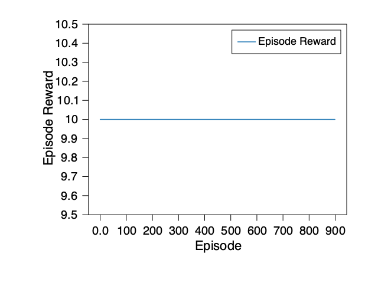
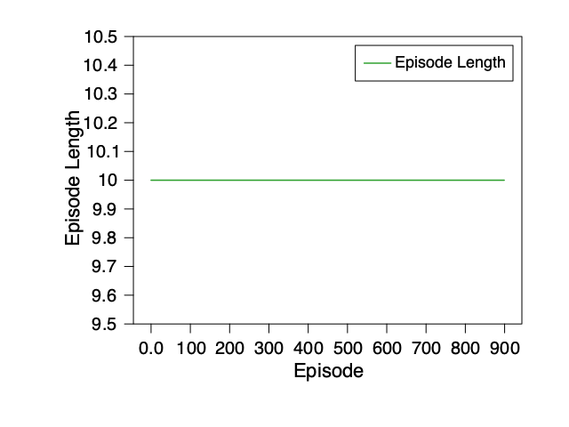
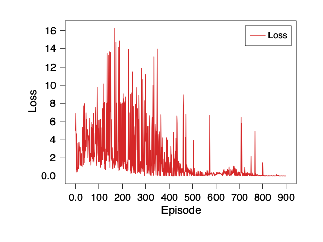
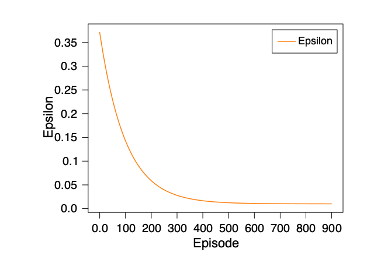
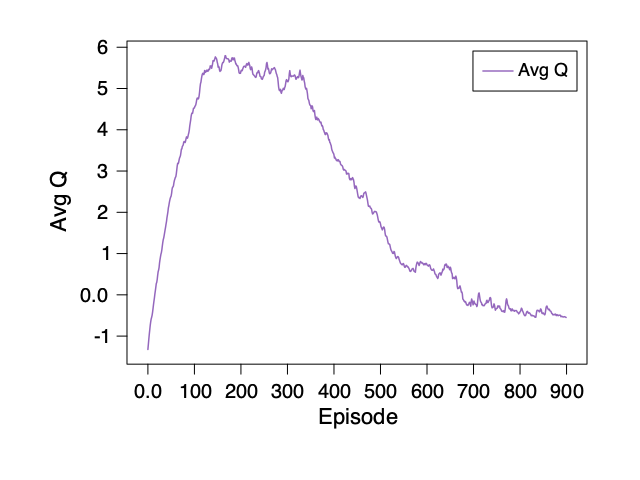

# DQN GridWorld Demo

This tutorial demonstrates how to train a Deep Q-Network (DQN) agent on a simple GridWorld environment using Fehu. We will walk through agent creation, training, evaluation, and visualize the learning progress step-by-step.

**Goals:**
- Understand the basics of DQN and GridWorld
- See how to set up and train a DQN agent
- Visualize episode rewards and key training metrics

---

## Quick Visualization: Built-in Video Recording

Fehu provides a built-in visualization API that automatically records videos of agent runs.  
To use it, run:

```sh
FEHU_DQN_RECORD_DIR=./run/ dune exec fehu/examples/04-dqn/dqn.exe
```

This will generate `.mp4` videos in the `./run` directory, showing the agent’s behavior before and after training.

You can use these videos for tutorials, documentation, and sharing results.
If you want deeper analysis—such as episode rewards, episode length, loss curve, epsilon schedule, and average Q-value—see the advanced plotting sections below.

### Agent Behavior Video (Before Training)
<video src="../../../../run/gridworld_random.mp4" controls width="480"></video>

### Agent Behavior Video (After Training)
<video src="../../../../run/gridworld_trained.mp4" controls width="480"></video>

---

## Prerequisites

- Make sure you have Fehu, Kaun, Rune, Nx, and Hugin installed in your OCaml environment
- To use plotting, install Hugin: `opam install hugin`
- This demo uses MDX, which allows executable OCaml code blocks in markdown documents
- **Note:** Plot images are generated by running the plotting code in a standalone OCaml script or utop, not inside MDX
- If you encounter errors, check your opam switch and library installations, and consult the documentation or maintainer

---

## What is GridWorld?

GridWorld is a simple environment where an agent moves in a grid to reach a goal. It is commonly used for teaching reinforcement learning concepts because it is easy to visualize and understand.

---

## What is DQN?

Deep Q-Network (DQN) is a reinforcement learning algorithm that uses a neural network to approximate Q-values for each action in a given state. It enables agents to learn optimal policies in environments with discrete actions.

---

## 1. Create a Simple GridWorld Environment

Below, we define a 5x5 grid environment. The agent starts at (0,0) and can move up, down, left, or right. The environment resets after 10 steps.

```ocaml
open Fehu
(* Define the observation space as a 2D grid from (0,0) to (4,4) *)
let obs_space = Space.Box.create ~low:[| 0.0; 0.0 |] ~high:[| 4.0; 4.0 |] in
(* Define the action space: 4 possible moves (up, down, left, right) *)
let act_space = Space.Discrete.create 4 in
let env_rng = Rune.Rng.key 123 in
let step_count = ref 0 in
(* Create the environment with reset and step functions *)
let env =
  Env.create ~rng:env_rng ~observation_space:obs_space ~action_space:act_space
    ~reset:(fun _env ?options:_ () ->
      step_count := 0;
      let obs = Rune.create Rune.float32 [| 2 |] [| 0.0; 0.0 |] in
      (obs, Info.empty))
    ~step:(fun _env action ->
      step_count := !step_count + 1;
      let terminated = !step_count >= 10 in
      let obs =
        Rune.create Rune.float32 [| 2 |] 
          [| float_of_int (!step_count mod 5); float_of_int (!step_count / 5) |]
      in
      Env.transition ~observation:obs ~reward:1.0 ~terminated ())
    ()
```

---

## 2. Create the DQN Agent

We build a simple neural network for Q-value approximation and configure the DQN agent.

**Hyperparameter Choices:**
- `batch_size = 4`: Small batch size for faster updates and less memory usage
- `buffer_capacity = 50`: Limited replay buffer for a small environment

```ocaml
open Fehu
open Fehu_algorithms.Dqn

let rng = Rune.Rng.key 42

(* Build a simple neural network for Q-value approximation *)
let q_network =
  Kaun.Layer.sequential
    [
      Kaun.Layer.linear ~in_features:2 ~out_features:8 ();
      Kaun.Layer.relu ();
      Kaun.Layer.linear ~in_features:8 ~out_features:4 ();
    ]

(* Configure the agent: batch size, buffer capacity, etc. *)
let config = { default_config with batch_size = 4; buffer_capacity = 50 }
```

---

## 3. Train the DQN Agent and Collect Metrics

We train the agent for a fixed number of episodes, collecting key metrics such as episode rewards, episode length, loss, epsilon, and average Q-value.
These metrics are saved to `metrics.csv` for later visualization.

**Why track training metrics?**  
Tracking episode rewards, episode length, loss, epsilon, and average Q-value helps you understand and diagnose the agent’s learning progress and stability.

```ocaml
open Fehu
open Fehu_algorithms.Dqn

let records = ref []  (* CSV lines collected in reverse order *)

let callback metrics =
  Printf.printf "Callback called: episode_length=%s episode_return=%s\n%!"
    (match metrics.episode_length with Some l -> string_of_int l | None -> "None")
    (match metrics.episode_return with Some r -> string_of_float r | None -> "None");
  match metrics.episode_return with
  | Some r ->
      let len = match metrics.episode_length with Some l -> l | None -> 0 in
      let loss = metrics.loss in
      let eps = metrics.epsilon in
      let avgq = metrics.avg_q_value in
      Printf.printf "Episode finished: reward=%f, length=%d, loss=%f, epsilon=%f, avg_q=%f\n%!" r len loss eps avgq;
      let line = Printf.sprintf "%f,%d,%f,%f,%f\n" r len loss eps avgq in
      records := line :: !records;
      `Continue
  | None -> `Continue

(* Define environment *)
let obs_space = Space.Box.create ~low:[| 0.0; 0.0 |] ~high:[| 4.0; 4.0 |]
let act_space = Space.Discrete.create 4
let env_rng = Rune.Rng.key 123
let step_count = ref 0
let env =
  Env.create ~rng:env_rng ~observation_space:obs_space ~action_space:act_space
    ~reset:(fun _env ?options:_ () ->
      step_count := 0;
      let obs = Rune.create Rune.float32 [| 2 |] [| 0.0; 0.0 |] in
      (obs, Info.empty))
    ~step:(fun _env action ->
      let action_arr = Rune.to_array action in
      let action_int = Int32.to_int action_arr.(0) in
      Printf.printf "Step: action=%d, step_count=%d\n%!" action_int !step_count;
      step_count := !step_count + 1;
      let terminated = !step_count >= 10 in
      let obs =
        Rune.create Rune.float32 [| 2 |]
          [| float_of_int (!step_count mod 5); float_of_int (!step_count / 5) |]
      in
      Env.transition ~observation:obs ~reward:1.0 ~terminated ())
    ()

(* Define Q-network *)
let rng = Rune.Rng.key 42
let q_network =
  Kaun.Layer.sequential
    [
      Kaun.Layer.linear ~in_features:2 ~out_features:8 ();
      Kaun.Layer.relu ();
      Kaun.Layer.linear ~in_features:8 ~out_features:4 ();
    ]

(* Define config *)
let config = { default_config with batch_size = 4; buffer_capacity = 50 }

let () =
  let _params, _state =
    train ~env ~q_network ~rng ~config ~total_timesteps:10000 ~callback ()
  in
  let out = "fehu/demos/metrics.csv" in
  let oc = open_out out in
  output_string oc "episode_return,episode_length,loss,epsilon,avg_q\n";
  List.iter (fun s -> output_string oc s) (List.rev !records);
  close_out oc
```

---

## 4. Visualize DQN Training Metrics

You can visualize all key metrics from training using the standalone OCaml script below.
This script generates plots for episode rewards, episode length, loss curve, epsilon schedule, and average Q-value from your metrics.csv file.

> **Note:**  
> Run the following OCaml script in a standalone file (not inside MDX) to generate all plots.  
> Place the resulting images in the notebook directory for display.

```ocaml
(* fehu/demos/plot_rewards.ml *)
let read_csv_column path col_idx =
  let ic = open_in path in
  let _header = input_line ic in
  let rec loop acc =
    try
      let line = input_line ic in
      let value = float_of_string (List.nth (String.split_on_char ',' line) col_idx) in
      loop (value :: acc)
    with End_of_file -> List.rev acc
  in
  let values = loop [] in
  close_in ic;
  values

let plot_metric ~col_idx ~label ~color ~output =
  let values = read_csv_column "fehu/demos/metrics.csv" col_idx in
  let n = List.length values in
  if n = 0 then (
    prerr_endline ("No values found for " ^ label ^ " in metrics.csv.");
    exit 1
  );
  let x = Nx.create Nx.float32 [| n |] (Array.init n float_of_int) in
  let y = Nx.create Nx.float32 [| n |] (Array.of_list values) in
  let fig = Hugin.Figure.create () in
  let ax = Hugin.Figure.add_subplot fig in
  let _ = Hugin.Plotting.plot ~x ~y ~color ~label ax in
  let _ = Hugin.Axes.set_xlabel "Episode" ax in
  let _ = Hugin.Axes.set_ylabel label ax in
  let _ = Hugin.Axes.legend true ax in
  Hugin.savefig output fig

let () =
  plot_metric ~col_idx:0 ~label:"Episode Reward" ~color:Hugin.Artist.Color.blue
    ~output:"fehu/demos/episode_rewards.png";
  plot_metric ~col_idx:1 ~label:"Episode Length" ~color:Hugin.Artist.Color.green
    ~output:"fehu/demos/episode_length.png";
  plot_metric ~col_idx:2 ~label:"Loss" ~color:Hugin.Artist.Color.red
    ~output:"fehu/demos/episode_loss.png";
  plot_metric ~col_idx:3 ~label:"Epsilon" ~color:Hugin.Artist.Color.orange
    ~output:"fehu/demos/epsilon.png";
  plot_metric ~col_idx:4 ~label:"Avg Q" ~color:Hugin.Artist.Color.magenta
    ~output:"fehu/demos/avg_q.png"
```

### Episode Rewards


This plot shows the total reward per episode.  
A rising or stable reward curve indicates successful learning.

#### Episode Length


This plot shows the number of steps taken in each episode.  
A decreasing or stable episode length indicates the agent is learning to reach the goal more efficiently.

#### Loss Curve


This plot shows the DQN loss over episodes.  
A decreasing loss suggests the Q-network is learning to predict better action values.

#### Epsilon Schedule


This plot shows the epsilon value used for exploration.  
Epsilon decays over time, meaning the agent explores less and exploits more as training progresses.

#### Average Q-value


#### This plot shows the average Q-value per episode. <br/> Tracking average Q helps diagnose learning stability and value estimation quality.
---

## Troubleshooting

- If you encounter errors running this notebook as an MDX document, check that all dependencies are installed and your OCaml version matches the project requirements
- Common errors include missing libraries or version mismatches. See the documentation or ask the maintainer for help if needed
- If the plot images do not appear, make sure you generated them with the standalone script and placed them in the notebook directory

---

## Summary

- We trained a DQN agent on GridWorld and tracked its learning progress
- We visualized episode rewards, episode length, loss, epsilon schedule, and average Q-value
- You can experiment with different network architectures, hyperparameters, or environments for deeper insight

---