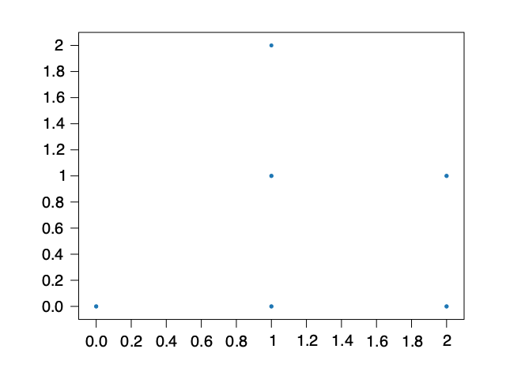
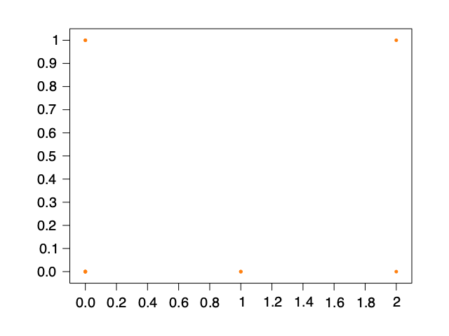
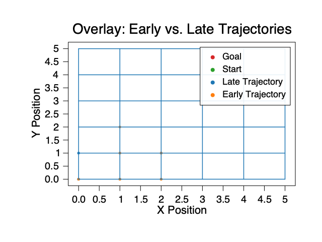
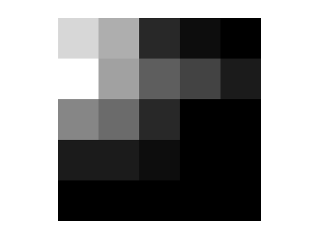
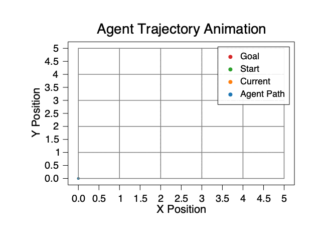

# DQN GridWorld Demo

This tutorial demonstrates how to train a Deep Q-Network (DQN) agent on a simple GridWorld environment using Fehu. We will walk through agent creation, training, evaluation, and visualize the learning progress step-by-step.

**Goals:**
- Understand the basics of DQN and GridWorld
- See how to set up and train a DQN agent
- Visualize episode rewards and agent behavior
- Compare agent trajectories in early and late episodes

---

## Prerequisites

- Make sure you have Fehu, Kaun, Rune, Nx, and Hugin installed in your OCaml environment
- To use plotting, install Hugin: `opam install hugin`
- This demo uses MDX, which allows executable OCaml code blocks in markdown documents
- **Note:** Plot images are generated by running the plotting code in a standalone OCaml script or utop, not inside MDX
- If you encounter errors, check your opam switch and library installations, and consult the documentation or maintainer

---

## What is GridWorld?

GridWorld is a simple environment where an agent moves in a grid to reach a goal. It is commonly used for teaching reinforcement learning concepts because it is easy to visualize and understand.

---

## What is DQN?

Deep Q-Network (DQN) is a reinforcement learning algorithm that uses a neural network to approximate Q-values for each action in a given state. It enables agents to learn optimal policies in environments with discrete actions.

---

## 1. Create a Simple GridWorld Environment

Below, we define a 5x5 grid environment. The agent starts at (0,0) and can move up, down, left, or right. The environment resets after 10 steps.

```ocaml
open Fehu

(* Define the observation space as a 2D grid from (0,0) to (4,4) *)
let obs_space = Space.Box.create ~low:[| 0.0; 0.0 |] ~high:[| 4.0; 4.0 |] in

(* Define the action space: 4 possible moves (up, down, left, right) *)
let act_space = Space.Discrete.create 4 in

let env_rng = Rune.Rng.key 123 in
let step_count = ref 0 in

(* Create the environment with reset and step functions *)
let env =
  Env.create ~rng:env_rng ~observation_space:obs_space ~action_space:act_space
    ~reset:(fun _env ?options:_ () ->
      step_count := 0;
      let obs = Rune.create Rune.float32 [| 2 |] [| 0.0; 0.0 |] in
      (obs, Info.empty))
    ~step:(fun _env action ->
      step_count := !step_count + 1;
      let terminated = !step_count >= 10 in
      let obs =
        Rune.create Rune.float32 [| 2 |] 
          [| float_of_int (!step_count mod 5); float_of_int (!step_count / 5) |]
      in
      Env.transition ~observation:obs ~reward:1.0 ~terminated ())
    ()
```

---

## 2. Create the DQN Agent

We build a simple neural network for Q-value approximation.

**Hyperparameter Choices:**
- `batch_size = 4`: Small batch size for faster updates and less memory usage
- `buffer_capacity = 50`: Limited replay buffer for a small environment

```ocaml
module Dqn = Fehu_algorithms.Dqn

let rng = Rune.Rng.key 42 in

(* Build a simple neural network for Q-value approximation *)
let q_net =
  Kaun.Layer.sequential
    [
      Kaun.Layer.linear ~in_features:2 ~out_features:8 ();
      Kaun.Layer.relu ();
      Kaun.Layer.linear ~in_features:8 ~out_features:4 ();
    ]
in

(* Configure the agent: batch size, buffer capacity, etc. *)
let config = Dqn.{ default_config with batch_size = 4; buffer_capacity = 50 } in
let agent = Dqn.create ~q_network:q_net ~n_actions:4 ~rng config
```

---

## 3. Train the DQN Agent and Collect Episode Rewards

We train the agent for 100 episodes, tracking total rewards and agent positions.

**Why track early/late positions?**  
Comparing the agent's path in the first and last episode helps us visualize learning progress—from random exploration to efficient goal-seeking.

```ocaml
let episode_rewards = ref [] in

(* Track agent positions for early and late episodes *)
let early_positions = ref [] in
let late_positions = ref [] in
let record_positions = ref [] in

(* State visitation heatmap *)
let grid_size = 5 in
let visit_counts = Array.make_matrix grid_size grid_size 0. in

let _agent =
  Dqn.learn agent ~env ~total_timesteps:100
    ~callback:(fun ~episode ~metrics ->
      if metrics.episode_step = 0 then record_positions := [];
      record_positions := metrics.observation :: !record_positions;
      let arr = Rune.to_array metrics.observation in
      let x = int_of_float arr.(0) in
      let y = int_of_float arr.(1) in
      if x >= 0 && x < grid_size && y >= 0 && y < grid_size then
        visit_counts.(x).(y) <- visit_counts.(x).(y) +. 1.;
      if metrics.terminated then begin
        if episode = 1 then early_positions := List.rev !record_positions;
        if episode = 100 then late_positions := List.rev !record_positions;
      end;
      episode_rewards := metrics.episode_return :: !episode_rewards;
      Printf.printf "Episode %d: Reward = %.2f\n%!" episode metrics.episode_return;
      true)
    ()
in

List.rev !episode_rewards
```

---

## 4. Visualize Episode Rewards

### Key Insight
The plot below shows how the agent's total reward per episode changes over time.

**Interpretation:**  
A rising or stable reward curve indicates successful learning. Below we print the total reward per episode to see how the agent improves over time.

```ocaml
(* Print episode rewards for each episode *)
List.iteri 
  (fun i r -> Printf.printf "Episode %d: Reward = %.2f\n%!" i r) 
  (List.rev !episode_rewards)
```

---

### Plotting with Hugin (outside MDX)

> **Note:**  
> The following code should be run in a standalone OCaml script or utop, not inside MDX. This will generate the plot image for display in your markdown notebook.

```ocaml
let plot_episode_rewards rewards filename =
  let fig = Hugin.figure () in
  let n = List.length rewards in
  let episodes = Array.init n float_of_int in
  let rewards_arr = Array.of_list rewards in
  let x_tensor = Nx.create Nx.float32 [| n |] episodes in
  let y_tensor = Nx.create Nx.float32 [| n |] rewards_arr in
  Hugin.plot ~label:"Episode Rewards" ~color:`blue x_tensor y_tensor ~figure:fig;
  Hugin.xlabel fig "Episode";
  Hugin.ylabel fig "Total Reward";
  Hugin.legend fig;
  Hugin.savefig filename fig
```

After running the code above, place `episode_rewards.png` in the same directory as this notebook.


---

## 5. Visualize Agent Trajectories (Early vs. Late Episodes)

### Key Insight
Comparing early and late trajectories shows how the agent's policy improves.

**Interpretation:**  
Early paths are often random and inefficient; late paths are more direct.

> **Note:**  
> The following code should be run in a standalone OCaml script or utop, not inside MDX. This will generate trajectory images for display in your markdown notebook.

```ocaml
open Nx
open Hugin

let grid_size = 5

(* Helper to extract x and y coordinates from observations *)
let extract_xy obs_list =
  List.map (fun obs ->
    let arr = Rune.to_array obs in
    (arr.(0), arr.(1))
  ) obs_list

let plot_grid_trajectory xs ys filename =
  let fig = Hugin.figure () in
  (* Draw grid lines *)
  for i = 0 to grid_size do
    Hugin.axvline fig (float_of_int i) ~color:`gray ~linestyle:`dashed;
    Hugin.axhline fig (float_of_int i) ~color:`gray ~linestyle:`dashed;
  done;
  (* Plot trajectory *)
  let x_tensor = Nx.create Nx.float32 [| Array.length xs |] xs in
  let y_tensor = Nx.create Nx.float32 [| Array.length ys |] ys in
  Hugin.scatter ~label:"Agent Path" ~color:`blue x_tensor y_tensor ~figure:fig;
  (* Mark start and goal *)
  Hugin.scatter ~label:"Start" ~color:`green 
    (Nx.create Nx.float32 [|1|] [|0.|]) 
    (Nx.create Nx.float32 [|1|] [|0.|]) ~figure:fig;
  Hugin.scatter ~label:"Goal" ~color:`red 
    (Nx.create Nx.float32 [|1|] [|4.|]) 
    (Nx.create Nx.float32 [|1|] [|4.|]) ~figure:fig;
  Hugin.xlabel fig "X Position";
  Hugin.ylabel fig "Y Position";
  Hugin.legend fig;
  Hugin.savefig filename fig

(* Overlay early and late trajectories for direct comparison *)
let plot_overlay_trajectories early_xs early_ys late_xs late_ys filename =
  let fig = Hugin.figure () in
  for i = 0 to grid_size do
    Hugin.axvline fig (float_of_int i) ~color:`gray ~linestyle:`dashed;
    Hugin.axhline fig (float_of_int i) ~color:`gray ~linestyle:`dashed;
  done;
  let early_x_tensor = Nx.create Nx.float32 [| Array.length early_xs |] early_xs in
  let early_y_tensor = Nx.create Nx.float32 [| Array.length early_ys |] early_ys in
  let late_x_tensor = Nx.create Nx.float32 [| Array.length late_xs |] late_xs in
  let late_y_tensor = Nx.create Nx.float32 [| Array.length late_ys |] late_ys in
  Hugin.scatter ~label:"Early Trajectory" ~color:`orange 
    early_x_tensor early_y_tensor ~figure:fig;
  Hugin.scatter ~label:"Late Trajectory" ~color:`blue 
    late_x_tensor late_y_tensor ~figure:fig;
  Hugin.scatter ~label:"Start" ~color:`green 
    (Nx.create Nx.float32 [|1|] [|0.|]) 
    (Nx.create Nx.float32 [|1|] [|0.|]) ~figure:fig;
  Hugin.scatter ~label:"Goal" ~color:`red 
    (Nx.create Nx.float32 [|1|] [|4.|]) 
    (Nx.create Nx.float32 [|1|] [|4.|]) ~figure:fig;
  Hugin.xlabel fig "X Position";
  Hugin.ylabel fig "Y Position";
  Hugin.legend fig;
  Hugin.savefig filename fig
```

After running the code above, place `gridworld_trajectory_early.png` and `gridworld_trajectory_late.png` in the same directory as this notebook.

### Display the Agent Trajectories in Markdown

#### Early Episode Trajectory


In the early episode, the agent explores the grid with a less efficient path, often wandering or taking suboptimal moves due to its untrained policy. This illustrates the initial learning phase where the agent is still discovering how the environment works.

#### Late Episode Trajectory


By the late episode, the agent has learned to reach the goal more directly, demonstrating improved policy and understanding of the environment. The path is typically shorter and more focused, showing the agent's progression from exploration to exploitation.

#### Overlay: Early vs. Late Trajectories


This plot overlays the agent's path in an early episode (orange) and a late episode (blue). Notice how the agent's behavior evolves from random exploration to efficient goal-seeking.

---

## 6. Visualize State Visitation Heatmap

> **Note:**  
> The following code should be run in a standalone OCaml script or utop, not inside MDX. This will generate a heatmap image for display in your markdown notebook.

```ocaml
open Nx
open Hugin

let read_heatmap path =
  let lines = In_channel.with_open_bin path In_channel.input_all
              |> String.split_on_char '\n'
              |> List.filter (fun s -> String.trim s <> "") in
  Array.of_list (
    List.map (fun line ->
      line
      |> String.split_on_char ' '
      |> List.filter (fun s -> s <> "")
      |> List.map float_of_string
      |> Array.of_list
    ) lines
  )

let () =
  let heatmap = read_heatmap "visit_counts.txt" in
  let flat = Array.concat (Array.to_list heatmap) in
  let shape = [| Array.length heatmap; Array.length heatmap.(0) |] in
  let heatmap_tensor = Nx.create Nx.float32 shape flat in
  let fig_heatmap = Hugin.imshow heatmap_tensor in
  Hugin.xlabel fig_heatmap "X Position";
  Hugin.ylabel fig_heatmap "Y Position";
  Hugin.legend fig_heatmap;
  Hugin.savefig "gridworld_heatmap.png" fig_heatmap
```

After running the code above, place `gridworld_heatmap.png` in the same directory as this notebook.

### The Heatmap


This heatmap shows how frequently each grid cell was visited by the agent during training. Brighter colors indicate more frequent visits, revealing the agent's preferred paths and exploration patterns.

---

## 7. Agent Trajectory Animation



This animation shows the agent's movement step-by-step in the gridworld. Early in training, the path is random; later, it becomes more direct.

---

## Troubleshooting

- If you encounter errors running this notebook as an MDX document, check that all dependencies are installed and your OCaml version matches the project requirements
- Common errors include missing libraries or version mismatches. See the documentation or ask the maintainer for help if needed
- If the plot images do not appear, make sure you generated them with the standalone script and placed them in the notebook directory

---

## Summary

- We trained a DQN agent on GridWorld and tracked its learning progress
- We visualized episode rewards, agent trajectories for early and late episodes, and state visitation as a heatmap
- The trajectory and heatmap plots include axis labels and legends for clarity
- Overlaying early and late trajectories helps visualize learning progress directly
- The trajectory and heatmap plots illustrate how the agent's behavior evolves: from random exploration to efficient goal-seeking
- You can experiment with different network architectures, hyperparameters, or environments
- Try visualizing Q-values or agent trajectories for deeper insight!

---