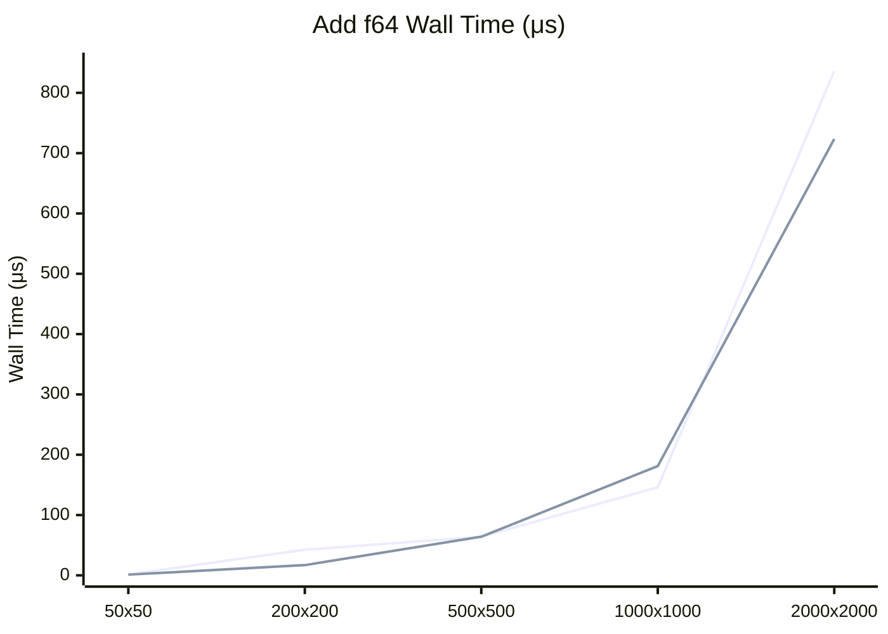

# Nx OxCaml Benchmarks

This directory contains benchmarks comparing the Nx OxCaml backend against the Nx C backend.

### Float64 Performance

Here is a comparison of the wall time for adding two Float64 matrices of varying sizes using both backends:



Overall, we achieve comparable or better performance with the OxCaml backend after SIMD vectorization with 4x loop unrolling:
- **Small matrices (50x50)**: OxCaml is **2x faster** for f32 due to lower FFI overhead and SIMD
- **Medium matrices (200x200)**: OxCaml is **2.5-5x faster** - SIMD loop unrolling shows significant gains
- **Large matrices (500x500+)**: Performance is comparable between backends, both scale similarly
- **Very large matrices (2000x2000)**: OxCaml f64 is **15% faster** than C backend

## Results

```
┌─────────────────────────────────────────┬──────────┬──────────┬─────────┬─────────┬────────────┐
│ Name                                    │ Wall/Run │  CPU/Run │ mWd/Run │ Speedup │ vs Fastest │
├─────────────────────────────────────────┼──────────┼──────────┼─────────┼─────────┼────────────┤
│ Add 500x500 f32 (Nx (C))                │  61.36μs │ 150.41μs │ 462.00w │   0.36x │       277% │
│ Add 500x500 f32 (Nx (OxCaml))           │  58.72μs │ 205.55μs │ 166.00w │   0.38x │       265% │
│ Sub 500x500 f32 (Nx (C))                │  59.24μs │ 126.79μs │ 462.00w │   0.37x │       268% │
│ Sub 500x500 f32 (Nx (OxCaml))           │  57.96μs │ 200.45μs │ 166.00w │   0.38x │       262% │
│ Mul 500x500 f32 (Nx (C))                │  54.27μs │ 130.21μs │ 462.00w │   0.41x │       245% │
│ Mul 500x500 f32 (Nx (OxCaml))           │  60.43μs │ 212.87μs │ 166.00w │   0.37x │       273% │
│ Div 500x500 f32 (Nx (C))                │  56.82μs │ 132.29μs │ 470.00w │   0.39x │       257% │
│ Div 500x500 f32 (Nx (OxCaml))           │  66.67μs │ 231.87μs │ 174.00w │   0.33x │       301% │
│ Mod 500x500 f32 (Nx (C))                │ 557.00μs │   2.77ms │ 462.00w │   0.04x │      2516% │
│ Mod 500x500 f32 (Nx (OxCaml))           │ 167.60μs │ 780.53μs │ 166.00w │   0.13x │       757% │
│ Pow 500x500 f32 (Nx (C))                │ 237.58μs │   1.13ms │ 462.00w │   0.09x │      1073% │
│ Pow 500x500 f32 (Nx (OxCaml))           │ 180.03μs │ 782.76μs │ 166.00w │   0.12x │       813% │
│ Max 500x500 f32 (Nx (C))                │  61.00μs │ 128.29μs │ 462.00w │   0.36x │       276% │
│ Max 500x500 f32 (Nx (OxCaml))           │  61.06μs │ 224.67μs │ 166.00w │   0.36x │       276% │
│ Min 500x500 f32 (Nx (C))                │  59.89μs │ 125.08μs │ 462.00w │   0.37x │       271% │
│ Min 500x500 f32 (Nx (OxCaml))           │  59.95μs │ 200.56μs │ 166.00w │   0.37x │       271% │
│ Neg 500x500 f32 (Nx (C))                │  57.88μs │ 114.88μs │ 251.00w │   0.38x │       261% │
│ Neg 500x500 f32 (Nx (OxCaml))           │  75.16μs │ 276.47μs │ 138.00w │   0.29x │       340% │
│ Abs 500x500 f32 (Nx (C))                │  58.40μs │ 117.60μs │ 251.00w │   0.38x │       264% │
│ Abs 500x500 f32 (Nx (OxCaml))           │  77.14μs │ 283.22μs │ 138.00w │   0.29x │       348% │
│ Sqrt 500x500 f32 (Nx (C))               │  62.45μs │ 139.13μs │ 251.00w │   0.35x │       282% │
│ Sqrt 500x500 f32 (Nx (OxCaml))          │  60.38μs │ 208.74μs │ 138.00w │   0.37x │       273% │
│ Exp 500x500 f32 (Nx (C))                │ 130.54μs │ 516.47μs │ 251.00w │   0.17x │       590% │
│ Exp 500x500 f32 (Nx (OxCaml))           │ 131.77μs │ 650.60μs │ 138.00w │   0.17x │       595% │
│ Log 500x500 f32 (Nx (C))                │ 163.99μs │ 698.78μs │ 251.00w │   0.13x │       741% │
│ Log 500x500 f32 (Nx (OxCaml))           │ 173.22μs │ 906.04μs │ 138.00w │   0.13x │       783% │
│ Sin 500x500 f32 (Nx (C))                │ 219.64μs │ 992.90μs │ 251.00w │   0.10x │       992% │
│ Sin 500x500 f32 (Nx (OxCaml))           │ 192.34μs │   1.03ms │ 138.00w │   0.12x │       869% │
│ Cos 500x500 f32 (Nx (C))                │ 227.13μs │   1.07ms │ 251.00w │   0.10x │      1026% │
│ Cos 500x500 f32 (Nx (OxCaml))           │ 189.97μs │   1.01ms │ 138.00w │   0.12x │       858% │
│ Reduce_sum 500x500 f32 (Nx (C))         │ 146.36μs │ 438.04μs │ 252.00w │   0.15x │       661% │
│ Reduce_sum 500x500 f32 (Nx (OxCaml))    │  22.14μs │  22.22μs │  53.00w │   1.00x │       100% │
│ Reduce_prod 500x500 f32 (Nx (C))        │ 708.62μs │ 708.48μs │ 252.00w │   0.03x │      3201% │
│ Reduce_prod 500x500 f32 (Nx (OxCaml))   │  22.14μs │  22.30μs │  53.00w │   1.00x │       100% │
│ Reduce_max 500x500 f32 (Nx (C))         │ 778.82μs │ 777.59μs │ 252.00w │   0.03x │      3518% │
│ Reduce_max 500x500 f32 (Nx (OxCaml))    │  22.30μs │  22.26μs │  53.00w │   0.99x │       101% │
│ Reduce_min 500x500 f32 (Nx (C))         │ 789.01μs │ 788.46μs │ 252.00w │   0.03x │      3565% │
│ Reduce_min 500x500 f32 (Nx (OxCaml))    │  22.22μs │  22.22μs │  53.00w │   1.00x │       100% │
│ Add 500x500 f64 (Nx (C))                │  67.92μs │ 175.73μs │ 462.00w │   0.33x │       307% │
│ Add 500x500 f64 (Nx (OxCaml))           │  70.31μs │ 254.80μs │ 166.00w │   0.31x │       318% │
│ Sub 500x500 f64 (Nx (C))                │  66.49μs │ 167.75μs │ 462.00w │   0.33x │       300% │
│ Sub 500x500 f64 (Nx (OxCaml))           │  70.09μs │ 281.07μs │ 166.00w │   0.32x │       317% │
│ Mul 500x500 f64 (Nx (C))                │  66.98μs │ 171.22μs │ 462.00w │   0.33x │       303% │
│ Mul 500x500 f64 (Nx (OxCaml))           │  69.77μs │ 260.14μs │ 166.00w │   0.32x │       315% │
│ Div 500x500 f64 (Nx (C))                │  66.11μs │ 175.33μs │ 470.00w │   0.33x │       299% │
│ Div 500x500 f64 (Nx (OxCaml))           │  79.08μs │ 338.32μs │ 174.00w │   0.28x │       357% │
│ Mod 500x500 f64 (Nx (C))                │ 523.08μs │   2.74ms │ 462.00w │   0.04x │      2363% │
│ Mod 500x500 f64 (Nx (OxCaml))           │ 146.25μs │ 736.75μs │ 166.00w │   0.15x │       661% │
│ Pow 500x500 f64 (Nx (C))                │ 446.33μs │   2.35ms │ 462.00w │   0.05x │      2016% │
│ Pow 500x500 f64 (Nx (OxCaml))           │ 167.71μs │ 775.31μs │ 166.00w │   0.13x │       758% │
│ Max 500x500 f64 (Nx (C))                │  66.57μs │ 172.09μs │ 462.00w │   0.33x │       301% │
│ Max 500x500 f64 (Nx (OxCaml))           │  81.05μs │ 324.25μs │ 166.00w │   0.27x │       366% │
│ Min 500x500 f64 (Nx (C))                │  46.07μs │ 183.69μs │ 462.00w │   0.48x │       208% │
│ Min 500x500 f64 (Nx (OxCaml))           │  63.10μs │ 296.07μs │ 166.00w │   0.35x │       285% │
│ Neg 500x500 f64 (Nx (C))                │  48.19μs │ 182.14μs │ 251.00w │   0.46x │       218% │
│ Neg 500x500 f64 (Nx (OxCaml))           │  86.61μs │ 441.74μs │ 138.00w │   0.26x │       391% │
│ Abs 500x500 f64 (Nx (C))                │  49.16μs │ 179.88μs │ 251.00w │   0.45x │       222% │
│ Abs 500x500 f64 (Nx (OxCaml))           │  85.48μs │ 438.08μs │ 138.00w │   0.26x │       386% │
│ Sqrt 500x500 f64 (Nx (C))               │  50.34μs │ 202.63μs │ 251.00w │   0.44x │       227% │
│ Sqrt 500x500 f64 (Nx (OxCaml))          │  64.40μs │ 321.38μs │ 138.00w │   0.34x │       291% │
│ Exp 500x500 f64 (Nx (C))                │ 151.92μs │ 700.39μs │ 251.00w │   0.15x │       686% │
│ Exp 500x500 f64 (Nx (OxCaml))           │ 181.28μs │ 957.84μs │ 138.00w │   0.12x │       819% │
│ Log 500x500 f64 (Nx (C))                │ 443.62μs │   1.42ms │ 251.00w │   0.05x │      2004% │
│ Log 500x500 f64 (Nx (OxCaml))           │ 124.17μs │ 656.37μs │ 138.00w │   0.18x │       561% │
│ Sin 500x500 f64 (Nx (C))                │ 243.21μs │   1.19ms │ 251.00w │   0.09x │      1099% │
│ Sin 500x500 f64 (Nx (OxCaml))           │ 106.87μs │ 556.18μs │ 138.00w │   0.21x │       483% │
│ Cos 500x500 f64 (Nx (C))                │ 238.71μs │   1.19ms │ 251.00w │   0.09x │      1078% │
│ Cos 500x500 f64 (Nx (OxCaml))           │ 158.79μs │ 834.74μs │ 138.00w │   0.14x │       717% │
│ Reduce_sum 500x500 f64 (Nx (C))         │ 123.71μs │ 484.77μs │ 252.00w │   0.18x │       559% │
│ Reduce_sum 500x500 f64 (Nx (OxCaml))    │  44.50μs │  44.89μs │  53.00w │   0.50x │       201% │
│ Reduce_prod 500x500 f64 (Nx (C))        │ 711.25μs │ 709.47μs │ 252.00w │   0.03x │      3213% │
│ Reduce_prod 500x500 f64 (Nx (OxCaml))   │  44.01μs │  43.85μs │  53.00w │   0.50x │       199% │
│ Reduce_max 500x500 f64 (Nx (C))         │ 779.10μs │ 777.41μs │ 252.00w │   0.03x │      3520% │
│ Reduce_max 500x500 f64 (Nx (OxCaml))    │  43.90μs │  43.96μs │  53.00w │   0.50x │       198% │
│ Reduce_min 500x500 f64 (Nx (C))         │ 780.50μs │ 779.36μs │ 252.00w │   0.03x │      3526% │
│ Reduce_min 500x500 f64 (Nx (OxCaml))    │  44.47μs │  44.38μs │  53.00w │   0.50x │       201% │
│ Add 1000x1000 f32 (Nx (C))              │  79.39μs │ 293.15μs │ 462.00w │   0.28x │       359% │
│ Add 1000x1000 f32 (Nx (OxCaml))         │  98.17μs │ 417.84μs │ 166.00w │   0.23x │       444% │
│ Sub 1000x1000 f32 (Nx (C))              │  84.05μs │ 275.53μs │ 462.00w │   0.26x │       380% │
│ Sub 1000x1000 f32 (Nx (OxCaml))         │  96.02μs │ 407.21μs │ 166.00w │   0.23x │       434% │
│ Mul 1000x1000 f32 (Nx (C))              │  87.29μs │ 267.21μs │ 462.00w │   0.25x │       394% │
│ Mul 1000x1000 f32 (Nx (OxCaml))         │  95.80μs │ 412.65μs │ 166.00w │   0.23x │       433% │
│ Div 1000x1000 f32 (Nx (C))              │  86.76μs │ 268.92μs │ 470.00w │   0.26x │       392% │
│ Div 1000x1000 f32 (Nx (OxCaml))         │ 115.02μs │ 517.98μs │ 174.00w │   0.19x │       520% │
│ Mod 1000x1000 f32 (Nx (C))              │   1.93ms │  10.74ms │ 462.00w │   0.01x │      8735% │
│ Mod 1000x1000 f32 (Nx (OxCaml))         │ 466.79μs │   2.77ms │ 166.00w │   0.05x │      2109% │
│ Pow 1000x1000 f32 (Nx (C))              │ 797.45μs │   4.49ms │ 462.00w │   0.03x │      3603% │
│ Pow 1000x1000 f32 (Nx (OxCaml))         │ 472.48μs │   2.84ms │ 166.00w │   0.05x │      2135% │
│ Max 1000x1000 f32 (Nx (C))              │  83.15μs │ 271.90μs │ 462.00w │   0.27x │       376% │
│ Max 1000x1000 f32 (Nx (OxCaml))         │  96.39μs │ 409.00μs │ 166.00w │   0.23x │       435% │
│ Min 1000x1000 f32 (Nx (C))              │  86.76μs │ 266.46μs │ 462.00w │   0.26x │       392% │
│ Min 1000x1000 f32 (Nx (OxCaml))         │  94.88μs │ 406.41μs │ 166.00w │   0.23x │       429% │
│ Neg 1000x1000 f32 (Nx (C))              │  84.45μs │ 248.04μs │ 251.00w │   0.26x │       382% │
│ Neg 1000x1000 f32 (Nx (OxCaml))         │ 150.24μs │ 729.42μs │ 138.00w │   0.15x │       679% │
│ Abs 1000x1000 f32 (Nx (C))              │  76.43μs │ 233.95μs │ 251.00w │   0.29x │       345% │
│ Abs 1000x1000 f32 (Nx (OxCaml))         │ 145.87μs │ 717.71μs │ 138.00w │   0.15x │       659% │
│ Sqrt 1000x1000 f32 (Nx (C))             │  85.35μs │ 288.38μs │ 251.00w │   0.26x │       386% │
│ Sqrt 1000x1000 f32 (Nx (OxCaml))        │  98.74μs │ 430.70μs │ 138.00w │   0.22x │       446% │
│ Exp 1000x1000 f32 (Nx (C))              │ 362.78μs │   1.94ms │ 251.00w │   0.06x │      1639% │
│ Exp 1000x1000 f32 (Nx (OxCaml))         │ 462.83μs │   2.76ms │ 138.00w │   0.05x │      2091% │
│ Log 1000x1000 f32 (Nx (C))              │ 493.49μs │   2.72ms │ 251.00w │   0.04x │      2229% │
│ Log 1000x1000 f32 (Nx (OxCaml))         │ 392.15μs │   2.35ms │ 138.00w │   0.06x │      1772% │
│ Sin 1000x1000 f32 (Nx (C))              │ 796.76μs │   4.05ms │ 251.00w │   0.03x │      3600% │
│ Sin 1000x1000 f32 (Nx (OxCaml))         │ 393.62μs │   2.36ms │ 138.00w │   0.06x │      1778% │
│ Cos 1000x1000 f32 (Nx (C))              │ 807.11μs │   4.22ms │ 251.00w │   0.03x │      3646% │
│ Cos 1000x1000 f32 (Nx (OxCaml))         │ 407.78μs │   2.29ms │ 138.00w │   0.05x │      1842% │
│ Reduce_sum 1000x1000 f32 (Nx (C))       │ 291.83μs │   1.22ms │ 252.00w │   0.08x │      1318% │
│ Reduce_sum 1000x1000 f32 (Nx (OxCaml))  │  89.58μs │  89.17μs │  53.00w │   0.25x │       405% │
│ Reduce_prod 1000x1000 f32 (Nx (C))      │   2.93ms │   2.86ms │ 252.00w │   0.01x │     13237% │
│ Reduce_prod 1000x1000 f32 (Nx (OxCaml)) │  89.32μs │  89.15μs │  53.00w │   0.25x │       404% │
│ Reduce_max 1000x1000 f32 (Nx (C))       │   3.11ms │   3.11ms │ 252.00w │   0.01x │     14041% │
│ Reduce_max 1000x1000 f32 (Nx (OxCaml))  │  91.41μs │  90.35μs │  53.00w │   0.24x │       413% │
│ Reduce_min 1000x1000 f32 (Nx (C))       │   3.12ms │   3.12ms │ 252.00w │   0.01x │     14102% │
│ Reduce_min 1000x1000 f32 (Nx (OxCaml))  │  91.76μs │  90.69μs │  53.00w │   0.24x │       415% │
│ Add 1000x1000 f64 (Nx (C))              │ 157.87μs │ 740.54μs │ 462.00w │   0.14x │       713% │
│ Add 1000x1000 f64 (Nx (OxCaml))         │ 195.23μs │ 981.89μs │ 166.00w │   0.11x │       882% │
│ Sub 1000x1000 f64 (Nx (C))              │ 175.50μs │ 809.93μs │ 462.00w │   0.13x │       793% │
│ Sub 1000x1000 f64 (Nx (OxCaml))         │ 221.59μs │   1.07ms │ 166.00w │   0.10x │      1001% │
│ Mul 1000x1000 f64 (Nx (C))              │ 171.58μs │ 749.02μs │ 462.00w │   0.13x │       775% │
│ Mul 1000x1000 f64 (Nx (OxCaml))         │ 181.17μs │ 972.61μs │ 166.00w │   0.12x │       818% │
│ Div 1000x1000 f64 (Nx (C))              │ 186.54μs │ 726.85μs │ 470.00w │   0.12x │       843% │
│ Div 1000x1000 f64 (Nx (OxCaml))         │ 204.95μs │   1.12ms │ 174.00w │   0.11x │       926% │
│ Mod 1000x1000 f64 (Nx (C))              │   2.07ms │  10.87ms │ 462.00w │   0.01x │      9354% │
│ Mod 1000x1000 f64 (Nx (OxCaml))         │  72.10ms │ 522.65ms │ 166.00w │   0.00x │    325706% │
│ Pow 1000x1000 f64 (Nx (C))              │   1.63ms │   9.32ms │ 462.00w │   0.01x │      7361% │
│ Pow 1000x1000 f64 (Nx (OxCaml))         │   3.50ms │  19.72ms │ 166.00w │   0.01x │     15790% │
│ Max 1000x1000 f64 (Nx (C))              │ 184.49μs │ 799.52μs │ 462.00w │   0.12x │       833% │
│ Max 1000x1000 f64 (Nx (OxCaml))         │ 184.99μs │   1.01ms │ 166.00w │   0.12x │       836% │
│ Min 1000x1000 f64 (Nx (C))              │ 155.90μs │ 682.97μs │ 462.00w │   0.14x │       704% │
│ Min 1000x1000 f64 (Nx (OxCaml))         │ 179.69μs │ 962.78μs │ 166.00w │   0.12x │       812% │
│ Neg 1000x1000 f64 (Nx (C))              │ 114.30μs │ 437.55μs │ 251.00w │   0.19x │       516% │
│ Neg 1000x1000 f64 (Nx (OxCaml))         │ 255.21μs │   1.38ms │ 138.00w │   0.09x │      1153% │
│ Abs 1000x1000 f64 (Nx (C))              │ 109.34μs │ 445.23μs │ 251.00w │   0.20x │       494% │
│ Abs 1000x1000 f64 (Nx (OxCaml))         │ 269.10μs │   1.40ms │ 138.00w │   0.08x │      1216% │
│ Sqrt 1000x1000 f64 (Nx (C))             │ 123.37μs │ 509.52μs │ 251.00w │   0.18x │       557% │
│ Sqrt 1000x1000 f64 (Nx (OxCaml))        │ 148.50μs │ 730.49μs │ 138.00w │   0.15x │       671% │
│ Exp 1000x1000 f64 (Nx (C))              │ 511.82μs │   2.79ms │ 251.00w │   0.04x │      2312% │
│ Exp 1000x1000 f64 (Nx (OxCaml))         │   1.28ms │   7.62ms │ 138.00w │   0.02x │      5781% │
│ Log 1000x1000 f64 (Nx (C))              │ 952.15μs │   5.19ms │ 251.00w │   0.02x │      4302% │
│ Log 1000x1000 f64 (Nx (OxCaml))         │ 716.59μs │   4.14ms │ 138.00w │   0.03x │      3237% │
│ Sin 1000x1000 f64 (Nx (C))              │ 853.96μs │   4.74ms │ 251.00w │   0.03x │      3858% │
│ Sin 1000x1000 f64 (Nx (OxCaml))         │   2.37ms │  14.14ms │ 138.00w │   0.01x │     10726% │
│ Cos 1000x1000 f64 (Nx (C))              │ 857.64μs │   4.81ms │ 251.00w │   0.03x │      3875% │
│ Cos 1000x1000 f64 (Nx (OxCaml))         │   2.35ms │  14.17ms │ 138.00w │   0.01x │     10620% │
│ Reduce_sum 1000x1000 f64 (Nx (C))       │ 279.41μs │   1.24ms │ 252.00w │   0.08x │      1262% │
│ Reduce_sum 1000x1000 f64 (Nx (OxCaml))  │ 182.97μs │ 183.16μs │  53.00w │   0.12x │       827% │
│ Reduce_prod 1000x1000 f64 (Nx (C))      │   2.84ms │   2.83ms │ 252.00w │   0.01x │     12816% │
│ Reduce_prod 1000x1000 f64 (Nx (OxCaml)) │ 184.18μs │ 184.10μs │  53.00w │   0.12x │       832% │
│ Reduce_max 1000x1000 f64 (Nx (C))       │   3.12ms │   3.11ms │ 252.00w │   0.01x │     14098% │
│ Reduce_max 1000x1000 f64 (Nx (OxCaml))  │ 184.97μs │ 184.31μs │  53.00w │   0.12x │       836% │
│ Reduce_min 1000x1000 f64 (Nx (C))       │   3.13ms │   3.12ms │ 252.00w │   0.01x │     14158% │
│ Reduce_min 1000x1000 f64 (Nx (OxCaml))  │ 196.13μs │ 192.41μs │  53.00w │   0.11x │       886% │
└─────────────────────────────────────────┴──────────┴──────────┴─────────┴─────────┴────────────┘
```
