# hugin.next examples

Each example is a directory holding `main.ml` and the image it renders. The
images are committed, and a build compiles the examples without running them.
To render them again into `_build` and replace the committed images that
differ from their renders, run

```sh
dune build @packages/hugin/next/examples/assets
dune promote
```

or run one example from its directory:

```sh
dune exec packages/hugin/next/examples/01-line/main.exe
```

| Example | Shows | Image |
|---|---|---|
| [`01-line`](01-line/main.ml) | Lines over a step axis, one per seed, coloured by a `dim` | 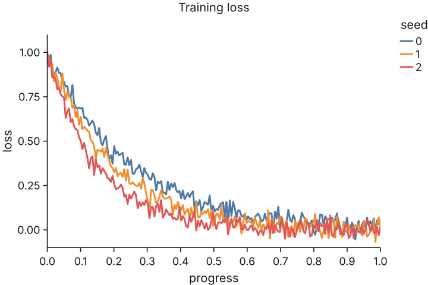 |
| [`01-line`](01-line/main.ml) | The same lines in `Theme.dark` |  |
| [`02-scatter`](02-scatter/main.ml) | Dots coloured by category and sized by a quantity, with two legends | 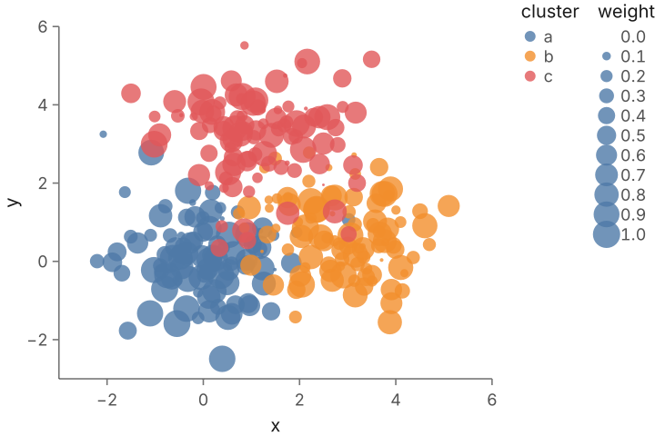 |
| [`03-bars`](03-bars/main.ml) | Bars: a `rect` over a band scale, its length from zero | 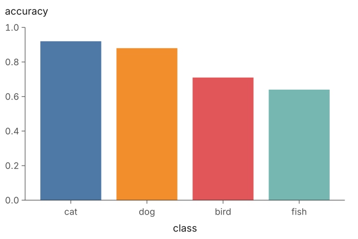 |
| [`04-heatmap`](04-heatmap/main.ml) | A matrix as cells, its rows and columns read with `dim`, and a colour bar | 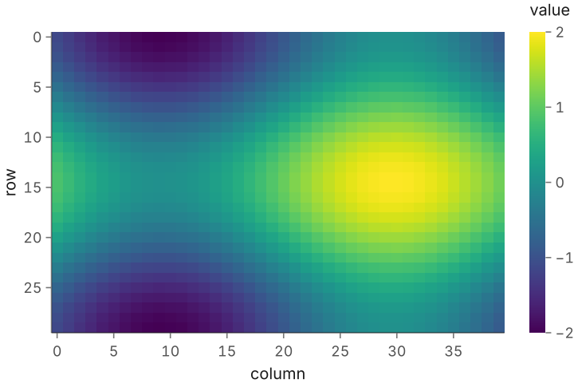 |
| [`05-facets`](05-facets/main.ml) | Small multiples: one panel per category of `fx`, sharing every scale | 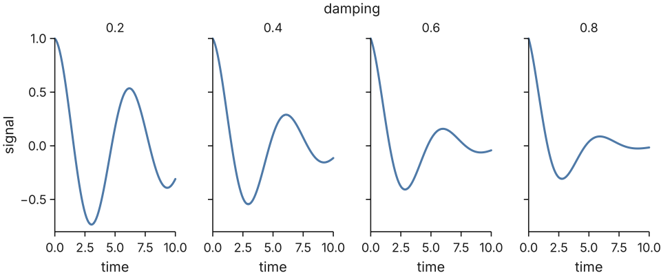 |
| [`06-confusion-matrix`](06-confusion-matrix/main.ml) | Cells coloured by recall, their counts in a contrasting colour (`map_range`) | 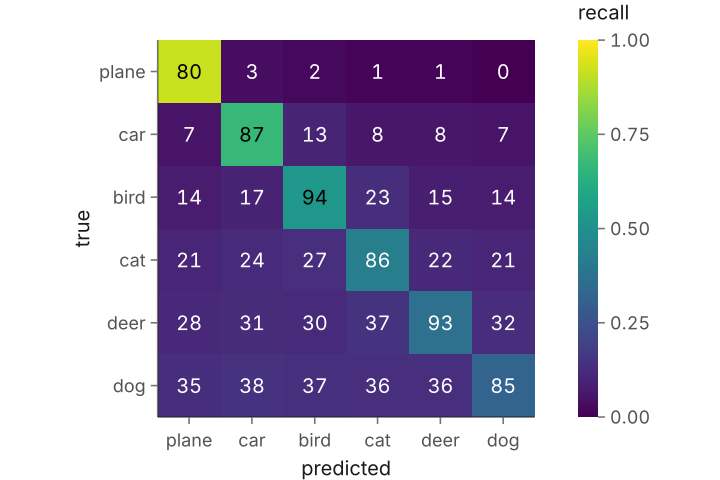 |
| [`07-attention`](07-attention/main.ml) | Attention maps faceted by layer and head, with one colour bar | 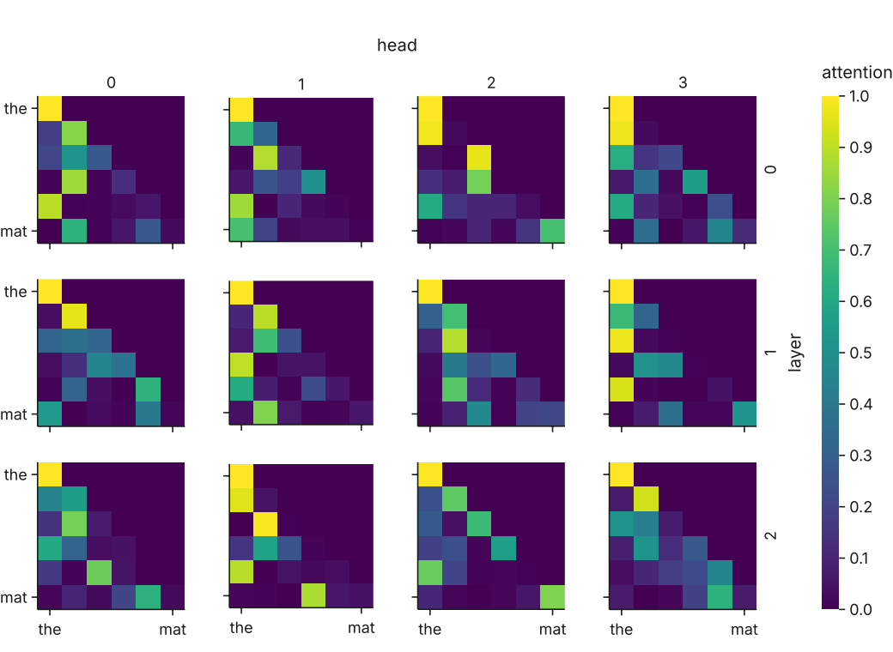 |
| [`08-embedding`](08-embedding/main.ml) | An embedding of 3,000 dots, and of 100,000 drawn as one image | 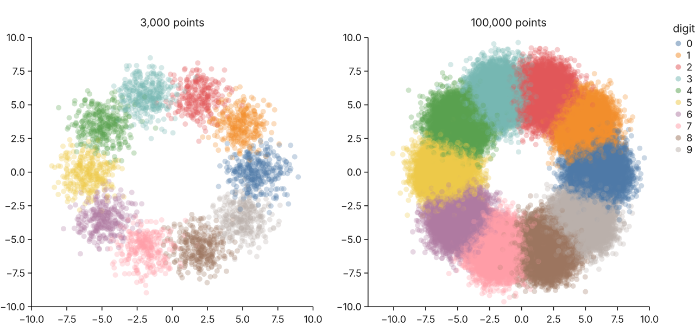 |
| [`09-image-grid`](09-image-grid/main.ml) | Images in wrapped panels, captioned, with the mistakes framed | 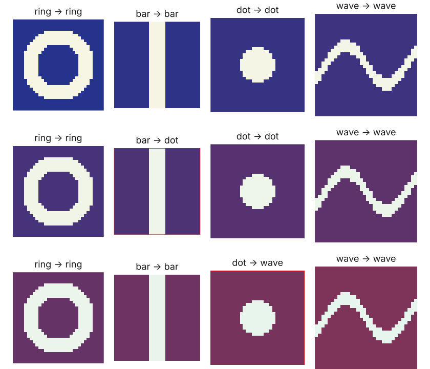 |
| [`10-loss-landscape`](10-loss-landscape/main.ml) | Filled contours on a log scale and an optimiser's path | 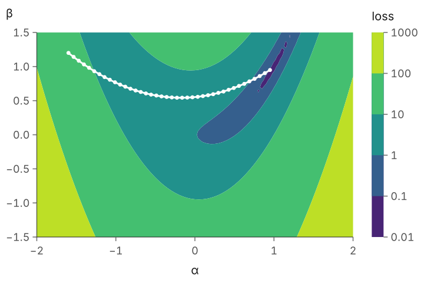 |
| [`11-dashboard`](11-dashboard/main.ml) | A training dashboard: loss on a log scale over epochs, and validation accuracy, sharing x | 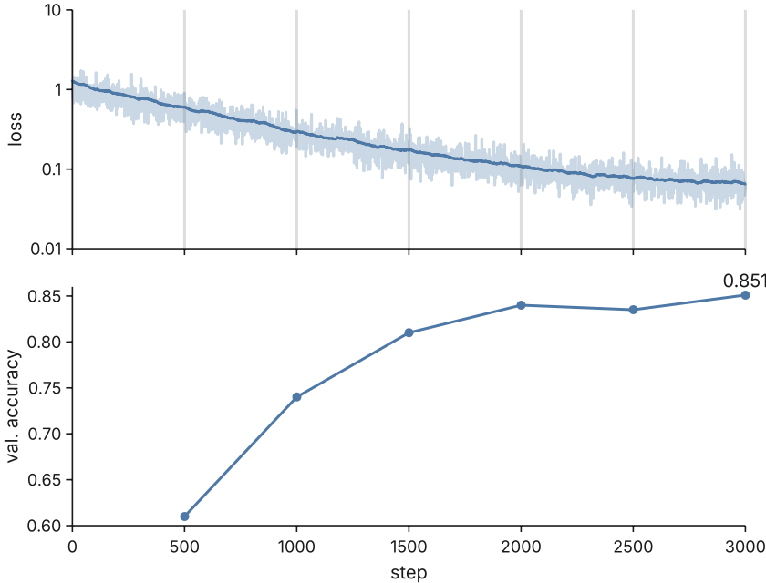 |
| [`12-paper-figure`](12-paper-figure/main.ml) | A two-column paper figure at 8 points, panels labelled (a) to (d) | 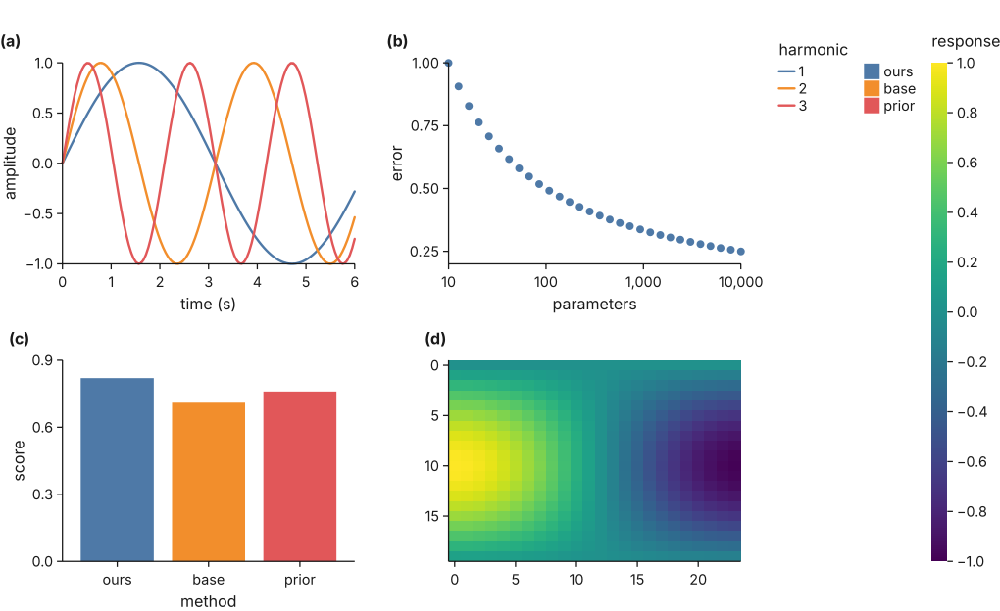 |
| [`13-histogram`](13-histogram/main.ml) | Two histograms over shared bins from `Stats.histogram`, drawn as rects from their edges | 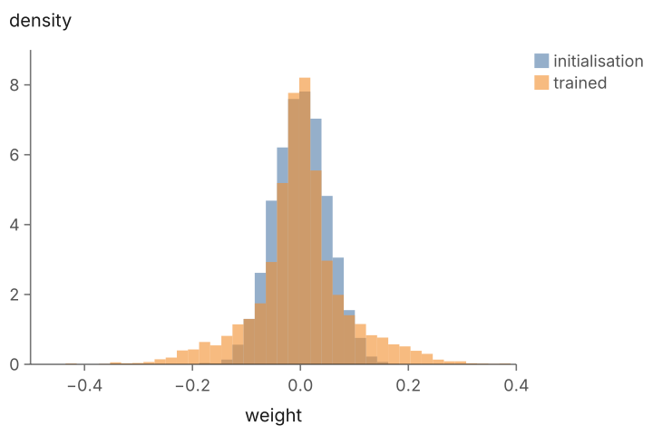 |
| [`14-area`](14-area/main.ml) | A band between the lowest and highest of eight seeds (`area` with `y2`), under their mean | 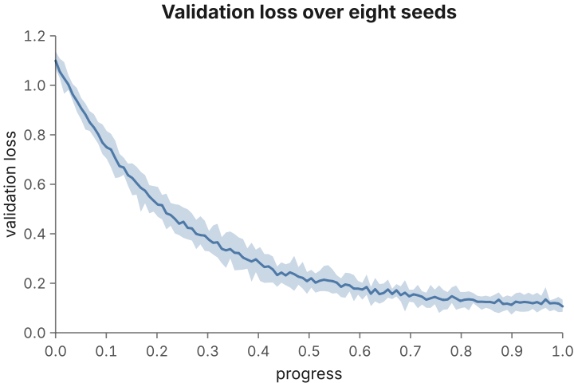 |
| [`15-errorbars`](15-errorbars/main.ml) | Error bars as a composition: a `rule` from `y` to `y2` under each `dot` |  |
| [`16-styles`](16-styles/main.ml) | Series told apart by colour and dash from one scale, a dotted `rule`, a `frame` and a legend inside the panel |  |
| [`17-calibration`](17-calibration/main.ml) | A calibration plot over the dashed diagonal `abline` y = x, its axes in percent |  |
