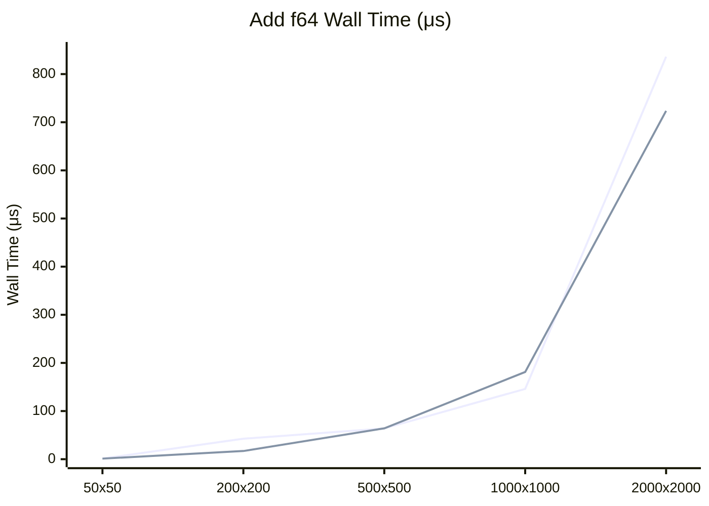

# Nx OxCaml Benchmarks

This directory contains benchmarks comparing the Nx OxCaml backend against the Nx C backend.

### Float64 Performance

Here is a comparison of the wall time for adding two Float64 matrices of varying sizes using both backends:

Overall, we achieve comparable or better performance with the OxCaml backend after SIMD vectorization with 4x loop unrolling:
- **Small matrices (50x50)**: OxCaml is **2x faster** for f32 due to lower FFI overhead and SIMD
- **Medium matrices (200x200)**: OxCaml is **2.5-5x faster** - SIMD loop unrolling shows significant gains
- **Large matrices (500x500+)**: Performance is comparable between backends, both scale similarly
- **Very large matrices (2000x2000)**: OxCaml f64 is **15% faster** than C backend

## Results

### 500x500
#### Float32

|   Name                                  | Wall/Run |   CPU/Run|  mWd/Run|  Speedup| vs Fastest |
|-----------------------------------------|----------|----------|---------|---------|------------|
| Add 500x500 f32 (Nx (C))                |  30.60μs | 111.69μs | 182.00w |   0.45x |       224% |
| Add 500x500 f32 (Nx (OxCaml))           |  30.47μs | 108.64μs | 129.00w |   0.45x |       223% |
| Matmul 500x500 f32 (Nx (C))             |   2.22ms |  13.92ms | 233.00w |   0.01x |     16235% |
| Matmul 500x500 f32 (Nx (OxCaml))        |   2.02ms |  13.59ms | 186.00w |   0.01x |     14749% |
| Sub 500x500 f32 (Nx (C))                |  34.69μs | 141.97μs | 182.00w |   0.39x |       254% |
| Sub 500x500 f32 (Nx (OxCaml))           |  29.71μs | 104.41μs | 129.00w |   0.46x |       217% |
| Mul 500x500 f32 (Nx (C))                |  29.25μs | 103.64μs | 182.00w |   0.47x |       214% |
| Mul 500x500 f32 (Nx (OxCaml))           |  38.93μs | 122.73μs | 129.00w |   0.35x |       285% |
| Div 500x500 f32 (Nx (C))                |  28.34μs |  97.59μs | 182.00w |   0.48x |       207% |
| Div 500x500 f32 (Nx (OxCaml))           |  28.88μs |  95.71μs | 129.00w |   0.47x |       211% |
| Mod 500x500 f32 (Nx (C))                | 162.13μs | 713.01μs | 182.00w |   0.08x |      1185% |
| Mod 500x500 f32 (Nx (OxCaml))           | 157.52μs | 680.18μs | 129.00w |   0.09x |      1152% |
| Pow 500x500 f32 (Nx (C))                | 271.30μs |   1.38ms | 182.00w |   0.05x |      1984% |
| Pow 500x500 f32 (Nx (OxCaml))           | 157.10μs | 680.93μs | 129.00w |   0.09x |      1149% |
| Atan2 500x500 f32 (Nx (C))              | 150.83μs | 714.78μs | 182.00w |   0.09x |      1103% |
| Atan2 500x500 f32 (Nx (OxCaml))         | 163.17μs | 771.08μs | 129.00w |   0.08x |      1193% |
| Max 500x500 f32 (Nx (C))                |  36.35μs | 157.58μs | 182.00w |   0.38x |       266% |
| Max 500x500 f32 (Nx (OxCaml))           |  36.14μs | 152.99μs | 129.00w |   0.38x |       264% |
| Min 500x500 f32 (Nx (C))                |  36.28μs | 159.36μs | 182.00w |   0.38x |       265% |
| Min 500x500 f32 (Nx (OxCaml))           |  35.39μs | 147.36μs | 129.00w |   0.39x |       259% |
| Cmp_eq 500x500 f32 (Nx (C))             | 682.80μs |   2.80ms | 182.00w |   0.02x |      4992% |
| Cmp_eq 500x500 f32 (Nx (OxCaml))        | 684.93μs |   2.83ms | 129.00w |   0.02x |      5008% |
| Cmp_ne 500x500 f32 (Nx (C))             | 791.05μs |   3.24ms | 182.00w |   0.02x |      5784% |
| Cmp_ne 500x500 f32 (Nx (OxCaml))        | 823.69μs |   3.34ms | 129.00w |   0.02x |      6022% |
| Cmp_lt 500x500 f32 (Nx (C))             |   1.25ms |   5.71ms | 182.00w |   0.01x |      9135% |
| Cmp_lt 500x500 f32 (Nx (OxCaml))        |   1.03ms |   4.83ms | 129.00w |   0.01x |      7517% |
| Cmp_le 500x500 f32 (Nx (C))             |   1.06ms |   5.00ms | 182.00w |   0.01x |      7730% |
| Cmp_le 500x500 f32 (Nx (OxCaml))        |   1.13ms |   5.27ms | 129.00w |   0.01x |      8276% |
| Where 500x500 f32 (Nx (C))              |  92.57μs | 478.69μs | 197.00w |   0.15x |       677% |
| Where 500x500 f32 (Nx (OxCaml))         |  89.88μs | 379.98μs | 131.00w |   0.15x |       657% |
| Neg 500x500 f32 (Nx (C))                |  52.58μs | 226.24μs | 136.00w |   0.26x |       384% |
| Neg 500x500 f32 (Nx (OxCaml))           |  50.18μs | 217.61μs | 121.00w |   0.27x |       367% |
| Abs 500x500 f32 (Nx (C))                |  49.83μs | 215.97μs | 136.00w |   0.27x |       364% |
| Abs 500x500 f32 (Nx (OxCaml))           |  50.12μs | 216.70μs | 121.00w |   0.27x |       366% |
| Recip 500x500 f32 (Nx (C))              |  36.67μs | 152.77μs | 136.00w |   0.37x |       268% |
| Recip 500x500 f32 (Nx (OxCaml))         |  36.15μs | 142.44μs | 121.00w |   0.38x |       264% |
| Sqrt 500x500 f32 (Nx (C))               |  35.75μs | 144.91μs | 136.00w |   0.38x |       261% |
| Sqrt 500x500 f32 (Nx (OxCaml))          |  35.87μs | 148.45μs | 121.00w |   0.38x |       262% |
| Exp 500x500 f32 (Nx (C))                | 133.70μs | 633.97μs | 136.00w |   0.10x |       978% |
| Exp 500x500 f32 (Nx (OxCaml))           | 133.13μs | 601.69μs | 121.00w |   0.10x |       973% |
| Log 500x500 f32 (Nx (C))                | 151.71μs | 740.51μs | 136.00w |   0.09x |      1109% |
| Log 500x500 f32 (Nx (OxCaml))           | 133.62μs | 569.08μs | 121.00w |   0.10x |       977% |
| Sign 500x500 f32 (Nx (C))               |  81.77μs | 331.50μs | 136.00w |   0.17x |       598% |
| Sign 500x500 f32 (Nx (OxCaml))          |  79.06μs | 324.22μs | 121.00w |   0.17x |       578% |
| Sin 500x500 f32 (Nx (C))                | 129.16μs | 574.52μs | 136.00w |   0.11x |       944% |
| Sin 500x500 f32 (Nx (OxCaml))           | 127.66μs | 569.63μs | 121.00w |   0.11x |       933% |
| Cos 500x500 f32 (Nx (C))                | 142.37μs | 643.54μs | 136.00w |   0.10x |      1041% |
| Cos 500x500 f32 (Nx (OxCaml))           | 142.14μs | 604.10μs | 121.00w |   0.10x |      1039% |
| Tan 500x500 f32 (Nx (C))                | 191.00μs | 869.55μs | 136.00w |   0.07x |      1396% |
| Tan 500x500 f32 (Nx (OxCaml))           | 132.01μs | 575.87μs | 121.00w |   0.10x |       965% |
| Asin 500x500 f32 (Nx (C))               | 143.01μs | 671.67μs | 136.00w |   0.10x |      1046% |
| Asin 500x500 f32 (Nx (OxCaml))          | 182.79μs | 682.06μs | 121.00w |   0.07x |      1336% |
| Acos 500x500 f32 (Nx (C))               | 150.46μs | 699.85μs | 136.00w |   0.09x |      1100% |
| Acos 500x500 f32 (Nx (OxCaml))          | 120.12μs | 500.87μs | 121.00w |   0.11x |       878% |
| Atan 500x500 f32 (Nx (C))               | 175.23μs | 807.26μs | 136.00w |   0.08x |      1281% |
| Atan 500x500 f32 (Nx (OxCaml))          | 119.00μs | 509.22μs | 121.00w |   0.11x |       870% |
| Sinh 500x500 f32 (Nx (C))               | 131.17μs | 583.96μs | 136.00w |   0.10x |       959% |
| Sinh 500x500 f32 (Nx (OxCaml))          | 127.53μs | 577.76μs | 121.00w |   0.11x |       932% |
| Cosh 500x500 f32 (Nx (C))               | 148.55μs | 706.72μs | 136.00w |   0.09x |      1086% |
| Cosh 500x500 f32 (Nx (OxCaml))          | 128.88μs | 564.65μs | 121.00w |   0.11x |       942% |
| Tanh 500x500 f32 (Nx (C))               | 146.61μs | 692.48μs | 136.00w |   0.09x |      1072% |
| Tanh 500x500 f32 (Nx (OxCaml))          | 144.17μs | 666.82μs | 121.00w |   0.09x |      1054% |
| Trunc 500x500 f32 (Nx (C))              |  98.03μs | 341.47μs | 136.00w |   0.14x |       717% |
| Trunc 500x500 f32 (Nx (OxCaml))         |  82.15μs | 372.59μs | 121.00w |   0.17x |       601% |
| Ceil 500x500 f32 (Nx (C))               |  80.40μs | 339.01μs | 136.00w |   0.17x |       588% |
| Ceil 500x500 f32 (Nx (OxCaml))          |  80.48μs | 339.28μs | 121.00w |   0.17x |       588% |
| Floor 500x500 f32 (Nx (C))              |  80.20μs | 348.33μs | 136.00w |   0.17x |       586% |
| Floor 500x500 f32 (Nx (OxCaml))         |  80.79μs | 338.39μs | 121.00w |   0.17x |       591% |
| Round 500x500 f32 (Nx (C))              |  80.57μs | 330.31μs | 136.00w |   0.17x |       589% |
| Round 500x500 f32 (Nx (OxCaml))         |  81.06μs | 334.71μs | 121.00w |   0.17x |       593% |
| Erf 500x500 f32 (Nx (C))                | 167.08μs | 809.57μs | 136.00w |   0.08x |      1222% |
| Erf 500x500 f32 (Nx (OxCaml))           | 115.06μs | 497.70μs | 121.00w |   0.12x |       841% |
| Reduce_sum 500x500 f32 (Nx (C))         |  14.37μs |  14.51μs |  44.00w |   0.95x |       105% |
| Reduce_sum 500x500 f32 (Nx (OxCaml))    |  13.68μs |  13.71μs |  36.00w |   1.00x |       100% |
| Reduce_prod 500x500 f32 (Nx (C))        |  14.75μs |  14.73μs |  44.00w |   0.93x |       108% |
| Reduce_prod 500x500 f32 (Nx (OxCaml))   |  15.10μs |  15.13μs |  36.00w |   0.91x |       110% |
| Reduce_max 500x500 f32 (Nx (C))         |  13.91μs |  13.89μs |  44.00w |   0.98x |       102% |
| Reduce_max 500x500 f32 (Nx (OxCaml))    |  14.13μs |  13.93μs |  36.00w |   0.97x |       103% |
| Reduce_min 500x500 f32 (Nx (C))         |  13.75μs |  13.80μs |  44.00w |   0.99x |       101% |
| Reduce_min 500x500 f32 (Nx (OxCaml))    |  32.68μs |  32.69μs |  36.00w |   0.32x |       100% |
| Cum_sum 500x500 f32 (Nx (C))            | 212.78μs | 229.82μs | 202.00w |   0.06x |      1556% |
| Cum_sum 500x500 f32 (Nx (OxCaml))       | 200.76μs | 215.86μs |  86.00w |   0.07x |      1468% |
| Cum_prod 500x500 f32 (Nx (C))           | 251.65μs | 274.91μs | 202.00w |   0.05x |      1840% |
| Cum_prod 500x500 f32 (Nx (OxCaml))      | 248.06μs | 271.76μs |  86.00w |   0.06x |      1814% |
| Cum_max 500x500 f32 (Nx (C))            | 544.30μs | 570.51μs | 202.00w |   0.03x |      3980% |
| Cum_max 500x500 f32 (Nx (OxCaml))       | 536.13μs | 563.13μs |  86.00w |   0.03x |      3920% |
| Cum_min 500x500 f32 (Nx (C))            | 427.73μs | 453.79μs | 202.00w |   0.03x |      3127% |
| Cum_min 500x500 f32 (Nx (OxCaml))       | 425.75μs | 450.32μs |  86.00w |   0.03x |      3113% |
| Argmax 500x500 f32 (Nx (C))             | 187.45μs | 187.46μs | 146.00w |   0.07x |      1371% |
| Argmax 500x500 f32 (Nx (OxCaml))        | 192.46μs | 191.24μs |  55.00w |   0.07x |      1407% |
| Argmin 500x500 f32 (Nx (C))             | 191.45μs | 192.84μs | 146.00w |   0.07x |      1400% |
| Argmin 500x500 f32 (Nx (OxCaml))        | 188.06μs | 188.00μs |  55.00w |   0.07x |      1375% |
| Sort 500x500 f32 (Nx (C))               |   6.38ms |  42.36ms |  1.54kw |   0.00x |     46633% |
| Sort 500x500 f32 (Nx (OxCaml))          |   5.65ms |  41.10ms |  1.41kw |   0.00x |     41304% |
| Argsort 500x500 f32 (Nx (C))            |   5.37ms |  40.67ms |  1.54kw |   0.00x |     39296% |
| Argsort 500x500 f32 (Nx (OxCaml))       |   5.85ms |  40.03ms |  1.41kw |   0.00x |     42758% |

#### Float64

|   Name                                  | Wall/Run |   CPU/Run|  mWd/Run|  Speedup| vs Fastest |
|-----------------------------------------|----------|----------|---------|---------|------------|
| Add 500x500 f64 (Nx (C))                |  49.01μs | 223.73μs | 182.00w |   0.28x |       358% |
| Add 500x500 f64 (Nx (OxCaml))           |  41.33μs | 172.69μs | 129.00w |   0.33x |       302% |
| Matmul 500x500 f64 (Nx (C))             |   3.40ms |  23.67ms | 387.00w |   0.00x |     24851% |
| Matmul 500x500 f64 (Nx (OxCaml))        |   3.21ms |  22.93ms | 340.00w |   0.00x |     23504% |
| Sub 500x500 f64 (Nx (C))                |  45.71μs | 206.51μs | 182.00w |   0.30x |       334% |
| Sub 500x500 f64 (Nx (OxCaml))           |  41.71μs | 170.33μs | 129.00w |   0.33x |       305% |
| Mul 500x500 f64 (Nx (C))                |  40.37μs | 168.53μs | 182.00w |   0.34x |       295% |
| Mul 500x500 f64 (Nx (OxCaml))           |  41.26μs | 169.47μs | 129.00w |   0.33x |       302% |
| Div 500x500 f64 (Nx (C))                |  42.18μs | 183.09μs | 182.00w |   0.32x |       308% |
| Div 500x500 f64 (Nx (OxCaml))           |  41.91μs | 176.42μs | 129.00w |   0.33x |       306% |
| Mod 500x500 f64 (Nx (C))                | 137.70μs | 631.35μs | 182.00w |   0.10x |      1007% |
| Mod 500x500 f64 (Nx (OxCaml))           | 139.11μs | 634.78μs | 129.00w |   0.10x |      1017% |
| Pow 500x500 f64 (Nx (C))                | 140.58μs | 656.20μs | 182.00w |   0.10x |      1028% |
| Pow 500x500 f64 (Nx (OxCaml))           | 141.74μs | 649.94μs | 129.00w |   0.10x |      1036% |
| Atan2 500x500 f64 (Nx (C))              | 136.36μs | 638.84μs | 182.00w |   0.10x |       997% |
| Atan2 500x500 f64 (Nx (OxCaml))         | 136.43μs | 632.45μs | 129.00w |   0.10x |       998% |
| Max 500x500 f64 (Nx (C))                |  41.48μs | 174.83μs | 182.00w |   0.33x |       303% |
| Max 500x500 f64 (Nx (OxCaml))           |  44.73μs | 180.38μs | 129.00w |   0.31x |       327% |
| Min 500x500 f64 (Nx (C))                |  45.41μs | 191.96μs | 182.00w |   0.30x |       332% |
| Min 500x500 f64 (Nx (OxCaml))           |  41.68μs | 174.57μs | 129.00w |   0.33x |       305% |
| Cmp_eq 500x500 f64 (Nx (C))             |   1.01ms |   4.47ms | 182.00w |   0.01x |      7397% |
| Cmp_eq 500x500 f64 (Nx (OxCaml))        |   1.06ms |   4.62ms | 129.00w |   0.01x |      7782% |
| Cmp_ne 500x500 f64 (Nx (C))             |   1.30ms |   5.73ms | 182.00w |   0.01x |      9524% |
| Cmp_ne 500x500 f64 (Nx (OxCaml))        |   1.23ms |   4.74ms | 129.00w |   0.01x |      9006% |
| Cmp_lt 500x500 f64 (Nx (C))             | 943.27μs |   4.13ms | 182.00w |   0.01x |      6897% |
| Cmp_lt 500x500 f64 (Nx (OxCaml))        |   1.22ms |   4.99ms | 129.00w |   0.01x |      8907% |
| Cmp_le 500x500 f64 (Nx (C))             |   1.08ms |   3.22ms | 182.00w |   0.01x |      7928% |
| Cmp_le 500x500 f64 (Nx (OxCaml))        |   1.06ms |   4.41ms | 129.00w |   0.01x |      7721% |
| Where 500x500 f64 (Nx (C))              | 147.68μs | 842.28μs | 197.00w |   0.09x |      1080% |
| Where 500x500 f64 (Nx (OxCaml))         | 154.81μs | 748.81μs | 131.00w |   0.09x |      1132% |
| Neg 500x500 f64 (Nx (C))                |  86.54μs | 354.76μs | 136.00w |   0.16x |       633% |
| Neg 500x500 f64 (Nx (OxCaml))           |  86.54μs | 358.93μs | 121.00w |   0.16x |       633% |
| Abs 500x500 f64 (Nx (C))                | 100.97μs | 385.17μs | 136.00w |   0.14x |       738% |
| Abs 500x500 f64 (Nx (OxCaml))           |  86.27μs | 360.25μs | 121.00w |   0.16x |       631% |
| Recip 500x500 f64 (Nx (C))              |  44.09μs | 180.91μs | 136.00w |   0.31x |       322% |
| Recip 500x500 f64 (Nx (OxCaml))         |  40.34μs | 156.57μs | 121.00w |   0.34x |       295% |
| Sqrt 500x500 f64 (Nx (C))               |  42.67μs | 176.90μs | 136.00w |   0.32x |       312% |
| Sqrt 500x500 f64 (Nx (OxCaml))          |  41.63μs | 170.01μs | 121.00w |   0.33x |       304% |
| Exp 500x500 f64 (Nx (C))                | 157.47μs | 767.88μs | 136.00w |   0.09x |      1151% |
| Exp 500x500 f64 (Nx (OxCaml))           | 156.69μs | 751.70μs | 121.00w |   0.09x |      1146% |
| Log 500x500 f64 (Nx (C))                | 133.39μs | 584.07μs | 136.00w |   0.10x |       975% |
| Log 500x500 f64 (Nx (OxCaml))           | 123.90μs | 530.98μs | 121.00w |   0.11x |       906% |
| Sign 500x500 f64 (Nx (C))               |  74.70μs | 317.82μs | 136.00w |   0.18x |       546% |
| Sign 500x500 f64 (Nx (OxCaml))          |  71.44μs | 303.92μs | 121.00w |   0.19x |       522% |
| Sin 500x500 f64 (Nx (C))                | 112.41μs | 461.40μs | 136.00w |   0.12x |       822% |
| Sin 500x500 f64 (Nx (OxCaml))           | 107.62μs | 439.69μs | 121.00w |   0.13x |       787% |
| Cos 500x500 f64 (Nx (C))                | 161.07μs | 778.03μs | 136.00w |   0.08x |      1178% |
| Cos 500x500 f64 (Nx (OxCaml))           | 151.30μs | 720.60μs | 121.00w |   0.09x |      1106% |
| Tan 500x500 f64 (Nx (C))                | 118.31μs | 487.78μs | 136.00w |   0.12x |       865% |
| Tan 500x500 f64 (Nx (OxCaml))           | 108.48μs | 444.22μs | 121.00w |   0.13x |       793% |
| Asin 500x500 f64 (Nx (C))               | 123.21μs | 523.08μs | 136.00w |   0.11x |       901% |
| Asin 500x500 f64 (Nx (OxCaml))          | 124.65μs | 529.53μs | 121.00w |   0.11x |       911% |
| Acos 500x500 f64 (Nx (C))               | 131.97μs | 601.45μs | 136.00w |   0.10x |       965% |
| Acos 500x500 f64 (Nx (OxCaml))          | 131.10μs | 604.27μs | 121.00w |   0.10x |       959% |
| Atan 500x500 f64 (Nx (C))               | 152.79μs | 746.26μs | 136.00w |   0.09x |      1117% |
| Atan 500x500 f64 (Nx (OxCaml))          | 157.65μs | 756.27μs | 121.00w |   0.09x |      1153% |
| Sinh 500x500 f64 (Nx (C))               | 132.66μs | 594.37μs | 136.00w |   0.10x |       970% |
| Sinh 500x500 f64 (Nx (OxCaml))          | 132.30μs | 577.01μs | 121.00w |   0.10x |       967% |
| Cosh 500x500 f64 (Nx (C))               | 127.97μs | 566.22μs | 136.00w |   0.11x |       936% |
| Cosh 500x500 f64 (Nx (OxCaml))          | 146.16μs | 613.39μs | 121.00w |   0.09x |      1069% |
| Tanh 500x500 f64 (Nx (C))               | 140.44μs | 641.76μs | 136.00w |   0.10x |      1027% |
| Tanh 500x500 f64 (Nx (OxCaml))          | 140.39μs | 637.24μs | 121.00w |   0.10x |      1026% |
| Trunc 500x500 f64 (Nx (C))              |  64.83μs | 282.49μs | 136.00w |   0.21x |       474% |
| Trunc 500x500 f64 (Nx (OxCaml))         |  64.23μs | 274.66μs | 121.00w |   0.21x |       470% |
| Ceil 500x500 f64 (Nx (C))               |  86.09μs | 342.45μs | 136.00w |   0.16x |       629% |
| Ceil 500x500 f64 (Nx (OxCaml))          |  86.92μs | 347.15μs | 121.00w |   0.16x |       635% |
| Floor 500x500 f64 (Nx (C))              |  84.83μs | 339.45μs | 136.00w |   0.16x |       620% |
| Floor 500x500 f64 (Nx (OxCaml))         |  86.70μs | 343.81μs | 121.00w |   0.16x |       634% |
| Round 500x500 f64 (Nx (C))              |  64.02μs | 282.72μs | 136.00w |   0.21x |       468% |
| Round 500x500 f64 (Nx (OxCaml))         |  64.78μs | 287.42μs | 121.00w |   0.21x |       474% |
| Erf 500x500 f64 (Nx (C))                | 158.46μs | 776.49μs | 136.00w |   0.09x |      1159% |
| Erf 500x500 f64 (Nx (OxCaml))           | 158.76μs | 758.10μs | 121.00w |   0.09x |      1161% |
| Reduce_sum 500x500 f64 (Nx (C))         |  27.98μs |  28.01μs |  44.00w |   0.49x |       205% |
| Reduce_sum 500x500 f64 (Nx (OxCaml))    |  27.25μs |  27.28μs |  36.00w |   0.50x |       199% |
| Reduce_prod 500x500 f64 (Nx (C))        |  29.84μs |  29.89μs |  44.00w |   0.46x |       218% |
| Reduce_prod 500x500 f64 (Nx (OxCaml))   |  29.94μs |  30.03μs |  36.00w |   0.46x |       219% |
| Reduce_max 500x500 f64 (Nx (C))         |  27.34μs |  27.50μs |  44.00w |   0.50x |       200% |
| Reduce_max 500x500 f64 (Nx (OxCaml))    |  27.21μs |  27.22μs |  36.00w |   0.50x |       199% |
| Reduce_min 500x500 f64 (Nx (C))         |  27.40μs |  27.32μs |  44.00w |   0.50x |       200% |
| Reduce_min 500x500 f64 (Nx (OxCaml))    |  27.26μs |  27.38μs |  36.00w |   0.50x |       199% |
| Cum_sum 500x500 f64 (Nx (C))            | 281.01μs | 329.56μs | 202.00w |   0.05x |      2055% |
| Cum_sum 500x500 f64 (Nx (OxCaml))       | 225.89μs | 254.66μs |  86.00w |   0.06x |      1652% |
| Cum_prod 500x500 f64 (Nx (C))           | 289.54μs | 315.43μs | 202.00w |   0.05x |      2117% |
| Cum_prod 500x500 f64 (Nx (OxCaml))      | 284.06μs | 312.46μs |  86.00w |   0.05x |      2077% |
| Cum_max 500x500 f64 (Nx (C))            | 577.07μs | 620.63μs | 202.00w |   0.02x |      4219% |
| Cum_max 500x500 f64 (Nx (OxCaml))       | 578.63μs | 628.08μs |  86.00w |   0.02x |      4231% |
| Cum_min 500x500 f64 (Nx (C))            | 463.64μs | 507.04μs | 202.00w |   0.03x |      3390% |
| Cum_min 500x500 f64 (Nx (OxCaml))       | 438.90μs | 481.33μs |  86.00w |   0.03x |      3209% |
| Argmax 500x500 f64 (Nx (C))             | 188.46μs | 187.96μs | 146.00w |   0.07x |      1378% |
| Argmax 500x500 f64 (Nx (OxCaml))        | 186.28μs | 186.30μs |  55.00w |   0.07x |      1362% |
| Argmin 500x500 f64 (Nx (C))             | 186.38μs | 186.57μs | 146.00w |   0.07x |      1363% |
| Argmin 500x500 f64 (Nx (OxCaml))        | 186.88μs | 186.89μs |  55.00w |   0.07x |      1366% |
| Sort 500x500 f64 (Nx (C))               |   5.64ms |  41.26ms |  1.64kw |   0.00x |     41261% |
| Sort 500x500 f64 (Nx (OxCaml))          |   5.29ms |  40.19ms |  1.51kw |   0.00x |     38644% |
| Argsort 500x500 f64 (Nx (C))            |   5.47ms |  40.47ms |  1.64kw |   0.00x |     40025% |
| Argsort 500x500 f64 (Nx (OxCaml))       |   5.62ms |  40.67ms |  1.51kw |   0.00x |     41082% |

### 1000x1000
#### Float32

|   Name                                  | Wall/Run |   CPU/Run|  mWd/Run|  Speedup| vs Fastest |
|-----------------------------------------|----------|----------|---------|---------|------------|
| Add 1000x1000 f32 (Nx (C))              |  62.56μs | 301.80μs | 182.00w |   0.22x |       457% |
| Add 1000x1000 f32 (Nx (OxCaml))         |  61.93μs | 288.53μs | 129.00w |   0.22x |       453% |
| Matmul 1000x1000 f32 (Nx (C))           |  12.42ms |  85.21ms | 403.00w |   0.00x |     90782% |
| Matmul 1000x1000 f32 (Nx (OxCaml))      |  12.39ms |  87.01ms | 356.00w |   0.00x |     90606% |
| Sub 1000x1000 f32 (Nx (C))              |  64.74μs | 319.55μs | 182.00w |   0.21x |       473% |
| Sub 1000x1000 f32 (Nx (OxCaml))         |  60.28μs | 264.16μs | 129.00w |   0.23x |       441% |
| Mul 1000x1000 f32 (Nx (C))              |  59.81μs | 261.08μs | 182.00w |   0.23x |       437% |
| Mul 1000x1000 f32 (Nx (OxCaml))         |  61.21μs | 276.01μs | 129.00w |   0.22x |       448% |
| Div 1000x1000 f32 (Nx (C))              |  60.16μs | 264.74μs | 182.00w |   0.23x |       440% |
| Div 1000x1000 f32 (Nx (OxCaml))         |  60.91μs | 264.06μs | 129.00w |   0.22x |       445% |
| Mod 1000x1000 f32 (Nx (C))              | 533.32μs |   3.76ms | 182.00w |   0.03x |      3899% |
| Mod 1000x1000 f32 (Nx (OxCaml))         | 405.58μs |   2.65ms | 129.00w |   0.03x |      2965% |
| Pow 1000x1000 f32 (Nx (C))              | 730.72μs |   5.25ms | 182.00w |   0.02x |      5343% |
| Pow 1000x1000 f32 (Nx (OxCaml))         | 384.87μs |   2.61ms | 129.00w |   0.04x |      2814% |
| Atan2 1000x1000 f32 (Nx (C))            | 451.12μs |   3.27ms | 182.00w |   0.03x |      3298% |
| Atan2 1000x1000 f32 (Nx (OxCaml))       | 412.09μs |   3.11ms | 129.00w |   0.03x |      3013% |
| Max 1000x1000 f32 (Nx (C))              |  61.19μs | 265.75μs | 182.00w |   0.22x |       447% |
| Max 1000x1000 f32 (Nx (OxCaml))         |  60.84μs | 269.39μs | 129.00w |   0.22x |       445% |
| Min 1000x1000 f32 (Nx (C))              |  60.31μs | 271.05μs | 182.00w |   0.23x |       441% |
| Min 1000x1000 f32 (Nx (OxCaml))         |  60.88μs | 265.44μs | 129.00w |   0.22x |       445% |
| Cmp_eq 1000x1000 f32 (Nx (C))           |   2.13ms |   9.34ms | 182.00w |   0.01x |     15580% |
| Cmp_eq 1000x1000 f32 (Nx (OxCaml))      |   2.18ms |   9.52ms | 129.00w |   0.01x |     15909% |
| Cmp_ne 1000x1000 f32 (Nx (C))           |   3.66ms |  14.39ms | 182.00w |   0.00x |     26727% |
| Cmp_ne 1000x1000 f32 (Nx (OxCaml))      |   3.24ms |  13.39ms | 129.00w |   0.00x |     23712% |
| Cmp_lt 1000x1000 f32 (Nx (C))           |   5.64ms |  25.29ms | 182.00w |   0.00x |     41260% |
| Cmp_lt 1000x1000 f32 (Nx (OxCaml))      |   5.64ms |  24.91ms | 129.00w |   0.00x |     41224% |
| Cmp_le 1000x1000 f32 (Nx (C))           |   5.47ms |  24.22ms | 182.00w |   0.00x |     39986% |
| Cmp_le 1000x1000 f32 (Nx (OxCaml))      |   5.71ms |  25.03ms | 129.00w |   0.00x |     41712% |
| Where 1000x1000 f32 (Nx (C))            | 264.81μs |   1.71ms | 197.00w |   0.05x |      1936% |
| Where 1000x1000 f32 (Nx (OxCaml))       | 277.03μs |   1.58ms | 131.00w |   0.05x |      2025% |
| Neg 1000x1000 f32 (Nx (C))              | 155.71μs | 736.18μs | 136.00w |   0.09x |      1138% |
| Neg 1000x1000 f32 (Nx (OxCaml))         | 154.05μs | 730.76μs | 121.00w |   0.09x |      1126% |
| Abs 1000x1000 f32 (Nx (C))              | 152.95μs | 737.90μs | 136.00w |   0.09x |      1118% |
| Abs 1000x1000 f32 (Nx (OxCaml))         | 153.36μs | 729.44μs | 121.00w |   0.09x |      1121% |
| Recip 1000x1000 f32 (Nx (C))            |  62.70μs | 276.72μs | 136.00w |   0.22x |       458% |
| Recip 1000x1000 f32 (Nx (OxCaml))       |  62.63μs | 280.41μs | 121.00w |   0.22x |       458% |
| Sqrt 1000x1000 f32 (Nx (C))             |  62.81μs | 280.04μs | 136.00w |   0.22x |       459% |
| Sqrt 1000x1000 f32 (Nx (OxCaml))        |  62.72μs | 278.44μs | 121.00w |   0.22x |       459% |
| Exp 1000x1000 f32 (Nx (C))              | 374.67μs |   2.45ms | 136.00w |   0.04x |      2739% |
| Exp 1000x1000 f32 (Nx (OxCaml))         | 388.59μs |   2.48ms | 121.00w |   0.04x |      2841% |
| Log 1000x1000 f32 (Nx (C))              | 416.75μs |   3.04ms | 136.00w |   0.03x |      3047% |
| Log 1000x1000 f32 (Nx (OxCaml))         | 345.53μs |   2.19ms | 121.00w |   0.04x |      2526% |
| Sign 1000x1000 f32 (Nx (C))             | 256.76μs |   1.38ms | 136.00w |   0.05x |      1877% |
| Sign 1000x1000 f32 (Nx (OxCaml))        | 258.86μs |   1.37ms | 121.00w |   0.05x |      1893% |
| Sin 1000x1000 f32 (Nx (C))              | 366.26μs |   2.40ms | 136.00w |   0.04x |      2678% |
| Sin 1000x1000 f32 (Nx (OxCaml))         | 361.94μs |   2.26ms | 121.00w |   0.04x |      2646% |
| Cos 1000x1000 f32 (Nx (C))              | 381.20μs |   2.48ms | 136.00w |   0.04x |      2787% |
| Cos 1000x1000 f32 (Nx (OxCaml))         | 364.15μs |   2.24ms | 121.00w |   0.04x |      2662% |
| Tan 1000x1000 f32 (Nx (C))              | 451.01μs |   3.24ms | 136.00w |   0.03x |      3297% |
| Tan 1000x1000 f32 (Nx (OxCaml))         | 361.97μs |   2.24ms | 121.00w |   0.04x |      2646% |
| Asin 1000x1000 f32 (Nx (C))             | 423.16μs |   2.81ms | 136.00w |   0.03x |      3094% |
| Asin 1000x1000 f32 (Nx (OxCaml))        | 339.51μs |   2.03ms | 121.00w |   0.04x |      2482% |
| Acos 1000x1000 f32 (Nx (C))             | 431.59μs |   2.78ms | 136.00w |   0.03x |      3156% |
| Acos 1000x1000 f32 (Nx (OxCaml))        | 328.86μs |   1.96ms | 121.00w |   0.04x |      2404% |
| Atan 1000x1000 f32 (Nx (C))             | 448.77μs |   3.10ms | 136.00w |   0.03x |      3281% |
| Atan 1000x1000 f32 (Nx (OxCaml))        | 345.95μs |   2.06ms | 121.00w |   0.04x |      2529% |
| Sinh 1000x1000 f32 (Nx (C))             | 396.34μs |   2.46ms | 136.00w |   0.03x |      2898% |
| Sinh 1000x1000 f32 (Nx (OxCaml))        | 390.33μs |   2.34ms | 121.00w |   0.04x |      2854% |
| Cosh 1000x1000 f32 (Nx (C))             | 414.64μs |   2.93ms | 136.00w |   0.03x |      3032% |
| Cosh 1000x1000 f32 (Nx (OxCaml))        | 363.67μs |   2.27ms | 121.00w |   0.04x |      2659% |
| Tanh 1000x1000 f32 (Nx (C))             | 470.83μs |   2.99ms | 136.00w |   0.03x |      3442% |
| Tanh 1000x1000 f32 (Nx (OxCaml))        | 427.28μs |   2.70ms | 121.00w |   0.03x |      3124% |
| Trunc 1000x1000 f32 (Nx (C))            | 262.10μs |   1.44ms | 136.00w |   0.05x |      1916% |
| Trunc 1000x1000 f32 (Nx (OxCaml))       | 253.48μs |   1.41ms | 121.00w |   0.05x |      1853% |
| Ceil 1000x1000 f32 (Nx (C))             | 253.97μs |   1.40ms | 136.00w |   0.05x |      1857% |
| Ceil 1000x1000 f32 (Nx (OxCaml))        | 256.65μs |   1.41ms | 121.00w |   0.05x |      1877% |
| Floor 1000x1000 f32 (Nx (C))            | 256.12μs |   1.42ms | 136.00w |   0.05x |      1873% |
| Floor 1000x1000 f32 (Nx (OxCaml))       | 251.59μs |   1.40ms | 121.00w |   0.05x |      1839% |
| Round 1000x1000 f32 (Nx (C))            | 253.82μs |   1.42ms | 136.00w |   0.05x |      1856% |
| Round 1000x1000 f32 (Nx (OxCaml))       | 257.58μs |   1.42ms | 121.00w |   0.05x |      1883% |
| Erf 1000x1000 f32 (Nx (C))              | 464.81μs |   3.27ms | 136.00w |   0.03x |      3398% |
| Erf 1000x1000 f32 (Nx (OxCaml))         | 331.11μs |   2.00ms | 121.00w |   0.04x |      2421% |
| Reduce_sum 1000x1000 f32 (Nx (C))       |  58.82μs |  58.90μs |  44.00w |   0.23x |       430% |
| Reduce_sum 1000x1000 f32 (Nx (OxCaml))  |  54.80μs |  54.91μs |  36.00w |   0.25x |       401% |
| Reduce_prod 1000x1000 f32 (Nx (C))      |  59.29μs |  59.40μs |  44.00w |   0.23x |       433% |
| Reduce_prod 1000x1000 f32 (Nx (OxCaml)) |  70.28μs |  66.44μs |  36.00w |   0.19x |       514% |
| Reduce_max 1000x1000 f32 (Nx (C))       |  56.01μs |  55.91μs |  44.00w |   0.24x |       410% |
| Reduce_max 1000x1000 f32 (Nx (OxCaml))  |  54.98μs |  55.01μs |  36.00w |   0.25x |       402% |
| Reduce_min 1000x1000 f32 (Nx (C))       |  55.76μs |  55.63μs |  44.00w |   0.25x |       408% |
| Reduce_min 1000x1000 f32 (Nx (OxCaml))  |  62.71μs |  60.96μs |  36.00w |   0.22x |       459% |
| Cum_sum 1000x1000 f32 (Nx (C))          |   1.15ms |   2.10ms | 202.00w |   0.01x |      8402% |
| Cum_sum 1000x1000 f32 (Nx (OxCaml))     | 794.04μs | 865.96μs |  86.00w |   0.02x |      5806% |
| Cum_prod 1000x1000 f32 (Nx (C))         |   1.03ms |   1.11ms | 202.00w |   0.01x |      7515% |
| Cum_prod 1000x1000 f32 (Nx (OxCaml))    |   1.02ms |   1.09ms |  86.00w |   0.01x |      7435% |
| Cum_max 1000x1000 f32 (Nx (C))          |   2.26ms |   2.34ms | 202.00w |   0.01x |     16532% |
| Cum_max 1000x1000 f32 (Nx (OxCaml))     |   2.35ms |   2.38ms |  86.00w |   0.01x |     17150% |
| Cum_min 1000x1000 f32 (Nx (C))          |   1.45ms |   1.54ms | 202.00w |   0.01x |     10633% |
| Cum_min 1000x1000 f32 (Nx (OxCaml))     |   1.97ms |   1.99ms |  86.00w |   0.01x |     14374% |
| Argmax 1000x1000 f32 (Nx (C))           | 762.04μs | 760.13μs | 146.00w |   0.02x |      5572% |
| Argmax 1000x1000 f32 (Nx (OxCaml))      | 753.89μs | 753.93μs |  55.00w |   0.02x |      5512% |
| Argmin 1000x1000 f32 (Nx (C))           | 749.88μs | 749.95μs | 146.00w |   0.02x |      5483% |
| Argmin 1000x1000 f32 (Nx (OxCaml))      | 753.27μs | 753.15μs |  55.00w |   0.02x |      5507% |
| Sort 1000x1000 f32 (Nx (C))             |  26.40ms | 196.84ms |  2.64kw |   0.00x |    193001% |
| Sort 1000x1000 f32 (Nx (OxCaml))        |  22.31ms | 167.33ms |  2.51kw |   0.00x |    163098% |
| Argsort 1000x1000 f32 (Nx (C))          |  25.92ms | 198.53ms |  2.64kw |   0.00x |    189483% |
| Argsort 1000x1000 f32 (Nx (OxCaml))     |  22.20ms | 167.61ms |  2.51kw |   0.00x |    162340% |

#### Float64

|   Name                                  | Wall/Run |   CPU/Run|  mWd/Run|  Speedup| vs Fastest |
|-----------------------------------------|----------|----------|---------|---------|------------|
| Add 1000x1000 f64 (Nx (C))              | 132.64μs | 728.65μs | 182.00w |   0.10x |       970% |
| Add 1000x1000 f64 (Nx (OxCaml))         | 136.77μs | 644.59μs | 129.00w |   0.10x |      1000% |
| Matmul 1000x1000 f64 (Nx (C))           |  22.91ms | 161.58ms | 711.00w |   0.00x |    167477% |
| Matmul 1000x1000 f64 (Nx (OxCaml))      |  24.11ms | 170.71ms | 664.00w |   0.00x |    176290% |
| Sub 1000x1000 f64 (Nx (C))              | 249.65μs | 931.06μs | 182.00w |   0.05x |      1825% |
| Sub 1000x1000 f64 (Nx (OxCaml))         | 230.61μs | 935.20μs | 129.00w |   0.06x |      1686% |
| Mul 1000x1000 f64 (Nx (C))              | 264.58μs |   1.02ms | 182.00w |   0.05x |      1934% |
| Mul 1000x1000 f64 (Nx (OxCaml))         | 430.45μs |   1.30ms | 129.00w |   0.03x |      3147% |
| Div 1000x1000 f64 (Nx (C))              | 225.49μs | 870.82μs | 182.00w |   0.06x |      1649% |
| Div 1000x1000 f64 (Nx (OxCaml))         | 259.41μs | 982.64μs | 129.00w |   0.05x |      1897% |
| Mod 1000x1000 f64 (Nx (C))              | 626.30μs |   3.22ms | 182.00w |   0.02x |      4579% |
| Mod 1000x1000 f64 (Nx (OxCaml))         | 531.08μs |   2.80ms | 129.00w |   0.03x |      3883% |
| Pow 1000x1000 f64 (Nx (C))              | 474.43μs |   3.14ms | 182.00w |   0.03x |      3469% |
| Pow 1000x1000 f64 (Nx (OxCaml))         | 462.95μs |   2.85ms | 129.00w |   0.03x |      3385% |
| Atan2 1000x1000 f64 (Nx (C))            |   1.63ms |  12.87ms | 182.00w |   0.01x |     11901% |
| Atan2 1000x1000 f64 (Nx (OxCaml))       | 402.09μs |   2.66ms | 129.00w |   0.03x |      2940% |
| Max 1000x1000 f64 (Nx (C))              | 145.04μs | 652.03μs | 182.00w |   0.09x |      1060% |
| Max 1000x1000 f64 (Nx (OxCaml))         | 150.65μs | 653.21μs | 129.00w |   0.09x |      1101% |
| Min 1000x1000 f64 (Nx (C))              | 265.83μs | 977.62μs | 182.00w |   0.05x |      1944% |
| Min 1000x1000 f64 (Nx (OxCaml))         | 167.77μs | 735.04μs | 129.00w |   0.08x |      1227% |
| Cmp_eq 1000x1000 f64 (Nx (C))           |   2.48ms |   9.50ms | 182.00w |   0.01x |     18144% |
| Cmp_eq 1000x1000 f64 (Nx (OxCaml))      |   2.89ms |  11.11ms | 129.00w |   0.00x |     21110% |
| Cmp_ne 1000x1000 f64 (Nx (C))           |   3.19ms |  10.59ms | 182.00w |   0.00x |     23300% |
| Cmp_ne 1000x1000 f64 (Nx (OxCaml))      |   3.77ms |  15.54ms | 129.00w |   0.00x |     27585% |
| Cmp_lt 1000x1000 f64 (Nx (C))           |   5.27ms |  22.69ms | 182.00w |   0.00x |     38536% |
| Cmp_lt 1000x1000 f64 (Nx (OxCaml))      |   5.15ms |  21.46ms | 129.00w |   0.00x |     37645% |
| Cmp_le 1000x1000 f64 (Nx (C))           |   5.10ms |  20.11ms | 182.00w |   0.00x |     37314% |
| Cmp_le 1000x1000 f64 (Nx (OxCaml))      |   4.29ms |  17.19ms | 129.00w |   0.00x |     31371% |
| Where 1000x1000 f64 (Nx (C))            | 439.24μs |   3.24ms | 197.00w |   0.03x |      3211% |
| Where 1000x1000 f64 (Nx (OxCaml))       | 443.54μs |   3.18ms | 131.00w |   0.03x |      3243% |
| Neg 1000x1000 f64 (Nx (C))              | 264.31μs |   1.51ms | 136.00w |   0.05x |      1932% |
| Neg 1000x1000 f64 (Nx (OxCaml))         | 270.70μs |   1.53ms | 121.00w |   0.05x |      1979% |
| Abs 1000x1000 f64 (Nx (C))              | 267.77μs |   1.51ms | 136.00w |   0.05x |      1958% |
| Abs 1000x1000 f64 (Nx (OxCaml))         | 271.98μs |   1.51ms | 121.00w |   0.05x |      1989% |
| Recip 1000x1000 f64 (Nx (C))            | 123.94μs | 542.15μs | 136.00w |   0.11x |       906% |
| Recip 1000x1000 f64 (Nx (OxCaml))       | 123.11μs | 544.59μs | 121.00w |   0.11x |       900% |
| Sqrt 1000x1000 f64 (Nx (C))             | 124.13μs | 535.58μs | 136.00w |   0.11x |       908% |
| Sqrt 1000x1000 f64 (Nx (OxCaml))        | 122.56μs | 544.87μs | 121.00w |   0.11x |       896% |
| Exp 1000x1000 f64 (Nx (C))              | 828.15μs |   6.35ms | 136.00w |   0.02x |      6055% |
| Exp 1000x1000 f64 (Nx (OxCaml))         | 479.04μs |   3.43ms | 121.00w |   0.03x |      3502% |
| Log 1000x1000 f64 (Nx (C))              | 528.25μs |   3.73ms | 136.00w |   0.03x |      3862% |
| Log 1000x1000 f64 (Nx (OxCaml))         | 340.95μs |   2.23ms | 121.00w |   0.04x |      2493% |
| Sign 1000x1000 f64 (Nx (C))             | 240.69μs |   1.26ms | 136.00w |   0.06x |      1760% |
| Sign 1000x1000 f64 (Nx (OxCaml))        | 276.91μs |   1.49ms | 121.00w |   0.05x |      2025% |
| Sin 1000x1000 f64 (Nx (C))              |   1.42ms |  11.01ms | 136.00w |   0.01x |     10363% |
| Sin 1000x1000 f64 (Nx (OxCaml))         | 283.57μs |   1.80ms | 121.00w |   0.05x |      2073% |
| Cos 1000x1000 f64 (Nx (C))              |   1.52ms |  11.26ms | 136.00w |   0.01x |     11080% |
| Cos 1000x1000 f64 (Nx (OxCaml))         | 435.59μs |   3.21ms | 121.00w |   0.03x |      3185% |
| Tan 1000x1000 f64 (Nx (C))              |   1.32ms |   9.98ms | 136.00w |   0.01x |      9674% |
| Tan 1000x1000 f64 (Nx (OxCaml))         | 303.17μs |   1.82ms | 121.00w |   0.05x |      2217% |
| Asin 1000x1000 f64 (Nx (C))             | 938.89μs |   6.82ms | 136.00w |   0.01x |      6865% |
| Asin 1000x1000 f64 (Nx (OxCaml))        | 346.76μs |   2.30ms | 121.00w |   0.04x |      2535% |
| Acos 1000x1000 f64 (Nx (C))             | 809.93μs |   6.47ms | 136.00w |   0.02x |      5922% |
| Acos 1000x1000 f64 (Nx (OxCaml))        | 346.70μs |   2.37ms | 121.00w |   0.04x |      2535% |
| Atan 1000x1000 f64 (Nx (C))             | 988.76μs |   7.14ms | 136.00w |   0.01x |      7229% |
| Atan 1000x1000 f64 (Nx (OxCaml))        | 403.65μs |   2.92ms | 121.00w |   0.03x |      2951% |
| Sinh 1000x1000 f64 (Nx (C))             | 813.88μs |   6.50ms | 136.00w |   0.02x |      5951% |
| Sinh 1000x1000 f64 (Nx (OxCaml))        | 343.88μs |   2.35ms | 121.00w |   0.04x |      2514% |
| Cosh 1000x1000 f64 (Nx (C))             | 818.33μs |   6.60ms | 136.00w |   0.02x |      5983% |
| Cosh 1000x1000 f64 (Nx (OxCaml))        | 340.94μs |   2.29ms | 121.00w |   0.04x |      2493% |
| Tanh 1000x1000 f64 (Nx (C))             | 895.88μs |   6.74ms | 136.00w |   0.02x |      6550% |
| Tanh 1000x1000 f64 (Nx (OxCaml))        | 386.14μs |   2.58ms | 121.00w |   0.04x |      2823% |
| Trunc 1000x1000 f64 (Nx (C))            | 218.02μs |   1.11ms | 136.00w |   0.06x |      1594% |
| Trunc 1000x1000 f64 (Nx (OxCaml))       | 252.99μs |   1.14ms | 121.00w |   0.05x |      1850% |
| Ceil 1000x1000 f64 (Nx (C))             | 251.18μs |   1.41ms | 136.00w |   0.05x |      1836% |
| Ceil 1000x1000 f64 (Nx (OxCaml))        | 246.76μs |   1.37ms | 121.00w |   0.06x |      1804% |
| Floor 1000x1000 f64 (Nx (C))            | 316.99μs |   1.45ms | 136.00w |   0.04x |      2318% |
| Floor 1000x1000 f64 (Nx (OxCaml))       | 245.40μs |   1.37ms | 121.00w |   0.06x |      1794% |
| Round 1000x1000 f64 (Nx (C))            | 214.59μs |   1.10ms | 136.00w |   0.06x |      1569% |
| Round 1000x1000 f64 (Nx (OxCaml))       | 214.19μs |   1.09ms | 121.00w |   0.06x |      1566% |
| Erf 1000x1000 f64 (Nx (C))              | 940.93μs |   7.42ms | 136.00w |   0.01x |      6880% |
| Erf 1000x1000 f64 (Nx (OxCaml))         | 416.70μs |   3.03ms | 121.00w |   0.03x |      3047% |
| Reduce_sum 1000x1000 f64 (Nx (C))       | 120.69μs | 120.83μs |  44.00w |   0.11x |       882% |
| Reduce_sum 1000x1000 f64 (Nx (OxCaml))  | 110.52μs | 110.74μs |  36.00w |   0.12x |       808% |
| Reduce_prod 1000x1000 f64 (Nx (C))      | 120.27μs | 120.34μs |  44.00w |   0.11x |       879% |
| Reduce_prod 1000x1000 f64 (Nx (OxCaml)) | 121.48μs | 121.62μs |  36.00w |   0.11x |       888% |
| Reduce_max 1000x1000 f64 (Nx (C))       | 111.44μs | 111.46μs |  44.00w |   0.12x |       815% |
| Reduce_max 1000x1000 f64 (Nx (OxCaml))  | 110.46μs | 110.58μs |  36.00w |   0.12x |       808% |
| Reduce_min 1000x1000 f64 (Nx (C))       | 110.25μs | 110.29μs |  44.00w |   0.12x |       806% |
| Reduce_min 1000x1000 f64 (Nx (OxCaml))  | 112.04μs | 112.07μs |  36.00w |   0.12x |       819% |
| Cum_sum 1000x1000 f64 (Nx (C))          |   1.07ms |   1.23ms | 202.00w |   0.01x |      7790% |
| Cum_sum 1000x1000 f64 (Nx (OxCaml))     | 902.00μs | 969.14μs |  86.00w |   0.02x |      6595% |
| Cum_prod 1000x1000 f64 (Nx (C))         |   1.10ms |   1.17ms | 202.00w |   0.01x |      8050% |
| Cum_prod 1000x1000 f64 (Nx (OxCaml))    |   1.10ms |   1.18ms |  86.00w |   0.01x |      8071% |
| Cum_max 1000x1000 f64 (Nx (C))          |   2.39ms |   2.54ms | 202.00w |   0.01x |     17501% |
| Cum_max 1000x1000 f64 (Nx (OxCaml))     |   2.31ms |   2.48ms |  86.00w |   0.01x |     16915% |
| Cum_min 1000x1000 f64 (Nx (C))          |   2.54ms |   2.70ms | 202.00w |   0.01x |     18573% |
| Cum_min 1000x1000 f64 (Nx (OxCaml))     |   1.99ms |   2.11ms |  86.00w |   0.01x |     14544% |
| Argmax 1000x1000 f64 (Nx (C))           | 758.19μs | 754.59μs | 146.00w |   0.02x |      5543% |
| Argmax 1000x1000 f64 (Nx (OxCaml))      | 779.13μs | 772.06μs |  55.00w |   0.02x |      5697% |
| Argmin 1000x1000 f64 (Nx (C))           | 746.03μs | 746.15μs | 146.00w |   0.02x |      5455% |
| Argmin 1000x1000 f64 (Nx (OxCaml))      | 748.68μs | 748.65μs |  55.00w |   0.02x |      5474% |
| Sort 1000x1000 f64 (Nx (C))             |  41.54ms | 325.64ms |  2.84kw |   0.00x |    303691% |
| Sort 1000x1000 f64 (Nx (OxCaml))        |  24.51ms | 167.91ms |  2.71kw |   0.00x |    179237% |
| Argsort 1000x1000 f64 (Nx (C))          |  42.66ms | 328.92ms |  2.84kw |   0.00x |    311874% |
| Argsort 1000x1000 f64 (Nx (OxCaml))     |  22.86ms | 170.67ms |  2.71kw |   0.00x |    167117% |
